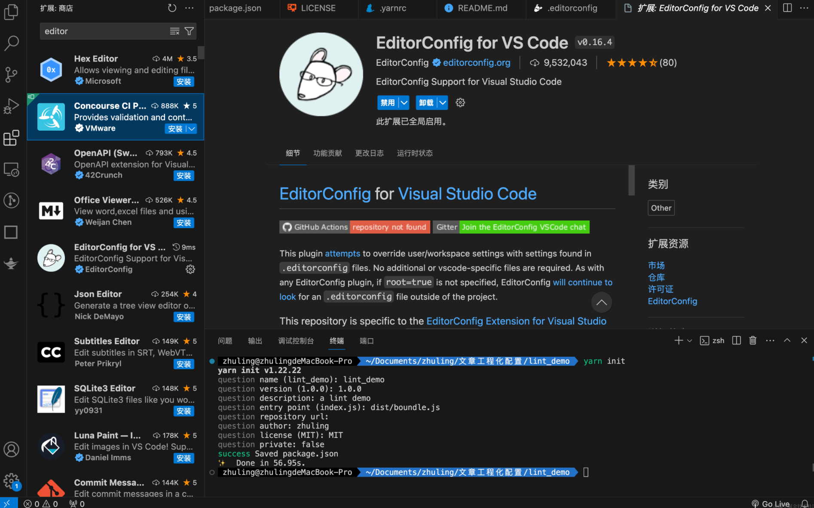
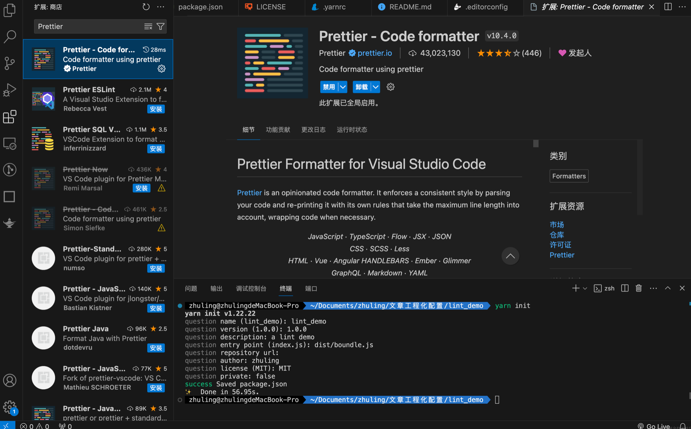
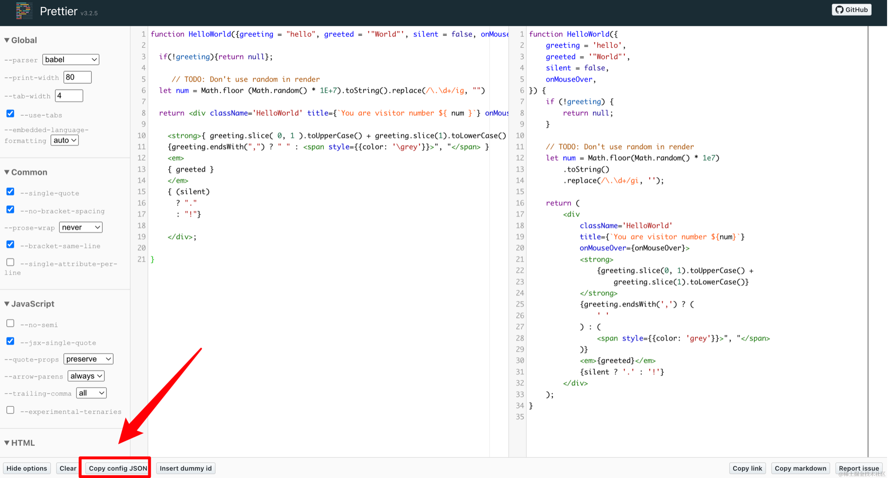

---
group:
  title: 00实战搭建&部署篇
  order: 0
title: 2.代码规范
order: 2
# 这个可以将写的组件设置为demo在右侧展示
# demo: /
---
## EditorConfig

.editorconfig文件是用来帮助开发人员在不同的编辑器和IDE中保持一致的代码风格和格式的配置文件。它可以定义一些基本的编辑器设置，如缩进风格、换行符类型、字符编码等，以确保团队成员在不同的编辑器中编写的代码具有一致的风格。



.editorconfig文件的语法很简单，通常由一系列键值对组成，每个键值对表示一项编辑器配置。以下是一个示例.editorconfig文件的内容：

```js
# EditorConfig 文件示例

# 表示这是项目根目录下的顶级 .editorconfig 文件，编辑器在查找配置时会停止向上查找
root = true

# 匹配所有文件
[*]
# 使用 Unix 风格的换行符
end_of_line = lf
# 文件末尾会插入一个空行
insert_final_newline = true

# 匹配 JavaScript 文件
[*.js]
# 使用空格缩进
indent_style = space
# 缩进大小为 4
indent_size = 4

# 匹配 Markdown 文件
[*.md]
# 使用制表符缩进
indent_style = tab
```

常见配置项
.editorconfig文件支持的配置项有很多，常见的包括：

*   root：是否是项目根目录下的顶级 .editorconfig 文件。
*   indent\_style：缩进风格，可以是 tab（制表符）或 space（空格）。
*   indent\_size：缩进大小，对于 tab 缩进风格无效。
*   tab\_width：制表符宽度，用于 tab 缩进风格。
*   end\_of\_line：换行符类型，可以是 lf（Unix 风格）、crlf（Windows 风格）或 cr（旧版 Mac 风格）。
*   charset：字符编码，通常设置为 utf-8。
*   trim\_trailing\_whitespace：是否去除行末多余的空格。
*   insert\_final\_newline：文件末尾是否插入空行。
    以上是一些常见的配置项，具体可以根据项目需要进行配置。详细的配置项列表和说明可以参考EditorConfig 官方文档。

这里解释下空格为什么需要统一，为什么有几种风格？
换行符类型的不同风格主要是由于不同操作系统对换行符的处理方式不同所导致的。

`LF（Line Feed）`：在 Unix 和类 Unix 系统（如 Linux、macOS、FreeBSD 等）中使用的换行符。在文本文件中，每行结尾只有 LF 字符。

`CRLF（Carriage Return + Line Feed）`：在 Windows 系统中使用的换行符。在文本文件中，每行结尾有 CR 和 LF 两个字符组成。

`CR（Carriage Return）`：在旧版 Mac 系统中使用的换行符。在文本文件中，每行结尾只有 CR 字符。

这些不同的换行符类型源于早期计算机系统中不同的文本处理方式，如今在不同的操作系统和文本编辑器中仍然会存在这些差异。因此，.editorconfig文件中的 end\_of\_line 配置选项允许你指定在项目中使用的换行符类型，以便在不同的环境中保持一致的换行符风格。

如果在一个项目中不同的文件使用了不同的换行符类型，可能会导致一些问题，主要包括：

*   跨平台兼容性问题：不同的操作系统对换行符的处理方式不同，如果文件中混合使用了不同的换行符类型，可能会导致在不同操作系统下的编辑器或工具处理文件时出现问题，如显示异常或解析错误。

*   版本控制问题：版本控制系统（如 Git）可能会在提交和比较文件时将换行符转换为统一的格式，如果文件中混合使用了不同的换行符类型，可能会导致版本控制系统不正确地处理换行符，导致代码冲突或历史记录混乱。

*   可读性问题：混合使用不同的换行符类型会使代码在不同的编辑器或工具中显示不一致，降低代码的可读性和维护性。

## Prettier



Prettier 是一个代码格式化工具，可以帮助开发人员自动格式化代码，使代码风格保持一致。它支持多种编程语言，包括 JavaScript、TypeScript、CSS、HTML、JSON 等。Prettier 的主要目标是通过提供一致的代码格式化规则来减少团队成员之间的代码格式争论，并提高代码的可读性和可维护性。

使用 Prettier 的优点包括：

*   一致的代码风格：Prettier 提供了一套默认的代码格式化规则，确保团队成员的代码风格保持一致，避免了手动调整代码格式的工作。

*   易于集成：Prettier 可以与大多数编辑器、集成开发环境（IDE）、代码编辑器和版本控制系统（如 VS Code、Atom、Sublime Text、WebStorm、Git 等）无缝集成，方便开发人员在编写代码时自动格式化。

*   广泛的支持：Prettier 支持多种编程语言和文件格式，包括 JavaScript、TypeScript、CSS、HTML、JSON、Markdown 等，可以统一管理项目中不同类型文件的代码格式。

*   易于配置：Prettier 提供了一些配置选项，可以根据项目的需要进行定制，例如缩进大小、换行符类型等。

*   强大的格式化功能：Prettier 能够处理复杂的代码结构，并根据配置规则自动调整代码格式，确保生成的代码符合一致的风格。

*   使用 Prettier 可以提高团队的开发效率，减少代码格式化方面的工作量，使开发人员可以更专注于编写高质量的代码。

#### 安装

    yarn add prettier@3.2.5 -D

安装成功之后在根目录新建文件 .prettierrc ，在[prettier playground](https://prettier.io/playground)尝试配置然后复制到文件中即可


```json
{
  // 箭头函数参数周围加上括号
  "arrowParens": "always",
  // 大括号与代码在同一行
  "bracketSameLine": true,
  // 大括号内部不加空格
  "bracketSpacing": false,
  // 分号结尾
  "semi": true,
  // 不使用实验性三元表达式
  "experimentalTernaries": false,
  // 使用单引号
  "singleQuote": true,
  // JSX属性值使用单引号
  "jsxSingleQuote": true,
  // 保留引号样式
  "quoteProps": "preserve",
  // 尾随逗号保留
  "trailingComma": "all",
  // 不强制单个属性换行
  "singleAttributePerLine": false,
  // HTML空格敏感性为css
  "htmlWhitespaceSensitivity": "css",
  // Vue脚本和样式不缩进
  "vueIndentScriptAndStyle": false,
  // 文本不换行
  "proseWrap": "never",
  // 不插入格式化标记
  "insertPragma": false,
  // 打印宽度为80个字符
  "printWidth": 80,
  // 不要求格式化标记
  "requirePragma": false,
  // 使用Tab缩进
  "useTabs": true,
  // 嵌入语言格式自动
  "embeddedLanguageFormatting": "auto",
  // Tab宽度为4个空格
  "tabWidth": 4
}
```

## 配置保存自动格式化

先安装vscode的插件，然后再创建一个.vscode文件夹。
.vscode文件夹是用来存放 `Visual Studio Code （VS Code）`编辑器的工作区配置文件的目录。这些配置文件包含了与项目相关的编辑器设置，例如调试配置、任务配置、工作区设置等。这些设置可以使得多个开发人员在同一个项目中使用相同的编辑器配置，以确保项目的一致性和可维护性。该文件的配置优先于 vscode 全局的 settings.json ，这样别人下载了你的项目进行开发，也不会因为全局 setting.json 的配置不同而导致 Prettier 或之后会说到的 ESLint 、 StyleLint 失效，接下来在该文件内输入以下代码：

```json
{
	// =======================下面是配置prettier格式化的setting===================
	// 指定哪些文件不参与搜索
	"search.exclude": {
	  "**/node_modules": true,
	  "dist": true,
	  "build": true,
	  "yarn.lock": true
	},
	// 保存自动格式化
	"editor.formatOnSave": true,
	"[javascript]": {
	  "editor.defaultFormatter": "esbenp.prettier-vscode"
	},
	"[javascriptreact]": {
	  "editor.defaultFormatter": "esbenp.prettier-vscode"
	},
	"[typescript]": {
	  "editor.defaultFormatter": "esbenp.prettier-vscode"
	},
	"[typescriptreact]": {
	  "editor.defaultFormatter": "esbenp.prettier-vscode"
	},
	"[json]": {
	  "editor.defaultFormatter": "esbenp.prettier-vscode"
	},
	"[html]": {
	  "editor.defaultFormatter": "esbenp.prettier-vscode"
	},
	"[markdown]": {
	  "editor.defaultFormatter": "esbenp.prettier-vscode"
	},
	"[css]": {
	  "editor.defaultFormatter": "esbenp.prettier-vscode"
	},
	"[less]": {
	  "editor.defaultFormatter": "esbenp.prettier-vscode"
	},
	"[scss]": {
	  "editor.defaultFormatter": "esbenp.prettier-vscode"
	},
  
	// ==========================prettier===============================
  }
  
```

"editor.formatOnSave" 的作用是在我们保存时，会自动执行一次代码格式化，而我们该使用什么格式化器？接下来的代码便是设置默认的格式化器，看名字大家也能看得出来了吧！

在遇到 .js 、 .jsx 、.ts 、.tsx 、.json 、.html 、.md 、 .css 、 .less 、 .scss 为后缀的文件时，都会去使用 Prettier 去格式化代码，而格式化的规则就是我们配置的 .prettierrc 决定的！


## prettier\&editorConfig的区别

EditorConfig 的配置项都是一些不涉及具体语法的，比如 缩进大小、文移除多余空格等。

而 Prettier 是一个格式化工具，要根据具体语法格式化，对于不同的语法用单引号还是双引号，加不加分号，哪里换行等，当然，肯定也有缩进大小。

即使缩进大小这些共同都有的设置，两者也是不冲突的，设置 EditorConfig 的 indent\_size  为 4 ， Prettier 的 tabWidth 为 2 。

## .prettierignore

忽略格式化的文件
