---
group:
  title: 00实战搭建&部署篇
  order: 0
title: 6.webpack5基本配置
order: 6
# 这个可以将写的组件设置为demo在右侧展示
# demo: /
---
这个图可以大致总结webpack的配置分类和逻辑，webpack的配置其实就是这么一个流程，在打包流程的基础上在优化开发体验和产物优化的配置
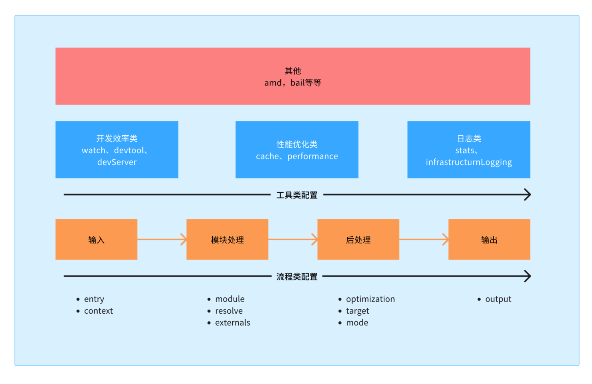

## 安装、配置

    yarn add webpack@5.90.3 webpack-cli@5.1.4 -D

*   webpack ：这不必多说，其用于编译 JavaScript 模块。
*   webpack-cli ：此工具用于在命令行中运行 webpack。
    紧接着我们在根目录下新建文件夹 scripts ，在之下再建一个文件夹 config ，在 config 中再建一个 .js 文件 webpack.common.js ，此结构如下：

<!---->

    scripts/
        config/
          webpack.common.js

后面会用到webpack-merge，提取公共的逻辑，区分开发环境和生产环境的配置。

## 打包出、入口input、output

这里就是配置webpack打包的输入输出。

在 Webpack 5 中，配置文件（通常是 webpack.config.js）的输入（entry）和输出（output）是最基本的部分，用于定义 Webpack 应当处理的文件以及它们处理完毕应当输出到哪里。

**输入（entry）**

Webpack 的 Entry 配置项用于定义项目的入口点。Webpack 会从这些入口点开始，解析出项目内的依赖关系。

基础的单个入口简写语法：

    module.exports = {
      entry: './path/to/my/entry/file.js'
    };

对象语法，当你需要更复杂的配置时使用：

    module.exports = {
      entry: {
        main: './src/index.js',
        app: './src/app.js'
        // 可以添加更多入口
      }
    };

常见的配置选项值：

*   字符串：单一入口点简化写法。
*   数组：当你想对多个文件一起打包但只创建一个 bundle。
*   对象：多个入口点，可以创建多个 bundle。适合多页面应用。

**输出（output）**

配置输出属性(output)告诉 Webpack 在哪里输出它所创建的 bundles，以及如何命名这些文件，默认值是 ./dist。
基础配置：

```
const path = require('path');

module.exports = {
  //...
  output: {
    path: path.resolve(__dirname, 'dist'),
    filename: 'bundle.js'
  }
};

```

多个入口起点时配置：
如果配置创建了多个单独的 "chunk"（例如，使用多个入口点或使用像 CommonsChunkPlugin 这样的插件），应该使用占位符(substitutions)来确保每个文件具有唯一的名称。

    module.exports = {
      //...
      output: {
        path: path.resolve(__dirname, 'dist'),
        filename: '[name].bundle.js'
      }
    };

常见的配置选项值：

*   path：输出文件所在的目录绝对路径。
*   filename：指定输出文件的名称。
*   publicPath：指定在浏览器中被引用的时候的公共的URL的路径。
*   library：暴露库的名称。作为全局变量，当你的库加载完成后，入口起点的返回值将分配给这个变量。
*   libraryTarget：在何种形式下导出库。
*   chunkFilename：非入口(non-entry) chunk 文件的名称。
*   assetModuleFilename：生成的资产(asset)文件名模版。
    示例配置：

<!---->

    module.exports = {
      //...
      output: {
        path: path.resolve(__dirname, 'dist'),
        filename: '[name].[contenthash].js',
        publicPath: '/',
        library: 'MyLibrary',
        libraryTarget: 'umd',
        chunkFilename: '[id].[chunkhash].js',
        assetModuleFilename: 'images/[hash][ext][query]'
      }
    };

我们在webpack.common.js文件中配置如下，

    const path = require('path')
    
    module.exports = {
      entry: {
        app: path.resolve(__dirname, '../../src/app.js'),
      },
      output: {
        filename: 'js/[name].[hash:8].js',
        path: path.resolve(__dirname, '../../dist'),
      },
    }

接下来在根目录创建 src 文件夹，新建 app.js 文件，输入以下代码：

    const root = document.querySelector('#root')
    root.innerHTML = 'hello, webpack!'

现在我们尝试使用刚才的 webpack 配置对其进行打包，那如何操作呢？ 打开 package.json ，为其添加一条 npm 命令：

    {
      "scripts": {
        "build": "webpack --config ./scripts/config/webpack.common.js",
      },
    }

测试，在dist下就生成了打包的文件

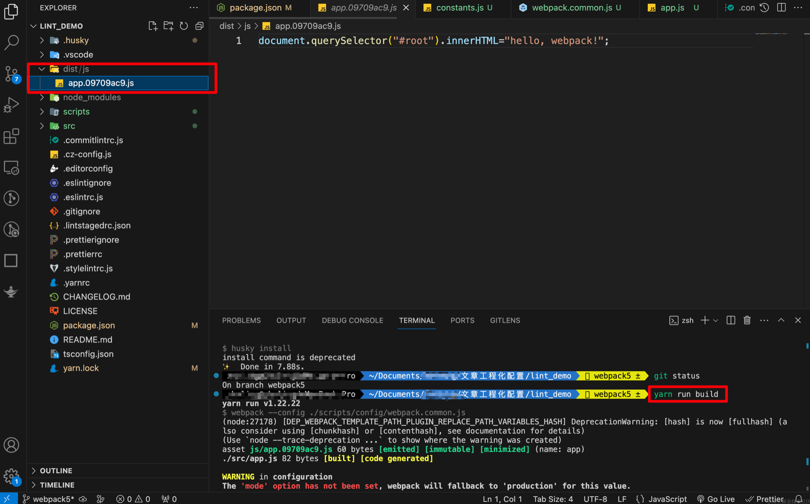

这里有一个警告，这里是因为我们没有配置打包环境，后面我们配置了之后就不会有了

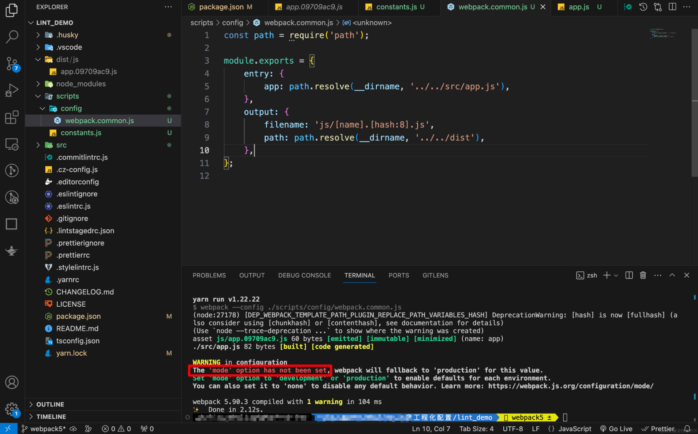

这里解释下output.filename的配置方式和原因，

在 Webpack 中，output.filename 属性是用来定义输出文件的名称的。你可以使用静态名称的字符串，但更常用的是利用占位符来动态地为每个输出文件指定名称。以下是可用的几种配置方式，和几种不同的哈希值类型：

**Filename 配置方式：**
静态名称：

    filename: 'bundle.js'

这将会输出一个名为 bundle.js 的文件。

**使用入口点名称：**

    filename: '[name].js'

这里的 \[name] 是一个占位符，为每个入口点生成带有其名称的输出文件。

**使用内部 chunk id：**

    filename: '[id].js'

\[id] 将会被替换为每个 chunk 的内部唯一标识符。

**根据内容生成的哈希值：**

    filename: '[contenthash].js'

\[contenthash] 是文件内容的哈希值，一般用于缓存逻辑。

聚焦在哈希占位符，Webpack 提供了几种不同类型的哈希值，它们有不同的意图和使用场景：

**Hash 值类型：**

*   `[hash]`：与整个项目的构建相关的哈希值。不论哪个文件有变化，整个项目构建的哈希值都会改变。
*   `[chunkhash]`：与 Webpack 打包过程中生成的 chunk 相关的哈希值。同一 chunk 内文件没有变化时，\[chunkhash] 是不变的。它可以用来优化浏览器缓存，因为不同的文件通常被打包进不同的 chunk。
*   `[contenthash]`：与文件内容直接相关的哈希值。只有文件内容改变了，`[contenthash]` 才会改变。这在使用如 css-extract-plugin 分离 CSS 文件时非常有用，因为你可能只希望在 CSS 文件的内容实际发生变化时才改变文件名。
*   `[modulehash]`：与单个模块相关的哈希值。
*   `[fullhash]`：Webpack 5 引入的哈希值，用来代替旧版本中的 \[hash]。

**Hash 值的区别：**

*   `[hash]` 和 `[fullhash]` 考虑的是整个编译过程。任何一个文件的改动都会导致所有输出文件的哈希值变化。这意味着即使只有一个文件被修改，缓存的所有文件也因为文件名改变而需要重新获取。
*   `[chunkhash]` 是针对每个 chunk 的。如果不同的入口导致了不同的 chunk 输出，那么只有当特定 chunk 中的模块变化时，该 chunk 的文件名才会改变。这允许客户端缓存未变更的 chunks。
*   `[contenthash]` 特别适用于 CSS 或其他静态资源离散文件的缓存策略。文件内容改变时，相关文件哈希值变化，未改变的文件则哈希值保持不变，使缓存更有效。

在使用哈希占位符时，可以指定哈希值的长度，如 `[hash:8]`，这将输出8个字符长度的哈希值，让文件名更为精简。

## 提取公共变量

在 scripts 下新建一个 constant.js 文件，存放一些用到的常量，项目根目录的绝对路径，开发服务器的端口路径，项目名称等等。

    scripts/
    	config/
      	webpack.common.js
    + constant.js

在里面定义我们的变量：

    const path = require('path')
    // 拼接绝对路径
    const PROJECT_PATH = path.resolve(__dirname, '../')
    // 项目名
    const PROJECT_NAME = path.parse(PROJECT_PATH).name
    
    module.exports = { 
      PROJECT_PATH,
      PROJECT_NAME
    }

然后在 webpack.common.js 中引入，修改代码：

```js
const {resolve} = require('path');
const {PROJECT_PATH} = require('../constants');

module.exports = {
	entry: {
		app: resolve(PROJECT_PATH, './src/app.js'),
	},
	output: {
		filename: 'js/[name].[hash:8].js',
		path: resolve(PROJECT_PATH, './dist'),
	},
};
```

## 区分开发/生产环境

开发环境不需要压缩代码，不需要提取css为单文件，但是需要开发服务器等优化开发体验的配置，但是生产环境又不需要，有的又是两个环境都需要的，所以我们需要区分开发、生产环境，我们可以使用[webpack-merge](https://github.com/survivejs/webpack-merge)来配置，然后合并。

    yarn add webpack-merge@5.10.0 -D

在 scripts/config 下新建文件 webpack.dev.js 作为开发环境配置，并输入以下代码：

```js
const { merge } = require('webpack-merge')
const common = require('./webpack.common.js')

module.exports = merge(common, {
  mode: 'development',
})
```

同样地，在 scripts/config 下新建文件 webpack.prod.js 作为生产环境配置，并输入以下代码：

    const { merge } = require('webpack-merge')
    const common = require('./webpack.common.js')
    
    module.exports = merge(common, {
      mode: 'production',
    })

对于mode我们可以使用环境变量去区分，就可以提取到common的配置中

## cross-env可跨平台设置和使用环境变量

cross-env 可跨平台设置和使用环境变量，不同操作系统设置环境变量的方式不一定相同，比如 Mac 电脑上使用 export NODE\_ENV=development ，而 Windows 电脑上使用的是 set NODE\_ENV=development ，有了这个利器，我们无需在考虑操作系统带来的差异性。

    yarn add cross-env@7.0.3 -D

然后在 package.json 中添加修改以下代码：

    {
      "scripts": {
        "start": "cross-env NODE_ENV=development webpack --config ./scripts/config/webpack.dev.js",
        "build": "cross-env NODE_ENV=production webpack --config ./scripts/config/webpack.prod.js",
      },
    }

修改 srcipt/constants.js 文件，增加一个公用布尔变量 isDev ：

```js
const path = require('path');
const PROJECT_PATH = path.resolve(__dirname, '../');
const PROJECT_NAME = path.parse(PROJECT_PATH).name;
const isDev = process.env.NODE_ENV !== 'production';

module.exports = {
	PROJECT_PATH,
	PROJECT_NAME,
	isDev,
};

```

hash 值在开发环境中并不需要，于是我们修改 webpack.common.js 文件：

```js
const {resolve} = require('path');
const {PROJECT_PATH, isDev} = require('../constants');

module.exports = {
	mode: isDev ? 'development' : 'production',
	entry: {
		app: resolve(PROJECT_PATH, './src/app.js'),
	},
	output: {
		filename: `js/[name]${isDev ? '' : '.[hash:8]'}.js`,
		path: resolve(PROJECT_PATH, './dist'),
	},
};

```

## 本地服务实时查看页面

    yarn add webpack-dev-server@5.0.3 html-webpack-plugin@5.6.0 -D

简单介绍一下两个工具的作用：

*   html-webpack-plugin ：每一个页面是一定要有 html 文件的，而这个插件能帮助我们将打包后的 js 文件自动引进 html 文件中，毕竟你不可能每次更改代码后都手动去引入 js 文件。
*   webpack-dev-server ：可以在本地起一个 http 服务，通过简单的配置还可指定其端口、热更新的开启等。

现在，我们先在项目根目录下新建一个 public 文件夹，里面存放一些公用的静态资源，现在我们先在其中新建一个 index.html ，写入以下内容：

```html
<!doctype html>
<html lang="en">
	<head>
		<meta charset="UTF-8" />
		<meta name="viewport" content="width=device-width, initial-scale=1.0" />
		<title>React18 + Ts5 + webpack5 开发模板搭建</title>
	</head>
	<body>
		<div id="root"></div>
	</body>
</html>

```

因为 html-webpack-plugin 在开发和生产环境我们都需要配置，于是我们打开 webpck.common.js 增加以下内容：

```js
const {resolve} = require('path');
const {PROJECT_PATH, isDev} = require('../constants');
const HtmlWebpackPlugin = require('html-webpack-plugin');

const PLUGINS = [
	// 配置html，自动引入打包出的js文件
	new HtmlWebpackPlugin({
		template: resolve(PROJECT_PATH, './public/index.html'),
		filename: 'index.html',
		cache: false,
		minify: isDev
			? false
			: {
					removeAttributeQuotes: true,
					collapseWhitespace: true,
					removeComments: true,
					collapseBooleanAttributes: true,
					collapseInlineTagWhitespace: true,
					removeRedundantAttributes: true,
					removeScriptTypeAttributes: true,
					removeStyleLinkTypeAttributes: true,
					minifyCSS: true,
					minifyJS: true,
					minifyURLs: true,
					useShortDoctype: true,
				},
	}),
];

module.exports = {
	mode: isDev ? 'development' : 'production',
	entry: {
		app: resolve(PROJECT_PATH, './src/app.js'),
	},
	output: {
		filename: `js/[name]${isDev ? '' : '.[hash:8]'}.js`,
		path: resolve(PROJECT_PATH, './dist'),
	},
	plugins: PLUGINS,
};

```

随后在 webpack.dev.js 下增加本地服务的配置：

```js
const { merge } = require("webpack-merge");
const common = require("./webpack.common.js");
const { SERVER_HOST, SERVER_PORT } = require("../constants");
module.exports = merge(common, {
  mode: "development",
  stats: "errors-only", // 终端仅打印 error
  devtool: "eval-source-map",
  devServer: {
    host: SERVER_HOST, // 指定 host，不设置的话默认是 localhost
    port: SERVER_PORT, // 指定端口，默认是8080
    client: {
      // 控制日志输出格式
      logging: "info", // 选择 'none', 'error', 'warn', 'info', 'log', 或 'verbose'
    },
    compress: true, // 是否启用 gzip 压缩
    open: true, // 打开默认浏览器
    hot: true, // 热更新
  },
});
```

我们定义了两个新的变量 SERVER\_HOST 和 SERVER\_PORT ，在 constants.js 中定义它们：

```js
const path = require('path');
const PROJECT_PATH = path.resolve(__dirname, '../');
const PROJECT_NAME = path.parse(PROJECT_PATH).name;
const isDev = process.env.NODE_ENV !== 'production';
const SERVER_HOST = '127.0.0.1';
const SERVER_PORT = 9000;
module.exports = {
	SERVER_HOST,
	SERVER_PORT,
	PROJECT_PATH,
	PROJECT_NAME,
	isDev,
};

```

现在配置好了本地服务的相关配置，我们还需要回到 package.json 中修改 start 命令：

```json
{
  "scripts": {
    "start": "cross-env NODE_ENV=development webpack-dev-server --config ./scripts/config/webpack.dev.js",
  },
}
```

yarn run start测试一下，如下图

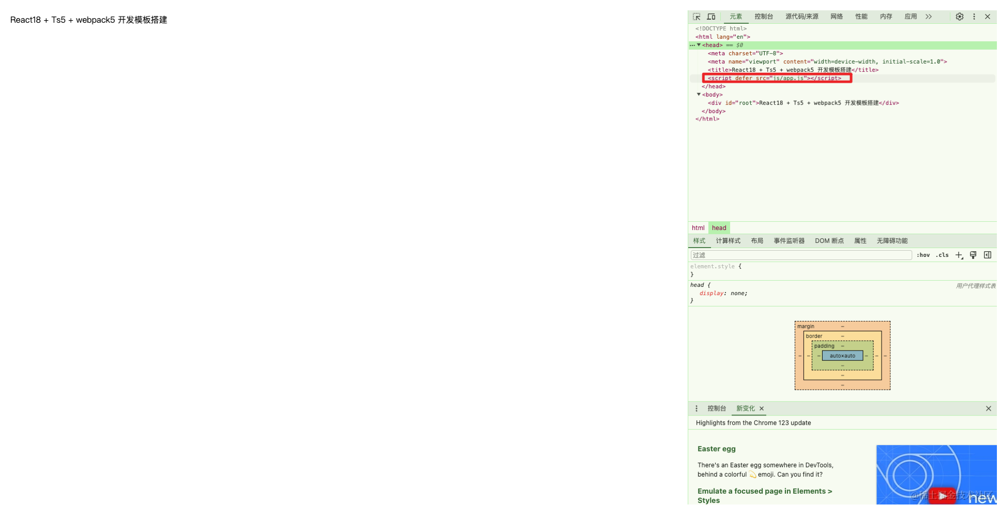

## devtool & sourcemap

devtool 是一个在 Webpack 配置中用于控制是否生成，以及如何生成 Source Map 的配置选项。Source Map 是一种用于将编译、打包、转换后的代码映射回原始源代码的工具，它在调试中非常有用，因为它允许你看到源代码级别的错误和日志信息，即使你正在运行的是转换后的代码。
Source Map：
Source Map 基本上是一个文件，它提供了从原始源代码到压缩、转换代码之间的映射。这样，当你在浏览器中调试时，即便是在查看转换后的代码（例如，压缩过后的或者由 TypeScript 转换成 JavaScript 的代码），调试器也能够展示出原始源码的位置，从而使得调试过程更加直观和容易。

在 Webpack 中，有多种方式可以生成 Source Map，devtool 配置项可以接受以下值之一：

*   eval：每个模块会用 eval() 执行，并且在末尾追加一个 //@ sourceMappingURL 注释，最快。
*   cheap-eval-source-map：生成较快，并且可以映射到行号。
*   cheap-module-eval-source-map：生成较快，并且会生成 Source Map 到模块级别。
*   eval-source-map：转换(transpile)每个模块，并在一个 DataUrl 中提供 Source Map，提供质量更好但速度较慢的 Source Map。
*   cheap-source-map：不包含列信息的 Source Map，不包括 loader 的 Source Map。
*   cheap-module-source-map：不包含列信息，但是加载器(loader)的 Source Map 会被简化为每行一个映射(mapping)。
*   inline-source-map：生成一个完整的 Source Map，并以 DataUrl 的形式追加到输出文件末尾。
*   source-map：生成一个独立的 Source Map 文件，提供完整的映射信息，通常用于生产环境中。
*   hidden-source-map：创建 Source Map，但不在打包文件中引用，错误信息不会显示原始代码的位置信息，只会显示构建后代码的位置信息。
*   nosources-source-map：创建 Source Map，但不包含 sourcesContent（原始代码内容）。
    这些选项提供了不同层次的 Source Map 质量和构建性能之间的权衡。例如，在开发环境中，你可能会选择一个构建速度快的 Source Map 选项，比如 eval-source-map，以提高构建和重构建的速度。在生产环境中，为了获取好的源映射，通常会采用 source-map 或 hidden-source-map 这种完整但较慢的选项。
    在 webpack.dev.js 中添加以下代码：

```js
module.exports = merge(common, {
  mode: 'development',
  devtool: 'eval-source-map',
})
```

在生产环境中我直接设为 false ，不需要 source-map 功能，在 webpack.prod.js 中添加以下代码：

    module.exports = merge(common, {
      mode: 'production',
      devtool: false,
    })

通过上面配置，我们本地进行开发时，代码出现了错误，控制台的错误日志就会精确地告诉你错误的代码文件、位置等信息。比如我们在 src/app.js 中第 5 行故意写个错误代码：

    const root = document.querySelector('#root');
    root.innerHTML = 'React18 + Ts5 + webpack5 开发模板搭建';
    
    const a = '212132321321';
    a = 21321321321;

效果如下

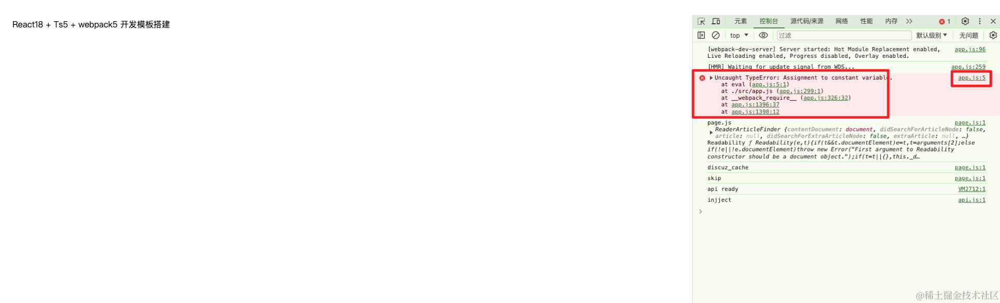

## 打包编译前清理 dist 目录

如果不清理，dist下面的打包输出会一直累积，但是只有在生产环境下，因为我们开发环境不需要哈希值，所以每次都是app.js会直接替换文件内容

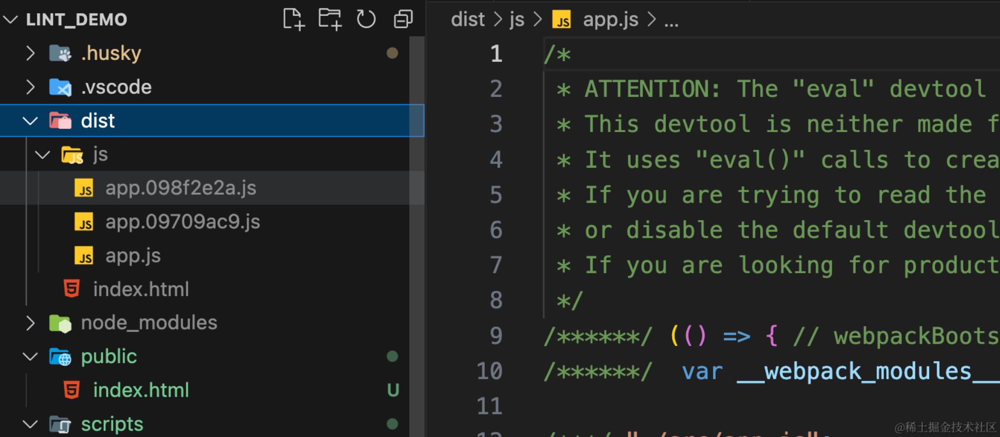

借助 clean-webpack-plugin 可以实现每次打包前先处理掉之前的 dist 目录，以保证每次打出的都是当前最新的，我们先安装它：

    yarn add clean-webpack-plugin@4.0.0 -D

打开 webpack.prod.js 文件，增加以下代码：

```js
const {merge} = require('webpack-merge');
const common = require('./webpack.common.js');
const {CleanWebpackPlugin} = require('clean-webpack-plugin');

const PLUGINS = [new CleanWebpackPlugin()];
module.exports = merge(common, {
	plugins: PLUGINS,
});

```

效果如下

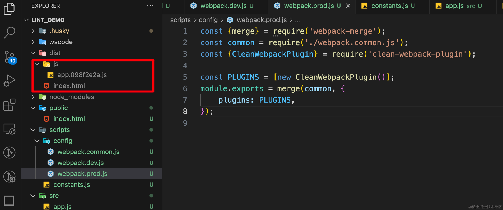

## 样式文件处理

### 处理 .css 文件

在 src/ 目录下新建一个 `app.css` 文件，给 #root 随便添加一个样式， app.js 中通过 `import './app.css'` ，再进行打包或本地服务启动，webpack 直接就会报错，报错告诉我们，我们可能需要一个其他loader去支持这种文件，因为 webpack 只会编译 .js 文件，它是不支持直接处理 .css 、 .less 或 .scss 文件的。

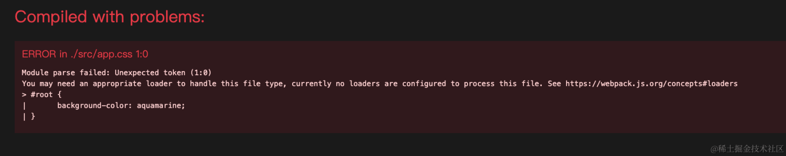

我们需要安装 style-loader 和 css-loader ：

    yarn add style-loader@3.3.4 css-loader@6.10.0 -D

遇到后缀为 .css 的文件，webpack 先用 css-loader 加载器去解析这个文件，遇到 @import 等语句就将相应样式文件引入（所以如果没有 css-loader ，就没法解析这类语句），计算后生成css字符串，接下来 style-loader 处理此字符串生成一个内容为最终解析完的 css 代码的 style 标签，放到 head 标签里。

loader 是有顺序的，webpack 肯定是先将所有 css 模块依赖解析完得到计算结果再创建 style 标签。因此应该把 style-loader 放在 css-loader 的前面（webpack loader 的执行顺序是从右到左，即从后往前）。
于是，打开我们的 webpack.common.js ，写入以下代码：

```js
module.exports = {
	// other...
  module: {
    rules: [
      {
        test: /\.css$/,
        use: [
          'style-loader',
          {
            loader: 'css-loader',
            options: {
              modules: false, // 默认就是 false, 若要开启，可在官网具体查看可配置项
              sourceMap: isDev, // 开启后与 devtool 设置一致, 开发环境开启，生产环境关闭
              importLoaders: 0, // 指定在 CSS loader 处理前使用的 laoder 数量
            },
          },
        ],
      },
    ]
  },
}
```

test 字段是匹配规则，针对符合规则的文件进行处理。

use 字段有几种写法：

*   可以是一个字符串，假如我们只使用 style-loader ，只需要 use: 'style-loader' 。
*   可以是一个数组，假如我们不对 css-loader 做额外配置，只需要 use: \['style-loader', 'css-loader'] 。
*   数组的每一项既可以是字符串也可以是一个对象，当我们需要在webpack 的配置文件中对 loader 进行配置，就需要将其编写为一个对象，并且在此对象的 options 字段中进行配置。比如我们上面要对 css-loader 做配置的写法。
    效果如下

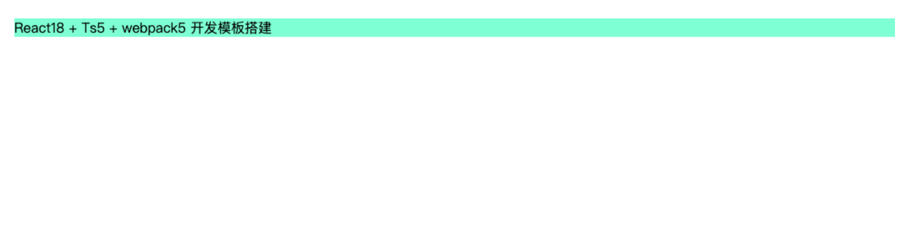

### LESS文件的处理

我们先把app.css改为app.less，import也改为引入less文件，这时候会报跟css一样的错，处理 .less 文件我们需要安装 less 和 less-loader ：

    yarn add less@4.2.0 less-loader@12.2.0 -D

遇到后缀为 .less 文件，

*   less-loader 会将你写的 less 语法转换为 css 语法，并转为 .css 文件。
*   less-loader 依赖于 less ，所以必须都安装。
    继续在 webpack.common.js 中写入代码：

```js
module.exports = {
	// other...
  module: {
    rules: [
      { /* ... */ },
      {
        test: /\.less$/,
        use: [
          'style-loader',
          {
            loader: 'css-loader',
            options: {
              modules: false,
              sourceMap: isDev,
              importLoaders: 1, // 需要先被 less-loader 处理，所以这里设置为 1
            },
          },
          {
            loader: 'less-loader',
            options: {
              sourceMap: isDev,
            },
          },
        ],
      },
    ]
  },
}
```

### SASS 样式文件处理

更改app.less为app.scss, import也更改为scss文件，处理 .scss 文件我们需要安装 node-sass 和 sass-loader ：

    yarn add node-sass@9.0.0 sass-loader@14.1.1 -D

遇到 .scss 后缀的文件， sass-loader 会将你写的 sass 语法转为 css 语法，并转为 .css 文件。
同样地， sass-loader 依赖于 node-sass ，所以两个都需要安装。（ node-sass 如果没有配置yarnrc文件的话可能需要挂代理， 我这里是配置了淘宝源）
继续在 webpack.common.js 中写入代码：

```js
module.exports = {
	// other...
  module: {
    rules: [
      { /* ... */ },
      {
        test: /\.scss$/,
        use: [
          'style-loader',
          {
            loader: 'css-loader',
            options: {
              modules: false,
              sourceMap: isDev,
              importLoaders: 1, // 需要先被 sass-loader 处理，所以这里设置为 1
            },
          },
          {
            loader: 'sass-loader',
            options: {
              sourceMap: isDev,
            },
          },
        ],
      },
    ]
  },
}
```

执行 `yarn run start` ，样式就已经正常加载了。

### PostCSS 处理浏览器兼容问题

postcss 一种对 css 编译的工具，类似 babel 对 js 一样通过各种插件对 css 进行处理，在这里我们主要使用以下插件：

*   postcss-flexbugs-fixes ：用于修复一些和 flex 布局相关的 bug。
*   postcss-preset-env ：将最新的 CSS 语法转换为目标环境的浏览器能够理解的 CSS 语法，目的是使开发者不用考虑浏览器兼容问题。我们使用 autoprefixer 来自动添加浏览器头。
*   postcss-normalize ：从 browserslist 中自动导入所需要的 normalize.css 内容。
    安装上面提到的所需的包：

<!---->

    yarn add postcss@8.4.35 postcss-loader@8.1.1 postcss-flexbugs-fixes@5.0.2 postcss-preset-env@9.5.1 autoprefixer@10.4.18 postcss-normalize@10.0.1 -D

根目录增加postcss.config.js文件，新增如下配置

```js
const {isDev} = require('./scripts/constants');
module.exports = {
	ident: 'postcss',
	plugins: [
		// 修复一些和 flex 布局相关的 bug
		require('postcss-flexbugs-fixes'),
		require('postcss-preset-env')({
			autoprefixer: {
				grid: true,
				flexbox: 'no-2009',
			},
			stage: 3,
		}),
		require('postcss-normalize'),
	],
	sourceMap: isDev,
};
```

更改webpack.common.js，这里我们提取重复的逻辑

```js
const getCssLoaders = (importLoaders) => [
	'style-loader',
	{
		loader: 'css-loader',
		options: {
			modules: false,
			sourceMap: isDev,
			importLoaders,
		},
	},
	'postcss-loader',
];

module.exports = {
	mode: isDev ? 'development' : 'production',
	entry: {
		app: resolve(PROJECT_PATH, './src/app.js'),
	},
	output: {
		filename: `js/[name]${isDev ? '' : '.[hash:8]'}.js`,
		path: resolve(PROJECT_PATH, './dist'),
	},
	plugins: PLUGINS,
	module: {
		rules: [
			{
				test: /\.css$/,
				use: getCssLoaders(1),
			},
			{
				test: /\.less$/,
				use: [
					...getCssLoaders(2),
					{
						loader: 'less-loader',
						options: {
							sourceMap: isDev,
						},
					},
				],
			},
			{
				test: /\.scss$/,
				use: [
					...getCssLoaders(2),
					{
						loader: 'sass-loader',
						options: {
							sourceMap: isDev,
						},
					},
				],
			},
		],
	},
};
```

在 package.json 中添加 browserslist （指定了项目的目标浏览器的范围）

```json

{
  "browserslist": [
    ">0.2%",
    "not dead", 
    "ie >= 9",
    "not op_mini all"
  ],
}
```

现在，在如果你在入口文件（比如我之前一直用的 app.js ）随便引一个写了 display: flex 语法的样式文件， `yarn run start` 浏览器就自动加上了前缀

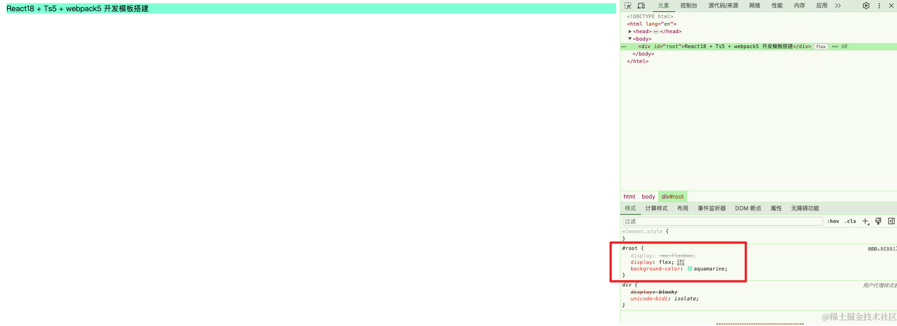

## 处理图片和文件

我们先准备一张图片，在app.js中用import引入


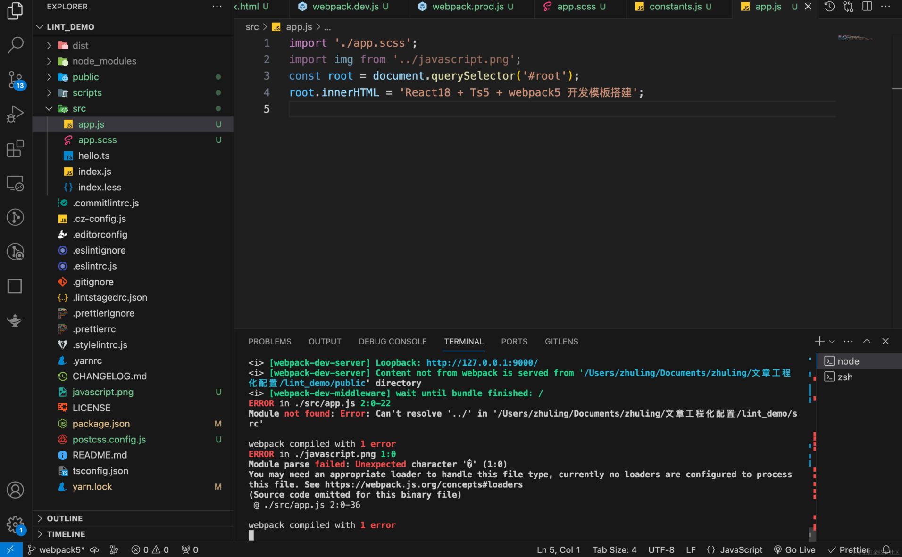

这时候会报错，我们需要loader去处理图片文件，我们增加如下配置

```js
// 处理图片、文件、字体
{
  test: /\.(png|svg|jpg|jpeg|gif)$/i,
  type: "asset/resource",
},
{
  test: /\.(woff|woff2|eot|ttf|otf)$/i,
  type: "asset/resource",
},
{
  test: /\.txt/,
  type: "asset/source",
},
{
  // 通用文件则使用 asset，此时会按照默认条件自动决定是否转换为 Data URI
  test: /\.(?:ico|gif|png|jpg|jpeg)$/i,
  type: "asset",
  parser: {
    // 如果文件大小小于 8kb，那么会转换为 data URI，否则为单独文件。
    // 8kb 是默认值，你可以根据需要进行调整
    dataUrlCondition: {
      maxSize: 8 * 1024, // 8kb
    },
  },
},
```

在Webpack 5中处理图片、文件、字体等资源类型非常简单，因为Webpack 5内置了资源模块（Asset Modules），这是一类模块类型，它允许使用资源文件（字体、图标等）而无需配置额外的loader。

资源模块提供了四种类型：

*   asset/resource: 发送一个单独的文件并导出 URL。之前通过使用 file-loader 实现。
*   asset/inline: 导出一个资源的 data URI。之前通过使用 url-loader 实现。
*   asset/source: 导出资源的源代码。之前通过使用 raw-loader 实现。
*   asset: 在导出一个 data URI 和发送一个单独的文件之间自动选择。之前通过使用 url-loader 并且配置资源体积限制实现。
    针对不同类型的资源，你可以按以下方式添加规则到Webpack配置

以上是Webpack 5处理静态资源的基本配置，理解和使用资源模块可以使得资源处理更简单有效。这些配置项取代了之前在Webpack 4及以前需要使用的file-loader、url-loader和raw-loader。使用资源模块，配置变得更简洁明了，减少了构建配置的复杂性。在大多数情况下，默认的配置已经可以满足日常开发的需要。

# 🍋 写在最后

如果你看到这里了，并且觉得这篇文章对您有所帮助，希望你能够点赞👍和收藏⭐支持一下作者🙇🙇🙇，感谢🍺🍺！如果文中有任何不准确之处，也欢迎您指正，共同进步。感谢您的阅读，期待您的点赞👍和收藏⭐！

参考文章

*   [我是这样搭建Typescript+React项目环境的！](https://github.com/vortesnail/blog/issues/14) 本文主要流程参考这篇文章，将文章中的包换成了相对较新的，解决了配置过程中存在的问题，增加了一些没有的配置

感兴趣的同学可以关注下我的公众号ObjectX前端实验室

🌟 少走弯路 | ObjectX前端实验室 🛠️「精选资源｜实战经验｜技术洞见」
