---
group:
  title: 00实战搭建&部署篇
  order: 0
title: 7.组件库搭建
order: 7
# 这个可以将写的组件设置为demo在右侧展示
# demo: /
---
# 一、引入storybook

    npx storybook@8.0.6 init

这里会让你选择用什么来编译storybook编写的组件和文档，并不是你的项目配置了什么，这里我们选择vite，多尝试尝试。

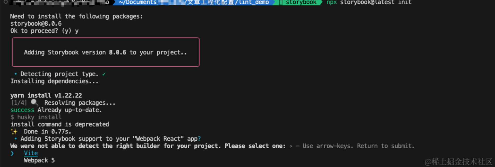

依赖安装完成后，浏览器会自动打开一个网页，但是我们发现内容是空白的，我们看到控制台会有一个报错，因为我们之前的配置是用的webpack，所以我们肯定没有安装过vite，这里你也可以在之前选择的时候选择webpack就不会有这个问题，但是我们为了多尝试，选择了vite，所以我们安装下vite，然后重新启动

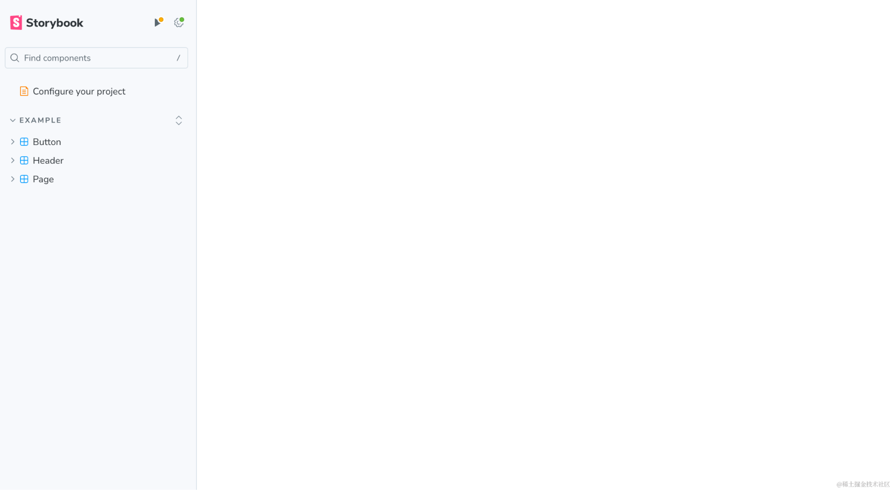

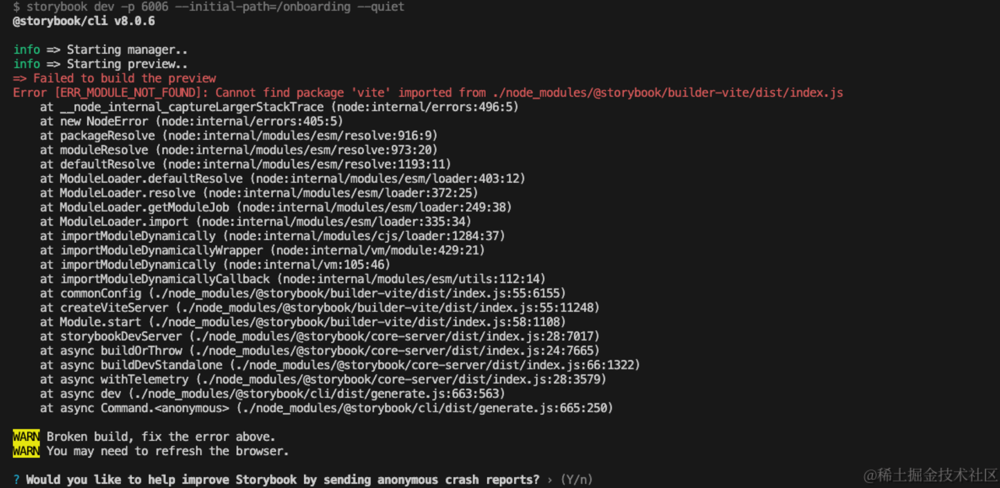

    yarn add vite@5.2.8 -D

安装完成后重新`yarn run storybook`，就可以愉快的玩耍了，就这么简单

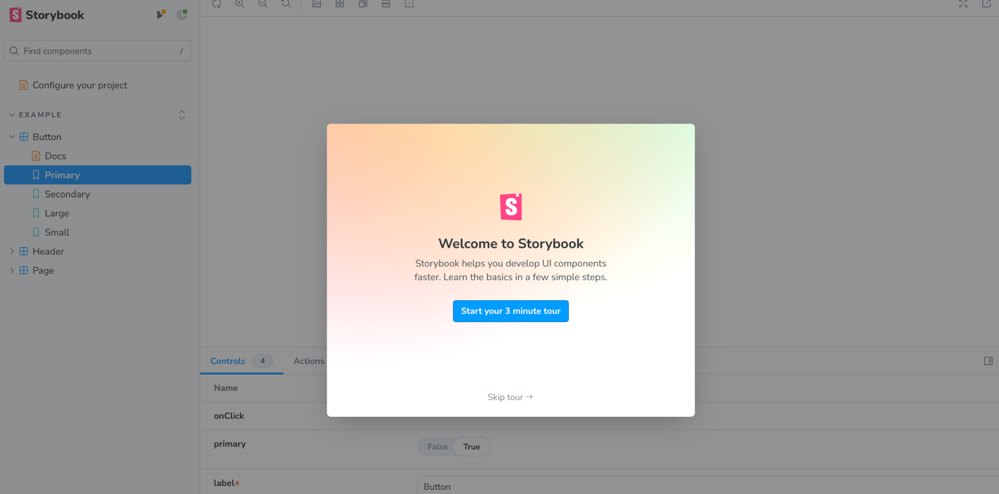

# 二、storybook的基本使用
我们回头看看项目里面storybook安装完之后，给我们增加了很多东西

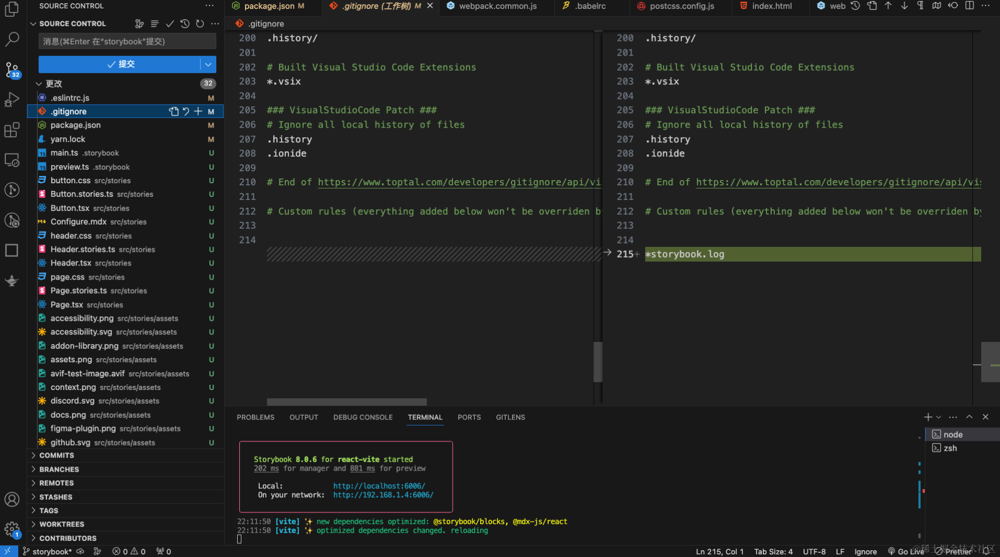

主要的其实就是这两个文件夹，.storybook是配置文件，`src/stories`是写组件的地方，但是我们组件我们不写在这里，我们在`src/components`去写，storybook并不限制我们在那个目录下写组件，我们可以在任意位置编写组件，仅需要在写组件的同时写一个`xxx.stories.tsx`文件，为组件编写story。


## 2.1 创建一个新的组件目录如下

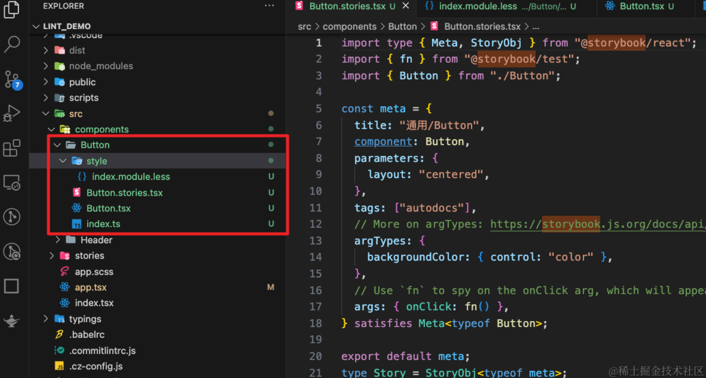

这样的目录结构是因为我们之前配置了`css module`，然后后续需要打包组件
```
index.ts 用于导出组件
Button.tsx 编写组件代码
Button.stories.tsx storybook 配置代码
style/index.module.less 样式代码
```
大部分代码是我们从示例组件里面复制过来的，但是需要注意的是，因为配置了`css module`，`Button.tsx`组件我们需要更改，使用模块化的方式使用样式。
### index.ts
```ts
export * from "./Button";
```
### Button.tsx
```tsx
import React from 'react';
import style from './style/index.module.less';

interface ButtonProps {
	/**
	 * Is this the principal call to action on the page?
	 */
	primary?: boolean;
	/**
	 * What background color to use
	 */
	backgroundColor?: string;
	/**
	 * How large should the button be?
	 */
	size?: 'small' | 'medium' | 'large';
	/**
	 * Button contents
	 */
	label: string;
	/**
	 * Optional click handler
	 */
	onClick?: () => void;
}

/**
 * Primary UI component for user interaction
 */
export const Button = ({
	primary = false,
	size = 'medium',
	backgroundColor,
	label,
	...props
}: ButtonProps) => {
	const mode = primary
		? style['storybook-button--primary']
		: style['storybook-button--secondary'];
	return (
		<button
			type='button'
			className={[
				style['storybook-button'],
				style[`storybook-button--${size}`],
				mode,
			].join(' ')}
			style={{backgroundColor}}
			{...props}>
			{label}
		</button>
	);
};

```

### Button.stories.tsx文件
```tsx
import type { Meta, StoryObj } from "@storybook/react";
import { fn } from "@storybook/test";
import { Button } from "./Button";

const meta = {
  title: "通用/Button",
  component: Button,
  parameters: {
    layout: "centered",
  },
  tags: ["autodocs"],
  // More on argTypes: https://storybook.js.org/docs/api/argtypes
  argTypes: {
    backgroundColor: { control: "color" },
  },
  // Use `fn` to spy on the onClick arg, which will appear in the actions panel once invoked: https://storybook.js.org/docs/essentials/actions#action-args
  args: { onClick: fn() },
} satisfies Meta<typeof Button>;

export default meta;
type Story = StoryObj<typeof meta>;

// More on writing stories with args: https://storybook.js.org/docs/writing-stories/args
export const Primary: Story = {
  args: {
    primary: true,
    label: "Button",
  },
};

export const Secondary: Story = {
  args: {
    label: "Button",
  },
};

export const Large: Story = {
  args: {
    size: "large",
    label: "Button",
  },
};

export const Small: Story = {
  args: {
    size: "small",
    label: "Button",
  },
};

```

### index.module.less

```less
/* stylelint-disable selector-class-pattern */

.storybook-button {
	display: inline-block;
	font-weight: 700;
	font-family: 'Nunito Sans', 'Helvetica Neue', Helvetica, Arial, sans-serif;
	line-height: 1;
	border: 0;
	border-radius: 3em;
	cursor: pointer;
}

.storybook-button--primary {
	color: white;
	background-color: #1ea7fd;
}

.storybook-button--secondary {
	color: #333;
	background-color: transparent;
	box-shadow: rgb(0 0 0 / 15%) 0 0 0 1px inset;
}

.storybook-button--small {
	padding: 10px 16px;
	font-size: 12px;
}

.storybook-button--medium {
	padding: 11px 20px;
	font-size: 14px;
}

.storybook-button--large {
	padding: 12px 24px;
	font-size: 16px;
}

```

## 2.2 直接在当前的项目中引入测试下组件
在app.tsx中导入组件，简单测试下使用，代码如下
```tsx
import React from 'react';
import img from '../javascript.png';
import './app.scss';
import {Button} from '@components/Button/Button';
function App() {
	return (
            <>
                <Button label='Button' onClick={() => {}} primary />
                <div className='App'>React18 + Ts5 + webpack5 开发模板搭建</div>;
                </img>
            </>
	);
}

export default App;
```

项目引用效果如下:

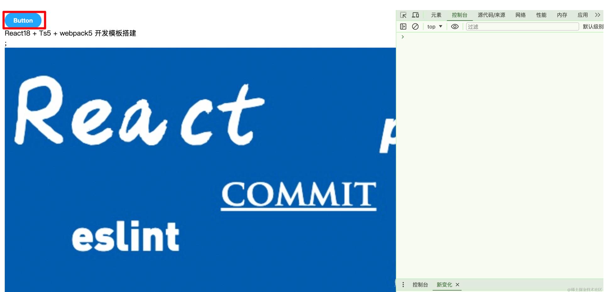

storybook效果如下：

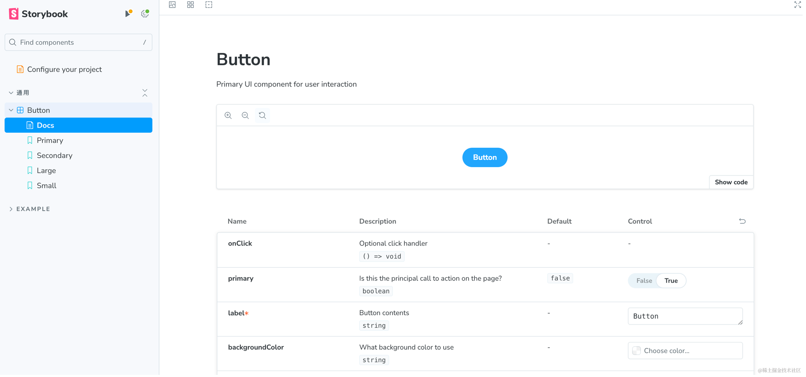

## 2.3 关于更多storybook的内容
本文不再介绍其他storybook的内容，如果你想了解更多，可以阅读神光写的文章，里面很详细
[想给组件加上文档？ 试试 Storybook](https://juejin.cn/post/7299743820434309147)

# 三、rollup打包组件
## 3.1.导出组件
我们新增两个文件`src/components/index.ts`和`src/index.ts`，用于汇总组件并导出，给rollup设置打包入口，并且不影响我们本地测试什么的。
### `src/components/index.ts`文件
代码如下
```ts
export * from './Button';

```
### `src/index.ts`
代码如下
```ts
export * from './components';
```

## 3.2.安装配置rollup
与webpack 这样的工具相比，Rollup 更专注于处理 ES6 模块的打包，它会尽可能地将你的代码打包成更小、更高效的文件。Rollup 支持多种常见的 JavaScript 模块格式，包括 ES6 模块、CommonJS 和 AMD。

但是Rollup 在设计上更专注于处理 ES6 模块的打包，因此对于一些特定的功能（如解析模块路径、处理 CommonJS 模块、处理 TypeScript 文件、处理 CSS 文件、生成类型声明文件等），它并没有提供原生支持，需要借助插件来实现这些功能。所以我们需要安装如下插件，帮助我们打包组件库。

+ `@rollup/plugin-commonjs` : 将 CommonJS 模块转换为 ES6 模块，使得 Rollup 可以处理 CommonJS 格式的模块依赖。
+ `@rollup/plugin-node-resolve`: 用于解析项目中依赖的第三方模块的路径，以便 Rollup 可以正确地打包这些模块。
+ `@rollup/plugin-typescript`: 处理 TypeScript 文件
+ `rollup`
+ `rollup-plugin-dts`: 生成类型声明文件（.d.ts 文件）
+ `rollup-plugin-postcss`: 处理 CSS 文件，将其转换为浏览器可识别的格式
```
yarn add rollup@4.13.0 @rollup/plugin-commonjs@25.0.7 @rollup/plugin-node-resolve@15.2.3 @rollup/plugin-typescript@11.1.6 rollup-plugin-dts@6.1.0 rollup-plugin-postcss@4.0.2 -D
```
安装完成后创建 `rollup.config.mjs` 位于根目录，.mjs代表该文件是esmodule规范，我们想正确的使用import,内容如下:
```js
import {readFileSync} from 'node:fs';

import resolve from '@rollup/plugin-node-resolve';
import commonjs from '@rollup/plugin-commonjs';
import typescript from '@rollup/plugin-typescript';
import dts from 'rollup-plugin-dts';
import postcss from 'rollup-plugin-postcss';

const pkg = JSON.parse(readFileSync('./package.json'));

export default [
	// 第一步先打包出commonjs和esmodule的文件
	{
		input: './src/index.ts',
		output: [
			{
				file: pkg.main,
				format: 'cjs',
				sourcemap: true,
			},
			{
				file: pkg.module,
				format: 'esm',
				sourcemap: true,
			},
		],
		plugins: [
			resolve(),
			commonjs(),
			typescript({
				tsconfig: './tsconfig.json',
                                //导出声明文件
				declaration: true,
                                //类型目录
				declarationDir: 'types',
                                //输出目录
				outDir: 'dist',
			}),
			postcss(),
		],
	},
	// 第二步将esm打包出的文件再打包到index.d.ts中去
	{
		input: './dist/esm/types/index.d.ts',
		output: [{file: './dist/index.d.ts', format: 'esm'}],
		plugins: [dts()],
		external: [/\.(css|less|scss)$/],
	},
];

```
解释下这个打包过程：
+ 第一步中的配置用于生成 CommonJS 和 ES Module 格式的代码文件，同时使用了 `resolve`、`commonjs`、`typescript` 和 `postcss` 等插件来处理模块解析、CommonJS 模块转换、TypeScript 编译和 CSS 处理等工作。

+ 第二步中的配置则是针对第一步生成的 ES Module 格式的代码文件进行处理，使用了 `dts` 插件来生成对应的类型声明文件（.d.ts 文件），同时通过 `external` 配置排除了 CSS 文件，因为类型声明文件不需要包含 CSS 相关内容。

CommonJS 文件不需要类型声明。在 Node.js 中，CommonJS 是一种模块规范，它不支持像 TypeScript 或 ES Module 那样的静态类型检查。在 CommonJS 模块中，变量的类型是在运行时动态确定的，而不是在编译时静态确定的，因此不需要像 TypeScript 中那样显式地声明变量的类型。

然后我们需要修改pageage.json文件
```json
{
	"name": "lint_demo",
	"version": "1.0.0",
	"description": "a lint demo ",
	"main": "./dist/cjs/index.js",
	"module": "./dist/esm/index.js",
	"types": "./dist/index.d.ts",
	"exports": {
		".": {
			"import": "./dist/esm/index.js",
			"require": "./dist/cjs/index.js"
		}
	},
	"files": [
		"dist"
	],
	"author": "xxx",
	"license": "MIT",
	"private": false,
	"browserslist": [
		">0.2%",
		"not dead",
		"ie >= 9",
		"not op_mini all"
	],
	"engines": {
		"node": ">=18"
	},
	"scripts": {
		"commit": "git-cz",
		"changelog": "conventional-changelog -p angular -i CHANGELOG.md -s",
		"prepare": "husky install",
		"lint": "npm run lint-eslint && npm run lint-stylelint",
		"lint-eslint": "eslint -c .eslintrc.js --ext .ts,.tsx,.js src",
		"lint-stylelint": "stylelint --config .stylelintrc.js src/**/*.{less,css,scss}",
		"start": "cross-env NODE_ENV=development webpack-dev-server --config ./scripts/config/webpack.dev.js",
		"build": "cross-env NODE_ENV=production webpack --config ./scripts/config/webpack.prod.js",
		"storybook": "storybook dev -p 6006",
		"build-storybook": "storybook build",
		"buildRc": "rollup -c"
	},
	"husky": {
		"hooks": {
			"pre-commit": "lint-staged",
			"commit-msg": "commitlint --config .commitlintrc.js -E HUSKY_GIT_PARAMS"
		}
	},
	"devDependencies": {
		"@babel/core": "7.24.0",
		"@babel/plugin-transform-runtime": "7.24.0",
		"@babel/preset-env": "7.24.0",
		"@babel/preset-react": "7.23.3",
		"@babel/preset-typescript": "7.23.3",
		"@chromatic-com/storybook": "^1.3.1",
		"@commitlint/cli": "19.2.0",
		"@commitlint/config-conventional": "19.1.0",
		"@storybook/addon-essentials": "^8.0.6",
		"@storybook/addon-interactions": "^8.0.6",
		"@storybook/addon-links": "^8.0.6",
		"@storybook/addon-onboarding": "^8.0.6",
		"@storybook/blocks": "^8.0.6",
		"@storybook/react": "^8.0.6",
		"@storybook/react-vite": "^8.0.6",
		"@storybook/test": "^8.0.6",
		"@types/react": "18.2.66",
		"@types/react-dom": "18.2.22",
		"@typescript-eslint/eslint-plugin": "^6.4.0",
		"@typescript-eslint/parser": "7.2.0",
		"autoprefixer": "10.4.18",
		"babel-loader": "9.1.3",
		"clean-webpack-plugin": "4.0.0",
		"commitizen": "^4.3.0",
		"commitlint-config-cz": "^0.13.3",
		"conventional-changelog-cli": "4.1.0",
		"cross-env": "7.0.3",
		"css-loader": "6.10.0",
		"cz-conventional-changelog": "^3.3.0",
		"cz-customizable": "^7.0.0",
		"eslint": "^8.0.1",
		"eslint-config-prettier": "9.1.0",
		"eslint-config-standard-with-typescript": "^43.0.1",
		"eslint-import-resolver-typescript": "3.6.1",
		"eslint-plugin-import": "^2.25.2",
		"eslint-plugin-n": "^15.0.0 || ^16.0.0 ",
		"eslint-plugin-promise": "^6.0.0",
		"eslint-plugin-react": "^7.34.1",
		"eslint-plugin-storybook": "^0.8.0",
		"html-webpack-plugin": "5.6.0",
		"husky": "9.0.11",
		"less": "4.2.0",
		"less-loader": "12.2.0",
		"lint-staged": "15.2.2",
		"node-sass": "9.0.0",
		"postcss": "8.4.35",
		"postcss-flexbugs-fixes": "5.0.2",
		"postcss-loader": "8.1.1",
		"postcss-normalize": "10.0.1",
		"postcss-preset-env": "9.5.1",
		"prettier": "3.2.5",
		"sass-loader": "14.1.1",
		"storybook": "^8.0.6",
		"style-loader": "3.3.4",
		"stylelint": "16.2.1",
		"stylelint-config-prettier": "9.0.5",
		"stylelint-config-rational-order": "0.1.2",
		"stylelint-config-standard": "36.0.0",
		"stylelint-declaration-block-no-ignored-properties": "2.8.0",
		"stylelint-prettier": "5.0.0",
		"typescript": "*",
		"vite": "^5.2.8",
		"webpack": "5.90.3",
		"webpack-cli": "5.1.4",
		"webpack-dev-server": "5.0.3",
		"webpack-merge": "5.10.0",
		"rollup": "4.13.0",
		"rollup-plugin-dts": "6.1.0",
		"rollup-plugin-postcss": "4.0.2",
		"@rollup/plugin-commonjs": "25.0.7",
		"@rollup/plugin-node-resolve": "15.2.3",
		"@rollup/plugin-typescript": "11.1.6"
	},
	"config": {
		"commitizen": {
			"path": "node_modules/cz-customizable"
		}
	},
	"dependencies": {
		"@babel/runtime-corejs3": "7.24.0",
		"react": "18.2.0",
		"react-dom": "18.2.0"
	}
}

```
我们新增了
```json
"main": "./dist/cjs/index.js"
"module": "./dist/esm/index.js"
"types": "./dist/index.d.ts"
"files": [ "dist" ]
"exports": {
		".": {
			"import": "./dist/esm/index.js",
			"require": "./dist/cjs/index.js"
		}
	},
        
"scripts": {
    "buildRc": "rollup -c"
}
```

+ main：指定了当用户通过 `require` 或 `import` 导入你的包时，默认加载的入口文件路径。这里指定了 CommonJS 规范的入口文件路径。
+ module：指定了当用户在支持 ES Modules 的环境下导入你的包时加载的入口文件路径。这里指定了 ES Modules 规范的入口文件路径。
+ types：指定了 TypeScript 的类型定义文件（`.d.ts` 文件）的路径，用于在 TypeScript 项目中提供类型提示。
+ files：指定了包中包含的文件和目录。在这里，它指定了 `dist` 目录，意味着只有 `dist` 目录下的文件会被打包发布到 npm。
+ exports：这是 Node.js 12+ 中新增的字段，用于指定模块的导出方式。在这里，`"."` 表示默认导出，`import` 和 `require` 分别指定了 ES Modules 和 CommonJS 的导出入口。

对exports的疑问，在 `package.json` 中配置了 `"exports"` 字段后，如果你的项目运行在支持 `ECMAScript` 模块的环境中（比如 `Node.js 12+`），则 `"exports"` 字段会覆盖 `"main"` 和 `"module"` 字段的作用，即只有 `"exports"` 字段中指定的模块入口会被使用。如果运行环境不支持 `ECMAScript` 模块，则 `"exports"` 字段会被忽略，此时会使用 `"main"` 字段指定的 `CommonJS` 入口。

## 3.3 打包测试

`yarn run buildRc`，但是这里控制台有一个插件报的警告，提示我们需要导出buttonProp的定义，可能是因为我们安装的包比较新的问题。

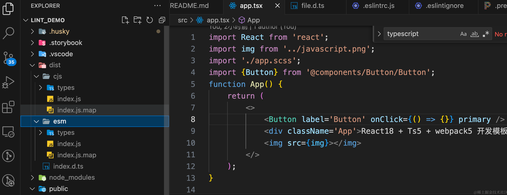

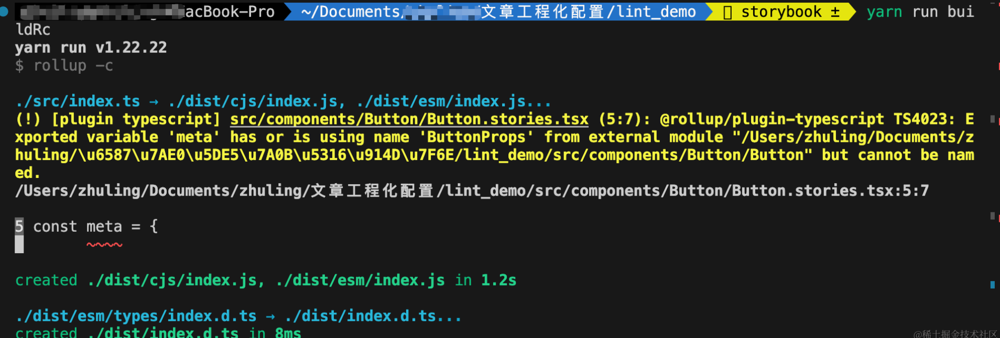

我们导出一下，警告就没有了

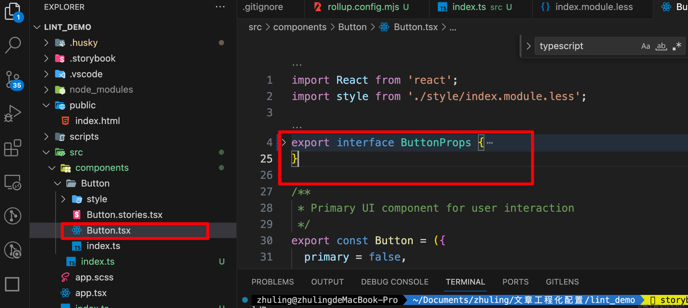


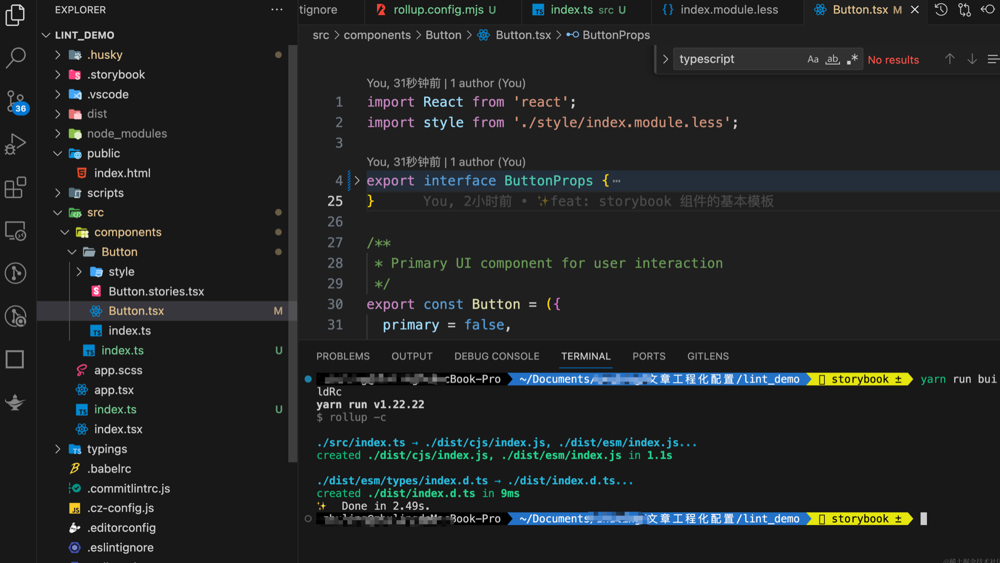

# 四、本地测试组件库
在当前项目
```
yarn link | npm link
```

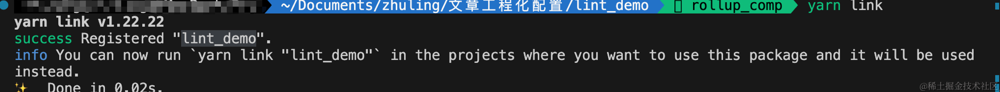
新建一个react项目进行测试

```
npx create-react-app test_comp --template typescript
```
进入 test_comp内进行link，注意lint_demo是pageage.json中的那么
```
yarn | npm link lint_demo
```

在app.tsx中引入
```tsx
import React from "react";
import logo from "./logo.svg";
import { Button } from "lint_demo";
import "./App.css";

function App() {
  return (
    <div className="App">
      <Button label="Button" onClick={() => {}} primary />
      <header className="App-header">
        
        <p>
          Edit <code>src/App.tsx</code> and save to reload.
        </p>
        <a
          className="App-link"
          href="https://reactjs.org"
          target="_blank"
          rel="noopener noreferrer"
        >
          Learn React
        </a>
      </header>
    </div>
  );
}

export default App;

```
效果如下：

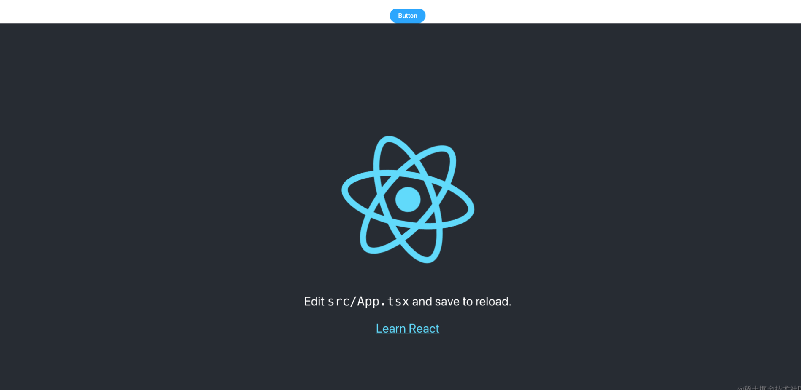


# 🍋 写在最后

如果您看到这里了，并且觉得这篇文章对您有所帮助，希望您能够点赞👍和收藏⭐支持一下作者🙇🙇🙇，感谢🍺🍺！如果文中有任何不准确之处，也欢迎您指正，共同进步。感谢您的阅读，期待您的点赞👍和收藏⭐！

感兴趣的同学可以关注下我的公众号ObjectX前端实验室


🌟 少走弯路 | ObjectX前端实验室 🛠️「精选资源｜实战经验｜技术洞见」
