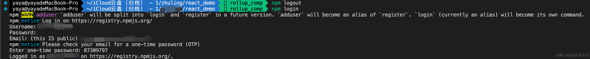
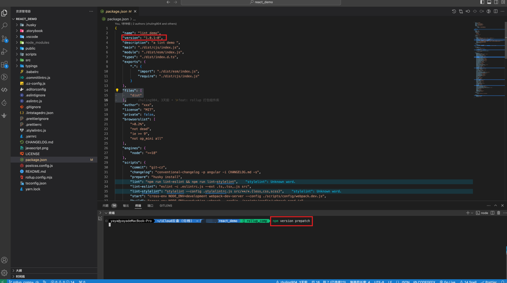
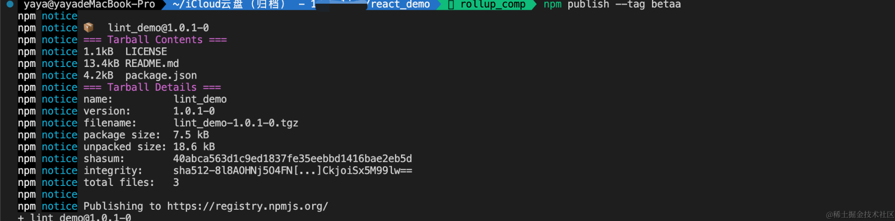
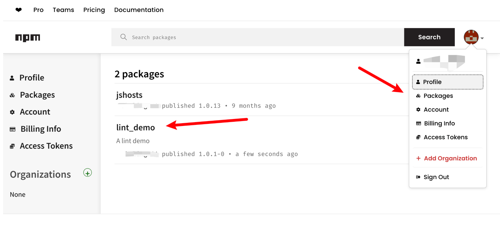
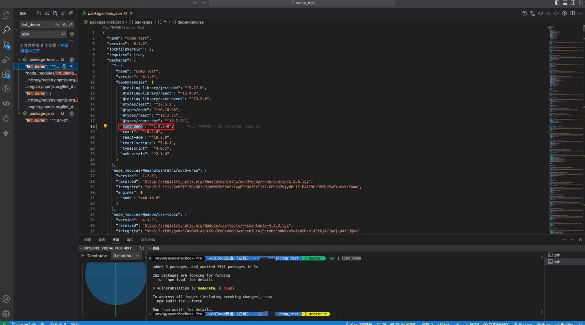
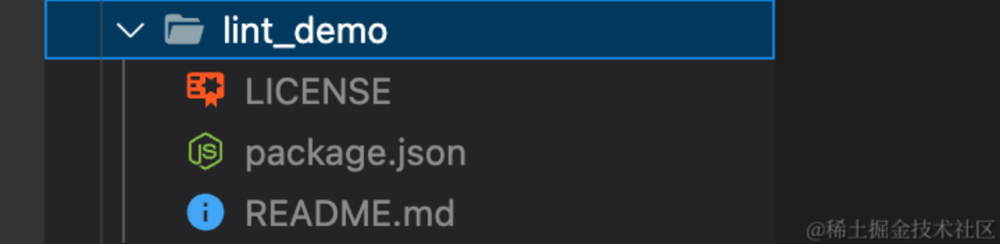
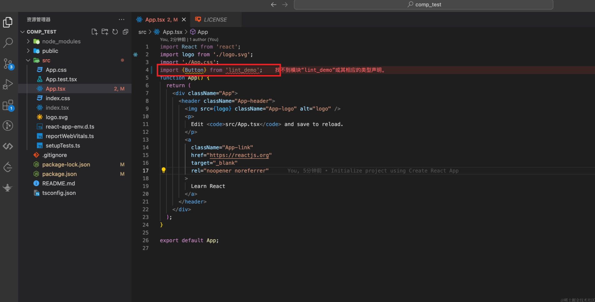
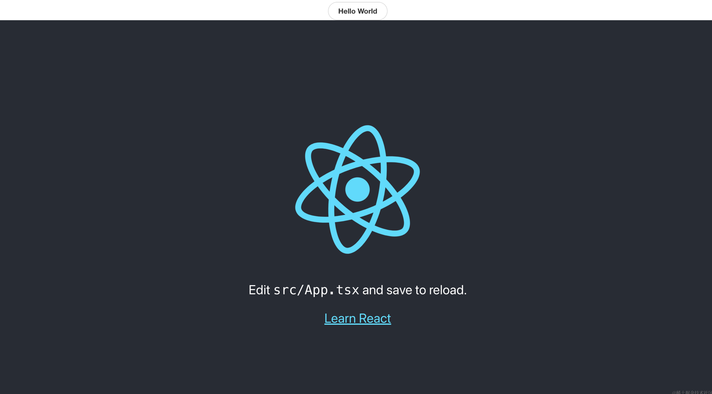

---
group:
  title: 00实战搭建&部署篇
  order: 0
title: 8.三大包管理器&npm工程化&发布流程
order: 8
# 这个可以将写的组件设置为demo在右侧展示
# demo: /
---
# 🍐 `npm`
## 1.`npm`简介
npm是JavaScript世界的包管理工具，是 Node.js 的一个模块，负责管理项目中的依赖包。npm 的功能很强大，可以安装、卸载、更新包。它允许我们在代码中引用项目需要的依赖包，并确保项目的依赖结构良好。

## 2.依赖管理原理&`npm install`发生了什么？

### 2.1 早期npm版本【递归】
早期版本如npm1，npm2等，使用的是递归的方式，按照包依赖的树形结构递归遍历安装，每个包和它依赖的包都将全部安装到本地的`node_modules`下。

如下的树状结构：
```
node_modules
└─ A@x.x.x
   ├─ index.js
   ├─ package.json
   └─ node_modules
      └─ B@x.x.x
         ├─ index.js
         ├─ node_modules
         └─ package.json
         C@x.x.x
         ├─ index.js
         ├─ node_modules
         └─ package.json

```
### 2.2 后续的npm版本npm3+【扁平化】
将包安装在项目顶层的`node_modules`中。当安装到相同模块时，判断已安装的模块版本是否符合新模块的版本范围，如果符合则跳过，不符合则在当前模块的`node_modules`下安装该模块。

如下D包的安装方式：

```
├── node_modules
│   ├── A@x.0.0
│   │    ├─ index.js
│   │    ├─ node_modules
│   │    │  ├─ D@1.0.0
│   │    │        ├─ index.js
│   │    │        ├─ node_modules
│   │    │        └─ package.json
│   │    └─ package.json
│   ├── B@x.0.0
│   │    ├─ index.js
│   │    ├─ node_modules
│   │    └─ package.json
│   ├── C@x.0.0
│   │    ├─ index.js
│   │    ├─ node_modules
│   │    └─ package.json
│   └── D@2.0.0
│        ├─ index.js
│        ├─ node_modules
│        └─ package.json

```

## 3.优缺缺点
### 3.1 递归
**优点：**
+ 层级结构清晰
+ 不存在兼容问题
+ 统一了操作行为和结构

**缺点：**
+ 相同模块大量冗余
+ 依赖包目录创建结构很深
### 3.2 扁平
扁平方式并没有完全解决模块重复的问题，如果每个模块依赖的D模块始终都和顶层`node_modules`中不一致，还是会一直安装重复的模块，

**优点：**
+ 层级嵌套较浅
+ 减小了磁盘占用

**缺点：**
+ 还是存在相同模块重复的情况
+ 依赖结构不清晰
+ 项目可以非法访问没有声明过的包
+ 比如：如果 A 依赖 B， B 依赖 C，那么 A 就算没有声明 C 的依赖，由于有依赖提升的存在，C 被装到了 A 的`node_modules`里面，那我在 A 里面用 C。在B更新后，可能存在使用新的C，不需要C，都会报错。

## 4.package-lock.json的诞生
项目可以非法访问没有声明过的包就是`package-lock.json`文件诞生的原因之一
+ **确定性版本控制**：
    -   `package-lock.json` 文件可以确保项目在不同环境中安装的依赖包版本是一致的，从而实现确定性版本控制。
+  **避免意外升级**：
    -   避免由于依赖包版本不固定导致的意外升级问题，保证在多人协作或多个环境中安装相同的依赖版本。
+  **减少不必要的冲突**：
    -   可以减少因依赖包版本冲突而导致的问题，通过锁定每个依赖包的确切版本，避免潜在的冲突。
+  **优化安装速度**：
    -   `package-lock.json` 文件提供了依赖包的详细信息，可以减少依赖包的下载和安装时间，因为 npm 可以直接使用锁定文件中的缓存信息。
+  **依赖树扁平化**：
    -   通过 `package-lock.json`，npm 可以更好地管理依赖树的结构，采用更加扁平化的安装方式，避免重复安装相同依赖的不同版本。
+  **增加安全性**：
    -   `package-lock.json` 可以帮助检测和防止依赖包的潜在安全漏洞，因为每个包及其依赖项的具体版本都会被记录下来。


# 🍎 `yarn`
## 1.`yarn`简介
Yarn是由Facebook、Google等公司联合推出的新一代JavaScript包管理工具，针对npm的一些缺点进行了改进，提供了更快、更安全的包管理体验。

## 2.依赖管理原理&`yarn install`发生了什么？
使用扁平化的安装模式跟上面后期的npm一致，

## 3.相对于`npm，yarn`有什么不同？

这些不同大部分都被后续npm的更新给覆盖了，但是并行下载的效率`yarn`还是要高一些

*  **安装速度优化**:`Yarn` 通过并行安装，即同时下载和安装多个依赖包，以及并行构建依赖树，从而加快了安装过程的速度。


*   **可预测性**: `Yarn` 使用 `yarn.lock` 文件来确保每次安装的依赖包版本一致，根据该文件精确地确定要安装的依赖版本，从而提高了项目的可重现性。


*  **依赖解析和版本管理**: `Yarn` 改进了依赖解析算法，有效地减少了依赖树的深度和宽度，优化了依赖包的冲突解决和版本管理，保证了依赖关系的稳定性。


*   **缓存机制**: `Yarn` 使用全局缓存目录，将重复下载的依赖包存储在本地，减少了网络请求，节省了时间和网络带宽。


*  **更好的用户体验**: `Yarn` 提供详细的日志信息，包括进度条、警告和错误信息，使开发者能够更方便地了解安装过程，定位和解决问题，提高了用户体验。


*   **离线模式**: `Yarn` 支持离线模式，通过预先下载依赖包并缓存它们，可以在没有网络连接的情况下仍然能够进行依赖包的安装，提供了更好的灵活性。


*   **Workspaces支持**: `Yarn` 的 Workspaces 功能允许开发者将多个相关的包一起管理，通过一次安装来处理多个包的依赖关系，简化了多包项目的管理流程。


## 4.优缺点
**优点**
+ npm扁平化的优点
+ 并行下载和本地缓存效率较高

**缺点：**
+ 还是存在幽灵依赖的问题
+ 并没有根本上解决npm的问题，仅提供了体验上的优化


# 🍑 `pnpm`
## 1.`pnpm`简介
pnpm是另一个流行的包管理器，其核心特点在于共享依赖，以及更加高效地管理依赖项。并且支持monorepo，使用硬链接的方式从根本上解决了幽灵依赖的问题。

## 2.硬链接&软连接
**硬链接**：
+ 硬链接是文件系统中的一种链接方式，它将一个文件与另一个文件的数据块连接在一起。
+ 硬链接指向文件的inode节点（在Linux的文件系统中，保存在磁盘分区中的文件不管是什么类型都给它分配一个编号，称为索引节点号(Inode Index)），因此原始文件和硬链接文件都指向相同的数据块。
+ 对一个文件的硬链接进行修改会影响其他所有硬链接，因为它们实际共享同一份数据。
+ 硬链接不能跨越文件系统，只能在同一个文件系统中创建。
+ 硬链接在文件系统中的应用可以节省存储空间，因为数据块不需要多次复制，而是在需要时被多个文件共享。当删除一个硬链接时，只有当所有相关的硬链接被删除后，文件的数据块才会真正释放，否则数据仍然存在于存储介质上。

**软链接（符号链接）** ：
+ 软链接是一种特殊的文件，其中存储了指向另一个文件的路径。
+ 软链接本身是一个独立的文件，它的内容是指向另一个文件的路径。如果原始文件更改位置或被删除，软链接就会失效。
+ 软链接可以跨越文件系统，因为它只存储目标文件的路径信息。

**主要区别：**

+ **数据共享**：硬链接共享相同的数据块，而软链接指向另一个文件。
+ **删除文件**：删除原始文件后，硬链接仍然可以访问数据，而软链接失效。
+ **跨文件系统**：硬链接不能跨文件系统，软链接可以在不同文件系统间创建链接。


## 3.依赖管理原理&`pnpm install`发生了什么？
pnpm安装的时候将包和包的依赖全都放置在同一个node_module下面，示例如下，硬连接就是同一个文件的不同引用，而软链接是新建一个文件，文件内容指向另一个路径，等于说就是我在某个全局的地方存储了所有包和依赖硬链接到了.pnpm下，然后我用link软链接去连接所有的包，构成原始的依赖结构。
```
├── node_modules
│   ├── A@x.0.0
│   │    ├─ index.js
│   │    ├─ node_modules
│   │    └─ package.json
│   ├── B@x.0.0
│   │    ├─ index.js
│   │    ├─ node_modules
│   │    └─ package.json
│   ├── C@x.0.0
│   │    ├─ index.js
│   │    ├─ node_modules
│   │    └─ package.json
│   ├── D@2.0.0
│   │     ├─ index.js
│   │     ├─ node_modules
│   │     └─ package.json
│   └── D@2.0.0
│        ├─ index.js
│        ├─ node_modules
│        └─ package.json
```

## 4.相对于`yarn、npm`，`pnpm`又优化了什么？
+ 节省磁盘空间
+ 解决了幽灵依赖当然lock文件也解决了这个问题。
+ 并且通过链接而不是复制的方式，更快。

## 5.缺点
没有在`pageage.json`中的包是不会被下载的，这导致使用某些第三方包的时候，如果在`pageage.json`未声明过，则不会下载，你会发现`npm|yarn`能跑，pnpm不能跑


# 🥝 npm工程管理
## 1.项目版本号管理
```
npm version (v)1.0.0  # 显示设置版本号为 1.0.0, v可要可不要
npm version major  # 大版本号加 1，其余版本号归 0
npm version minor  # 小版本号加 1，修订号归 0
npm version patch  # 修订号加 1

# 当前版本号为 1.0.0
npm version prepatch  # 版本号变为 1.0.0-0，也就是 1.0.0 版本的第一个预发布版本
npm version preminor  # 版本号变为 1.1.0-0，也就是 1.1.0 版本的第一个预发布版本
npm version premajor  # 版本号变为 2.0.0-0，也就是 2.0.0 版本的第一个预发布版本
npm version prerelease  # 版本号变为 2.0.0-1，也就是使预发布版本号加一

```
## 2.模块 tag 管理
在npm中，`tag` 是用于标记软件包版本的一种机制。每个发布的软件包都可以分配一个或多个标签，以便用户可以轻松地选择要安装的版本。默认情况下，npm会将`latest`标签分配给最新发布的版本，但用户也可以为特定版本分配自定义标签，例如`beta`、`alpha`等。

通过使用标签，开发人员可以在软件包的不同版本之间进行区分，同时也可以为测试版或预发布版分配特定的标签，以便用户知道这些版本可能不稳定或仍在开发中。标签还可以用于指定软件包的稳定版本和特定功能版本，让用户更容易地了解要安装的软件包版本。

基本操作
在npm中，可以使用以下命令来管理软件包的标签：

* **为软件包发布时指定标签：**

    ```
    npm publish --tag <tagname>
    ```

    这会将发布的软件包版本分配给指定的标签。

*  **查看已发布版本的标签：**

    ```
    npm dist-tag ls <package-name>
    ```

    这会列出指定软件包的所有已发布版本及其标签。

* **添加或更新标签：**

    ```
    npm dist-tag add <package-name>@<version> <tagname>
    ```

    这会为指定软件包的特定版本添加或更新标签。

*  **移除标签：**

    ```
    npm dist-tag rm <package-name> <tagname>
    ```

    这会移除指定软件包的标签。

*  **安装指定标签的软件包：**

    ```
    npm install <package-name>@<tagname>
    ```

    这会安装指定标签的软件包版本。

*  **将软件包标签为最新版本：**

    ```
    npm dist-tag add <package-name>@<version> latest
    ```

    这会将指定版本标记为`latest`，使其成为默认安装版本。

通过这些操作，开发人员可以更灵活地管理软件包的发布版本，并使用户能够方便地选择要安装的版本。

```
npm dist-tag ls 包名 # 查看包的tag

# 当前版本为1.0.1 
npm version prerelease # 1.0.2-0 
npm publish --tag beta 
npm dist-tag ls xxx # # beta: 1.0.2-0 
npm install xxx@beta # 下载beta版本 1.0.2-0
# 当`prerelease`版本已经稳定了，可以将`prerelease`版本设置为稳定版本：
npm dist-tag add xxx@1.0.2-0 latest
npm dist-tag ls xxx  # latest: 1.0.2-0
```

# 🍒 我们来发布一下之前创建的组件库模板
## 1.发布
先验证下npm是否已经登陆
```
npm who am i
```


如果没有登陆输入，根据提示输入用户名、密码、邮箱验证。
``` 
npm login
```




登录完成后我们配置需要上传到npm的文件，你可以选择在`pageage.json`文件中设置file字段，也可以配置`.npmignore`文件指定不需要发布的文件。
```
"files": [
	"dist"
],
```
`.npmignore`文件指定不需要发布的文件
```
node_modules
```
我们这里选择，files的配置方式。

先给我们的组件库模板设置一个版本号



发布并设置tag
```
npm publish --tag beta
```




我们去npm看一下，新发布的包是没办法搜到的，但是可以在个人中心查看。



## 2.安装测试组件库包
新建一个react项目
```
npx create-react-app --template typescript comp_test
```
安装一下我们的组件库包
```
npm i lint_demo
```



更改一下App.tsx，在引入的时候发现有报错，是因为我们忘记打包了





重新打包然后发布一下，重新安装。

```
npm i lint_demo@1.0.2-0   
```
App.tsx更改如下:
```tsx
import React from 'react';
import logo from './logo.svg';
import './App.css';
import {Button} from 'lint_demo';
function App() {
  return (
    <div className="App">
      <Button label='Hello World'></Button>
      <header className="App-header">
        
        <p>
          Edit <code>src/App.tsx</code> and save to reload.
        </p>
        <a
          className="App-link"
          href="https://reactjs.org"
          target="_blank"
          rel="noopener noreferrer"
        >
          Learn React
        </a>
      </header>
    </div>
  );
}

export default App;

```
`yarn start`效果如下





# 🍋 写在最后

如果您看到这里了，并且觉得这篇文章对您有所帮助，希望您能够点赞👍和收藏⭐支持一下作者🙇🙇🙇，感谢🍺🍺！如果文中有任何不准确之处，也欢迎您指正，共同进步。感谢您的阅读，期待您的点赞👍和收藏⭐！

感兴趣的同学可以关注下我的公众号ObjectX前端实验室


🌟 少走弯路 | ObjectX前端实验室 🛠️「精选资源｜实战经验｜技术洞见」
