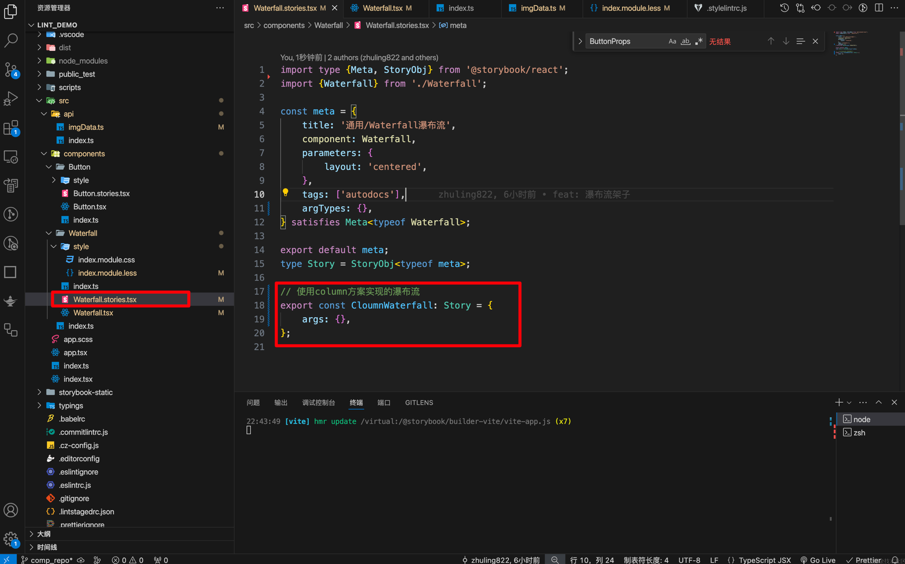
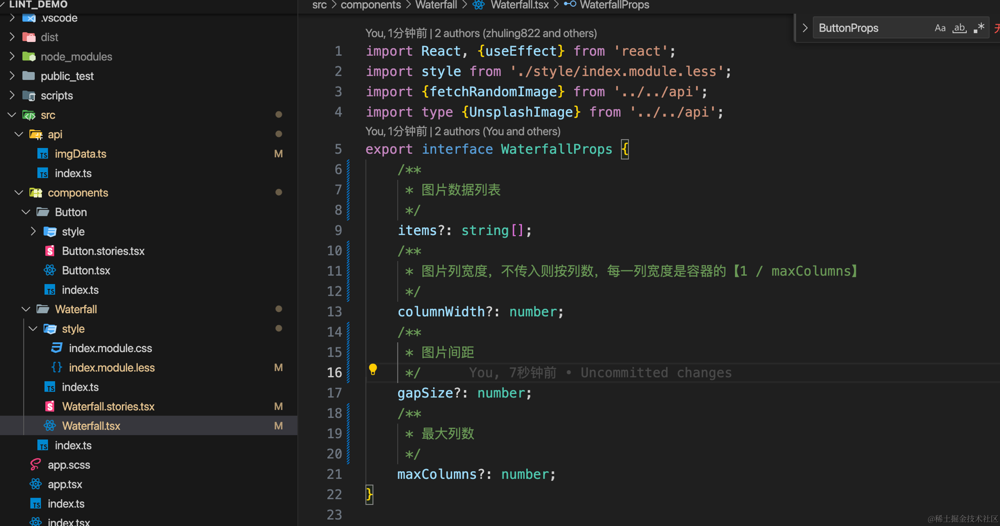
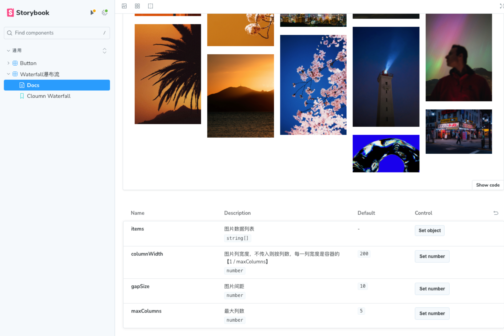
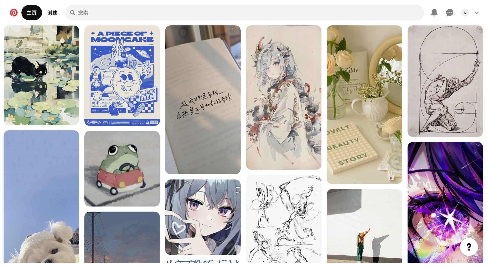
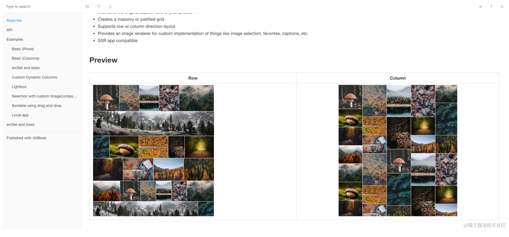
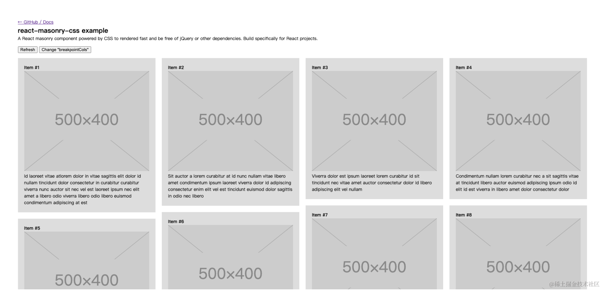
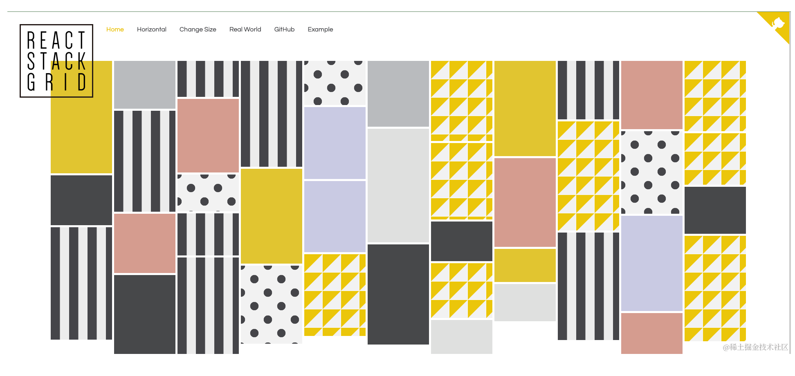
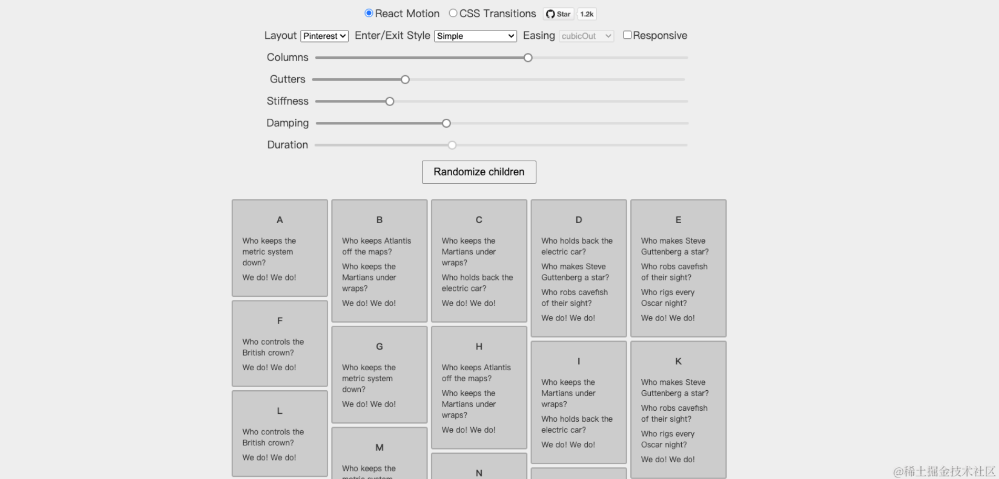

---
nav:
  title: 📚 常见组件实现
  order: 2
group:
  title: 1.瀑布流
  order: 0
title: 
order: 1
# 这个可以将写的组件设置为demo在右侧展示
# demo: /
---

# 瀑布流的几种实现方式
# 🥑 实现效果&代码
[在线demo体验](https://objectx-9.github.io/react_demo/?path=/docs/%E9%80%9A%E7%94%A8-button--docs)


# 🍐 一、storybook使用
安装和配置过程我们[之前](https://juejin.cn/post/7355026320088989733)已经搞定了，现在我们介绍如何书写。

`Storybook` 把同一个组件传入不同 `props` 的情况，叫做一个 `Story`，它会变成左侧的目录，通过目录可以访问到不同`props`下的组件的样式

一个组件包含多个 `Story`，一个文档里又包含多个组件，和一本书的目录差不多。
所以把这个工具叫做 `Storybook` ---神光




组件参数文档生成，注意注释一定要用多行注释的类型，`props`接口的定义为`组件名+Props`






# 🍑 二、瀑布流
## 1.瀑布流是个什么东西？
瀑布流布局（`Masonry Layout`），又称为砌石布局，是一种常用于网页设计中的布局方式。它通过模仿砌墙的方式，将元素（如图片、卡片或其他内容单元）按照不规则的列排布在页面上，每个元素的**高度**可以不同，但**宽度**通常保持一致，常见于图片分享网站、社交媒体平台和电子商务网站等，[Pinterest](https://www.pinterest.com/)是一个典型使用瀑布流布局的网站例子。这种布局方式强调内容的视觉吸引力，并通过不规则排列增加页面的趣味性和探索性。




## 2.特点
瀑布流布局的特点是：

-   **紧凑排列**：元素之间尽可能减少空隙，就像瀑布流水覆盖岩石一样连续且自然地流淌下来。
-   **不规则的网格**：与传统的网格布局相比，瀑布流布局中的单元块高度不一，创造视觉上的多样性和动态感。
-   **响应式设计**：在不同屏幕尺寸或者设备上，瀑布流布局可以通过调整列数来达到最佳浏览效果。


前端开发中实现瀑布流的方法通常有以下几种：

-   **CSS3的列属性**(`column-count`, `column-gap`, `column-fill`等)可以实现简单的瀑布流布局。
-   **JavaScript库**，比如Masonry、Isotope或者Salvattore等，可以提供更为复杂和灵活的瀑布流布局解决方案。
-   **Flexbox**和**Grid Layout**也可以用来实现类似瀑布流的布局，虽然可能需要一些额外的计算和排列逻辑。
## 2.优缺点
### 优点：

1.  **视觉吸引力**：瀑布流布局提供了一种视觉上吸引人的内容展示方式，特别是对于图片和视频等媒体内容，可以有效地吸引用户的注意力。
1.  **优化空间利用**：因为元素之间几乎没有空白，瀑布流布局最大限度地利用了屏幕的空间，展示更多的内容给用户。
1.  **响应式设计**：它可以根据不同屏幕尺寸自动调整列数和元素大小，提供良好的跨设备体验。
1.  **探索性**：不规则的布局增强了页面的探索性，能够鼓励用户滚动浏览更多的内容。
1.  **内容优先**：瀑布流布局强调内容的展示，使得用户能够快速浏览并发现他们感兴趣的项目。

### 缺点：

1.  **导航困难**：由于内容是不规则排列的，用户可能很难找到他们之前看过的特定项目。
1.  **加载性能**：页面在加载时可能会遇到性能问题，因为瀑布流布局涉及到大量的内容重排，在滚动浏览时可能出现卡顿。
1.  **复杂的实现**：正确实现瀑布流布局可能比简单的网格布局更复杂，尤其是当处理大量动态内容时。
1.  **SEO 不友好**：如果内容是异步加载的，爬虫可能无法有效地索引页面上的所有内容。
1.  **滚动无尽**：如果没有合适的加载更多内容的机制，用户可能会感到不断的滚动而难以到达页面底部，影响用户体验。
## 3.适用于哪些场景
适用于大量图片展示的场景，图片展示网站、社交媒体平台、个人或商业博客等等

# 🍉 三、`unsplash`请求图片
请求图片，`unsplash`请求任意图片，但是接口有请求限制，我这里直接用请求过的数据，`unsplash`图片加载很慢，能更大程度上暴露瀑布流可能遇到的问题。
```js
/**
 * 请求任意张图片
 * @returns
 */
export const fetchRandomImage = async (imgNums: number) => {
	// return IMG_DATA;
	// eslint-disable-next-line no-unreachable
	try {
		const res: I_ImgRes = await axios.get(
			'https://api.unsplash.com/photos/random',
			{
				params: {
					client_id: UNSPLASH_ACCESS_KEY, // 替换为你的Access Key
					count: imgNums,
				},
			},
		);
		return res.data.length !== 0 ? res?.data : [];
	} catch (error) {
		console.error('Error fetching image from Unsplash:', error);
	}
};
```
# 🥝 四、其他几种瀑布流的实现方式
## 1.column属性实现
### 效果
[在线demo体验](https://zhuling904.github.io/react_demo/?path=/story/%E9%80%9A%E7%94%A8-waterfall%E7%80%91%E5%B8%83%E6%B5%81--column-waterfall)


### 原理
`column` 属性是`CSS3`中引入的一个模块，它允许你将内容分为多列，就像报纸或杂志那样。这个属性可以让你轻松地创建多列布局，而不需要复杂的标记或脚本。`column` 属性包括几个子属性，用于控制列的数量、宽度、间距以及内容如何在这些列之间流动。

以下是一些常用的 `column` 子属性：

1.  `column-count`: 指定布局中的列数。例如，`column-count: 3;` 会将内容分为三列。
1.  `column-width`: 指定每列的理想宽度。浏览器会尝试创建至少这么宽的列，但如果空间不足，可能会创建更少的列。例如，`column-width: 200px;` 会尝试创建至少200像素宽的列。如果**不指定宽度则是按百分比**
1.  `column-gap`: 指定列与列之间的间距。例如，`column-gap: 20px;` 会在每列之间留下20像素的空白。
1.  `column-rule`: 这是一个简写属性，用于设置列之间的规则（即边框）的宽度、样式和颜色。例如，`column-rule: 1px solid black;` 会在每列之间添加一个1像素宽的黑色实线边框。
1.  `column-span`: 指定一个元素是否横跨所有列。例如，`column-span: all;` 会让一个元素横跨所有列，就像一个标题或广告横幅。
1.  `break-before`, `break-after`, `break-inside`: 这些属性控制内容如何在列、页面或区域之间断开。例如，`break-inside: avoid;` 会防止一个元素在列内部断开。

使用 `column` 属性可以创建出类似于瀑布流的效果，但它并不完全等同于瀑布流布局。瀑布流布局通常指的是一种不规则的、内容高度不一的布局，而 `column` 属性创建的是规则的、等宽的列。不过，通过结合使用 `column` 属性和其他CSS技巧，你也可以实现类似瀑布流的效果。
### 代码
#### `Waterfall.tsx`
组件仅仅用一个容器将图片项目包裹即可，其他的都是css实现，最容易

```js
import React, {useEffect} from 'react';
import style from './style/index.module.less';
import {fetchRandomImage} from '../../api';
import type {UnsplashImage} from '../../api';
export interface WaterfallProps {
	/**
	 * 图片数据列表
	 */
	items?: string[];
	/**
	 * 图片列宽度，不传入则按列数，每一列宽度是容器的【1 / maxColumns】
	 */
	columnWidth?: number;
	/**
	 * 图片间距
	 */
	gapSize?: number;
	/**
	 * 最大列数
	 */
	maxColumns?: number;
}

/**
 * 瀑布流组件
 */
export const Waterfall = ({
	items,
	columnWidth = 200,
	gapSize = 10,
	maxColumns = 5,
	...props
}: WaterfallProps) => {
	const [images, setImages] = React.useState<any>([]);

	useEffect(() => {
		const getImages = async () => {
			try {
				const imageUrls = await fetchRandomImage(10); // 获取30张图片
				setImages(imageUrls);
			} catch (error) {
				console.error('Error fetching images from Unsplash:', error);
			}
		};
		getImages();
	}, []);

	useEffect(() => {
		console.log('✅  ~ images:', images);
	}, [images]);
	return (
		<div className={style.container}>
			{images?.map((image: UnsplashImage, index: number) => {
				console.log('✅ ~  image:', image);

				return (
					<div key={`${image?.id}${index}`} className={style.item}>
						
					</div>
				);
			})}
		</div>
	);
};

```
#### index.module.less
通过`column-count`定义容器分为多少列，`column-gap`定义容器之间的间距，通过`break-inside: avoid`来避免内容在列内部断开，设置图片等比缩放，保证体验感，设置媒体查询，根据窗口大小调整列数量。
```less
.container {
	width: 100%; /* 容器宽度 */
	column-count: 5; /* 定义列数 */
	column-gap: 16px; /* 列与列之间的间距 */

	.item {
		break-inside: avoid; /* 防止内容在列内部断开 */
		margin-bottom: 16px; /* 每个项目之间的间距 */

		img {
			width: 100%; /* 图片宽度填满列宽 */
			height: auto; /* 保持图片宽高比 */
		}
	}
}

/* 为了响应式设计，你可以使用媒体查询来改变列数 */
@media (width <= 1000px) {
	/* stylelint-disable-next-line rule-empty-line-before */
	.container {
		column-count: 4;
	}
}

@media (width <= 800px) {
	/* stylelint-disable-next-line rule-empty-line-before */
	.container {
		column-count: 3;
	}
}

@media (width <= 600px) {
	/* stylelint-disable-next-line rule-empty-line-before */
	.container {
		column-count: 2;
	}
}

@media (width <= 400px) {
	/* stylelint-disable-next-line rule-empty-line-before */
	.container {
		column-count: 1;
	}
}

```

### 优缺点
优点：

1.  **简单易用**：`column`属性提供了一种简单的方法来创建多列布局，不需要复杂的JavaScript或额外的HTML结构。
1.  **响应式布局**：通过结合媒体查询，你可以轻松地创建响应式多列布局，使得布局能够适应不同的屏幕尺寸和设备。
1.  **内容流动性**：内容会自动填充到各个列中，无需手动计算位置，这使得布局更加灵活和动态。
1.  **浏览器支持**：现代浏览器对`column`属性的支持良好，这意味着大多数用户都能看到预期的布局效果。

缺点：

1.  **固定列数**：使用`column-count`时，列数是固定的，这可能不适用于所有内容，特别是当内容高度不一致时。
1.  **不规则布局限制**：`column`属性创建的是规则的列布局，而不是真正的瀑布流布局，后者通常具有不规则的列宽和高度。
1.  **内容断开**：在某些情况下，内容的自然阅读流程可能会被列的断开所打断，特别是当内容在不应该断开的地方被分割时，这个配置`break-inside: avoid`可以防止内容在列内部断开
1.  **交互性限制**：如果需要在列之间进行复杂的交互（如拖放、排序等），`column`属性可能无法提供足够的支持，并且排列规律永远都是先上下再左右。
1.  **兼容性问题**：虽然现代浏览器支持良好，但一些旧版本的浏览器可能不完全支持`column`属性，这可能导致在这些浏览器上的布局出现问题。
1.  **性能考虑**：对于大量内容的布局，使用`column`属性可能会影响性能，尤其是在处理大量动态内容时。
## 2.flex瀑布流实现方式
### 效果
[在线demo体验](https://zhuling904.github.io/react_demo/?path=/story/%E9%80%9A%E7%94%A8-waterfall%E7%80%91%E5%B8%83%E6%B5%81--flex-waterfall)


### 原理
用一个大的flex容器，设置主轴方向为`row`，根据`props`中的最大列数创建小的子集容器，设置主轴方向为`column`，从上到下，从左到右渲染图片，需要自行切割图片数据放入不同的列中，存在一种情况就是，如果切割后的数据总长度是相等的，那么瀑布流最后的长度就是一致的。


### 代码
#### index.tsx
主要是监听`resize`重置列数，根据props动态生成列容器
```tsx
const flexTypeRender = (options: WaterfallProps) => {
	const {items = [], maxColumns} = options;
	const [newMaxColumns, setNewMaxColumns] = useState(maxColumns ?? 5);
	useEffect(() => {
		const handleResize = () => {
			if (window.innerWidth < 600) {
				setNewMaxColumns(2);
			} else if (window.innerWidth < 800) {
				setNewMaxColumns(3);
			} else if (window.innerWidth < 1000) {
				setNewMaxColumns(4);
			} else if (window.innerWidth < 1200) {
				setNewMaxColumns(5);
			}
		};
		window.addEventListener('resize', handleResize);
		handleResize();
		return () => {
			window.removeEventListener('resize', handleResize);
		};
	}, []);

	return (
		<div className={style.flexContainer}>
			{Array(newMaxColumns)
				.fill(0)
				?.map((item, index) => {
					return (
						<div className={style.childContainer} key={index}>
							{shuffleArray(items)?.map(
								(image: UnsplashImage, index: number) => {
									return (
										<div key={`${image?.id}${index}`} className={style.item}>
											
										</div>
									);
								},
							)}
						</div>
					);
				})}
		</div>
	);
};
```
#### index.less
设置瀑布流容器主轴方向为`row`，图片等比缩放。
```less
.flexContainer {
	display: flex;
	flex-direction: row;
	width: 100%;

	.childContainer {
		flex: 1 1 1;
		margin-left: 10px;
    
		.item {
			flex: '0 0 auto';
			width: '100%';

			img {
				width: 100%; /* 图片宽度填满列宽 */
				height: auto; /* 保持图片宽高比 */
			}
		}
	}
}
```
### 优缺点
**优点**

1.  **布局灵活**：Flexbox 布局可以很容易地适应各种屏幕尺寸和分辨率。通过调整容器的 `flex` 属性，可以实现自适应布局。
1.  **实现简单**：利用 Flexbox 的特性，可以较为容易地实现从左到右、从上到下的布局，不需要复杂的计算和手动调整。
1.  **自动换行**：当图片过多时，主容器可以自动换行，继续放置新的图片，不会超出容器范围。
1.  **简化样式控制**：只需控制主容器和子容器的 `flex` 属性，就可以实现布局，不需要太多额外的 CSS 样式。

**缺点**

1.  **列高度不一致**：由于图片高度不同，各列的高度可能会不一致，导致布局不整齐，视觉效果不佳。
1.  **性能问题**：当图片较多时，每次重新渲染都会影响性能。Flexbox 布局在处理大量元素时，性能可能不如其他布局方案（如 Masonry）。
1.  **图片加载顺序**：在网络状况较差或图片较大时，图片加载顺序可能会影响布局，导致图片在渲染时跳动。
1.  **复杂的列数控制**：需要根据 `props` 动态创建子容器并控制每列的图片数量，这增加了代码复杂性。


## 3.grid瀑布流实现方式
### 效果
[在线demo体验](https://zhuling904.github.io/react_demo/?path=/story/%E9%80%9A%E7%94%A8-waterfall%E7%80%91%E5%B8%83%E6%B5%81--grid-waterfall)


### 原理
先给网格设置一个默认的行高`grid-auto-rows: 10px`，然后在图片加载完成后去计算计算图片真实占据的高度

```js
// 缓存计算，避免重复计算
	const calcRows = useCallback(() => {
		const gridContainerNode = gridContainer.current;
		if (gridContainerNode === null) return;

		const itemNodes = gridContainerNode.querySelectorAll(`.${style.item}`);
		const cols =
			getComputedStyle(gridContainerNode).gridTemplateColumns.split(' ').length;
		// 计算每个项目占据的位置
		itemNodes.forEach((item, index) => {
			const gapRows = index >= cols ? 8 : 0;
			const rows = Math.ceil((item.clientHeight + gapRows) / 10);
			(item as HTMLDivElement).style.gridRowEnd = `span ${rows}`;
		});
	}, []);
```

### 代码
#### index.tsx
```tsx
const gridTypeRender = (options: WaterfallProps) => {
	const {items = []} = options;
	const gridContainer = useRef<HTMLDivElement>(null);
	const [imagesLoaded, setImagesLoaded] = useState(false);

	// 缓存计算，避免重复计算
	const calcRows = useCallback(() => {
		const gridContainerNode = gridContainer.current;
		if (gridContainerNode === null) return;

		const itemNodes = gridContainerNode.querySelectorAll(`.${style.item}`);
		const cols =
			getComputedStyle(gridContainerNode).gridTemplateColumns.split(' ').length;
		// 计算每个项目占据的位置
		itemNodes.forEach((item, index) => {
			const gapRows = index >= cols ? 8 : 0;
			const rows = Math.ceil((item.clientHeight + gapRows) / 10);
			(item as HTMLDivElement).style.gridRowEnd = `span ${rows}`;
		});
	}, []);

	useEffect(() => {
		// 确保图片加载完成后再去计算布局
		if (imagesLoaded) {
			calcRows();
			const handleResize = () => {
				// 浏览器空闲计算布局
				requestAnimationFrame(calcRows);
			};

			window.addEventListener('resize', handleResize);
			return () => {
				window.removeEventListener('resize', handleResize);
			};
		}
	}, [imagesLoaded, calcRows]);

	// 图片加载完成后再去计算布局，useCallback避免重复计算
	const handleImageLoad = useCallback(() => {
		const totalImages = items.length;
		let loadedImages = 0;

		return () => {
			loadedImages++;
			if (loadedImages === totalImages) {
				setImagesLoaded(true);
			}
		};
	}, [items.length]);

	const onLoad = handleImageLoad();

	return (
		<div className={style.gridContainer} ref={gridContainer}>
			{shuffleArray(items).map((image: UnsplashImage, index: number) => (
				<div key={`${image?.id}${index}`} className={style.item}>
					
				</div>
			))}
		</div>
	);
};

```
#### index.less
```less
.gridContainer {
	display: grid;
	grid-auto-rows: 10px;
	grid-gap: 0 10px;
	grid-template-columns: repeat(4, 1fr);
	align-items: end;

	.item {
		display: flex;
		align-items: center;
		justify-content: center;
		background: #f8f8fa;

		img {
			width: 100%; /* 图片宽度填满列宽 */
			height: auto; /* 保持图片宽高比 */
		}
	}
}

```
### 优缺点
**优点**

1.  **简单实现**：这种方法比较直观，可以通过计算每张图片的高度来动态调整布局。
1.  **较好控制布局**：通过这种方法可以精确控制每张图片在网格中的位置和大小，确保瀑布流的布局效果。
1.  **响应式支持**：这种方法在响应式设计中表现良好，可以根据不同的屏幕尺寸动态调整图片的排列方式。

**缺点**

1.  **性能问题**：在大量图片加载时，计算每张图片的高度会增加浏览器的计算量，可能会导致页面的性能下降，特别是在低性能设备上。
1.  **布局抖动**：在图片加载过程中，网格的高度会不断调整，可能会导致布局抖动（reflow），影响用户体验。
1.  **延迟显示**：由于需要等待图片加载完成才能计算高度，可能会导致图片显示延迟，用户在图片未加载完成时会看到空白区域或占位符。
1.  **代码复杂度增加**：实现这种布局需要编写额外的 JavaScript 代码来处理图片加载和高度计算，增加了代码的复杂度和维护成本。
## 4.原生js封装实现
### 效果
[在线体验demo](https://zhuling904.github.io/react_demo/?path=/story/%E9%80%9A%E7%94%A8-waterfall%E7%80%91%E5%B8%83%E6%B5%81--js-waterfall)


### 原理
先给每一个项目设置一个默认高度，使用一个数据记录每一列的高度，每次将新插入的图片放入高度最低的一列，重新计算该列高度。循环插入即可。

### 代码
#### 核心类实现
其中实现了增量渲染、触底增加、动态渲染，
+ 动态渲染：主要是在图片加载完成后再加入容器
+ 触底增加&触底缓冲：主要根据滚动位置判断是否到底部了，如果到底部了，再次请求数据插入容器中，判断中增加一个缓冲高度，在用户即将触底之前提前请求，保证组件的流畅
+ 增量渲染：主要是使用一个变量保存当前渲染到的节点的`index`，每次判断是否是新增，从当前渲染开始重新计算，仅计算新增的。

触底更新代码：
```js
// 触底增加数据
	const handScorllAddData = async () => {
		const scrollTop = document.documentElement.scrollTop;
		const clientHeight = document.documentElement.clientHeight;
		const scrollHeight = document.body.scrollHeight;
		const buffer = 50; // 缓冲区距离
		console.log(
			`Scroll Top: ${scrollTop}, Client Height: ${clientHeight}, Scroll Height: ${scrollHeight}`,
		);

		if (scrollTop + clientHeight >= scrollHeight - buffer && !loading) {
			loading = true;
			console.log('触底，开始加载数据...');
			await getData(5);
			loading = false;
			console.log('数据加载完成');
		}
	};
```
核心类完整代码
```js
export class WaterFall {
	gap: number; // 间距
	container: HTMLDivElement; // 容器
	heightArr: number[]; // 保存每列的高度信息
	items: HTMLCollection; // 子节点
	renderIndex: number; // 保存已经渲染了的节点
	constructor(container: HTMLDivElement, options: {gap: number}) {
		this.gap = options?.gap ?? 0; // 间距
		this.container = container; // 容器
		this.heightArr = []; // 保存每列的高度信息
		this.items = container.children; // 子节点
		this.renderIndex = 0;
		this.container.addEventListener('resize', () => {
			this.heightArr = [];
			this.layout();
		});
		// 监听节点生成和卸载
		this.container.addEventListener('DOMSubtreeModified', () => {
			this.layout();
		});
	}

	getMaxHeight(heightArr: number[]) {
		let maxHeight = heightArr[0];
		for (let i = 1; i < heightArr.length; i++) {
			if (heightArr[i] > maxHeight) {
				maxHeight = heightArr[i];
			}
		}
		return maxHeight;
	}

	// 计算高度最小的列
	getMinIndex(heightArr: number[]) {
		let minIndex = 0;
		let min = heightArr[minIndex];
		for (let i = 1; i < heightArr.length; i++) {
			if (heightArr[i] < min) {
				min = heightArr[i];
				minIndex = i;
			}
		}
		return minIndex;
	}

	layout() {
		if (this.items.length === 0) return;
		const gap = this.gap;
		const pageWidth = this.container?.offsetWidth || 1000;
		const itemWidth = (this.items[0] as HTMLDivElement).offsetWidth;
		const columns = Math.ceil(pageWidth / (itemWidth + gap)) ?? 5; // 总共有多少列

		// 增量加载
		while (this.renderIndex < this.items.length) {
			let top, left;
			const curItem = this.items[this.renderIndex] as HTMLDivElement;
			const curImgItem = curItem.children[0] as HTMLImageElement;
			// 之前插入的时候我们给item设置了默认值，这我们需要将图片高度设置给item
			curItem.style.height = curImgItem.offsetHeight + 'px';
			curItem.style.width = curImgItem.offsetWidth + 'px';
			if (this.renderIndex < columns) {
				// 第一列
				top = 0;
				left = (itemWidth + gap) * this.renderIndex;
				this.heightArr[this.renderIndex] = curImgItem.offsetHeight;
			} else {
				// 找到高度最小的一列
				const minIndex = this.getMinIndex(this.heightArr);
				// 属于那一列，获取第一个元素，要获取left
				const whichColumnFirstItem = this.items[minIndex] as HTMLDivElement;

				top = this.heightArr[minIndex] + gap;
				left = whichColumnFirstItem.offsetLeft;
				// 重新计算当前插入列的高度
				this.heightArr[minIndex] += curImgItem.offsetHeight + gap;
			}

			curItem.style.top = top + 'px';
			curItem.style.left = left + 'px';
			this.renderIndex++;
		}
	}
}

```

#### index.tsx
```tsx
const jsTypeRender = (options: WaterfallProps) => {
	let loading = false;
	const {items = []} = options;
	const jsContainer = useRef<HTMLDivElement>(null);

	// 获取1-400之间的任意高度
	const getRandomHeight = (min = 1, max = 4) => {
		return (Math.floor(Math.random() * (max - min + 1)) + min) * 100;
	};

	// 生成随机的柔和颜色
	const getRandomColor = () => {
		const hue = Math.floor(Math.random() * 360); // 0到360度
		const saturation = Math.floor(Math.random() * 20) + 70; // 70%到90%的饱和度
		const lightness = Math.floor(Math.random() * 20) + 70; // 70%到90%的亮度
		return `hsl(${hue}, ${saturation}%, ${lightness}%)`;
	};

	// 模拟异步请求数据
	async function getData(num = 5) {
		console.log('✅ ~ 请求数据num:', num);
		const jsContainerNode = jsContainer.current;
		if (jsContainerNode === null) return;
		const images = (await fetchRandomImage(num)) as UnsplashImage[];
		for (let i = 0; i < images.length; i++) {
			const div = document.createElement('div');
			div.className = `${style.jsItem}`;
			const img = new Image();
			img.src = images[i].urls.full;
			// 等待图片加载完成，将图片依次插入到容器中
			img.onload = () => {
				const fragment = document.createDocumentFragment();
				div.className = `${style.jsItem}`;
				div.style.height = getRandomHeight(4, 1) + 'px';
				div.style.backgroundColor = getRandomColor(); // 设置随机颜色
				div.style.backgroundColor = getRandomColor(); // 设置随机颜色
				div.appendChild(img);
				fragment.appendChild(div);
				jsContainerNode.appendChild(fragment);
			};
			img.onerror = () => {
				console.error('Image failed to load');
			};
		}
	}

	// 触底增加数据
	const handScorllAddData = async () => {
		const scrollTop = document.documentElement.scrollTop;
		const clientHeight = document.documentElement.clientHeight;
		const scrollHeight = document.body.scrollHeight;
		const buffer = 50; // 缓冲区距离
		console.log(
			`Scroll Top: ${scrollTop}, Client Height: ${clientHeight}, Scroll Height: ${scrollHeight}`,
		);

		if (scrollTop + clientHeight >= scrollHeight - buffer && !loading) {
			loading = true;
			console.log('触底，开始加载数据...');
			await getData(5);
			loading = false;
			console.log('数据加载完成');
		}
	};

	// 先获取20条数据
	useEffect(() => {
		getData(20);
	}, []);

	// 渲染绘制
	useEffect(() => {
		const jsContainerNode = jsContainer.current;
		if (jsContainerNode === null) return;
		const water = new WaterFall(jsContainerNode, {gap: 10});
		water.layout();
	}, [items]);

	// 触底增加
	useEffect(() => {
		const onScroll = () => {
			console.log('滚动事件触发');
			handScorllAddData();
		};

		window.addEventListener('scroll', onScroll);

		return () => {
			window.removeEventListener('scroll', onScroll);
		};
	}, []);

	return <div className={style.jsContainer} ref={jsContainer}></div>;
};
```

#### index.less
```less
.jsContainer {
	position: relative;
	width: 900px;

	.jsItem {
		position: absolute;
		display: flex;
		align-items: center;
		justify-content: center;
		width: 200px;
		margin-bottom: 10px;
		overflow: hidden;
		color: white;
		font-size: 18px;
		background: rgb(236 146 10);
		transition: all 0.1s;

		.jsTag {
			position: absolute;
			top: 2px;
			left: 2px;
			color: white;
		}

		img {
			width: 100%;
			height: auto;
		}
	}
}
```
### 优缺点
**优点**

1.  **均匀分布**：每次插入图片时都能选择当前高度最低的列，从而使各列的高度更加均匀，避免出现某列高度明显高于其他列的情况。
1.  **简单实现**：这种方法逻辑简单，通过记录每列的高度，插入图片时只需比较并更新高度，容易实现和维护。
1.  **性能较好**：相比于其他复杂的瀑布流算法，这种方法对计算资源的消耗较少，适用于图片数量较多的场景。
1.  **动态适应**：能够适应不同高度的图片，灵活性较高，不需要对图片进行预处理。

**缺点**

1.  **高度不精确**：默认高度只是一个估算值，实际图片加载后可能与预期高度不一致，导致布局出现错位或不美观的情况。
1.  **首次加载性能问题**：在首次加载时，可能会出现由于所有图片同时设置默认高度而导致的布局抖动问题，需要等待图片实际加载完成后重新调整高度。
1.  **重新渲染开销**：当图片实际加载高度与默认高度不符时，需要重新计算并调整布局，可能会引起页面重新渲染，增加开销。
1.  **维护列高度数据**：需要持续维护每列的高度数据，若图片数量较多或频繁更新，数据维护工作量较大。
# 🍒 五、第三方库实现
## react-photo-gallery

  -   GitHub: <https://github.com/neptunian/react-photo-gallery> 这个组件提供了一个灵活的图片展示方式，支持瀑布流布局。


## react-masonry-css

  -   GitHub: <https://github.com/paulcollett/react-masonry-css>这是一个基于CSS的瀑布流布局组件，不依赖额外的JavaScript库。



## react-stack-grid

  -   GitHub: <https://github.com/tsuyoshiwada/react-stack-grid>
这是一个提供了Pinterest风格的瀑布流布局的组件。




## react-stonecutter

  -   GitHub: <https://github.com/dantrain/react-stonecutter>
这是一个用于创建动态网格布局的组件库，包括瀑布流布局。



# 🍎 推荐阅读
## 工程化
本系列是一个从0到1的实现过程，如果您有耐心跟着实现，您可以实现一个完整的`react18 + ts5 + webpack5 + 代码质量&代码风格检测&自动修复 + storybook8 + rollup + git action`实现的一个完整的组件库模板项目。如果您不打算自己配置，也可以直接clone[组件库仓库](https://objectx-9.github.io/react_demo/?path=/docs/%E9%80%9A%E7%94%A8-button--docs)切换到`rollup_comp`分支即是完整的项目，当前实现已经足够个人使用，后续我们会新增webpack5优化、按需加载组件、实现一些常见的组件封装：包括但不限于拖拽排序、瀑布流、穿梭框、弹窗等  
*   [【前端工程化】项目搭建篇-项目初始化&prettier、eslint、stylelint、lint-staged、husky](https://juejin.cn/post/7353504333999505408)
*   [【前端工程化】项目搭建篇-配置changelog、webpack5打包](https://juejin.cn/post/7353561676091097103)
*   [【前端工程化】项目搭建篇-引入react、ts、babel解析es6+、配置css module](https://juejin.cn/post/7353963878541246504)
*   [【前端工程化】组件库搭建篇-引入storybook、rollup打包组件、本地测试组件库](https://juejin.cn/post/7355026320088989733)
*   [【前端工程化】包管理器篇-三大包管理器、npm工程管理、npm发布流程](https://juejin.cn/post/7356175306937466916)
*   [【前端工程化】自动化篇-Github Action基本使用、自动部署组件库文档、github3D指标统计](https://juejin.cn/post/7356815857078157331)
*   [【前端工程化】自动化篇-手写脚本一键自动tag、发包、引导登录npm](https://juejin.cn/post/7366601730426159144)
## 常见组件实现
*   [【组件实现篇】"从零使用react打造瀑布流的四种方式：完美展示动态图片流"](https://juejin.cn/post/7370513151052021787)
## 面试手写系列
*   [前端面试手写必备【实现常见八大数据结构一】](https://juejin.cn/post/7353504333999505408)
*   [手写哈希表【银四末尾，你上岸了吗？】哈希表，快速计算、均匀分布、扩容实现](https://juejin.cn/post/7359877430340157503)
*   [【前端面试手写必备】树🌲&实现树结构](https://juejin.cn/post/7370513151052038171)
## react实现原理系列
*   [【react原理实践】使用babel手搓探索下jsx的原理](https://juejin.cn/spost/7360512664316117026)
*   [【喂饭式调试react源码】上手调试源码探究jsx原理](https://juejin.cn/spost/7361284455535345699)
*   [【上手调试源码系列】图解react几个核心包之间的关联](https://juejin.cn/spost/7363220284503097354#heading-0)
*   [【上手调试源码系列】react启动流程，其实就是创建三大全局对象](https://juejin.cn/post/7363193808521199655#heading-1)
## 其他
*   [工作流【效率小技巧】让alfred帮我启动所有项目，nice](https://juejin.cn/post/7358709354424860707)
*   [GPT4前端食用指南](https://juejin.cn/post/7352045198854406183)


# 🍋 写在最后

如果您看到这里了，并且觉得这篇文章对您有所帮助，希望您能够点赞👍和收藏⭐支持一下作者🙇🙇🙇，感谢🍺🍺！如果文中有任何不准确之处，也欢迎您指正，共同进步。感谢您的阅读，期待您的点赞👍和收藏⭐！

感兴趣的同学可以关注下我的公众号ObjectX前端实验室


🌟 少走弯路 | ObjectX前端实验室 🛠️「精选资源｜实战经验｜技术洞见」
