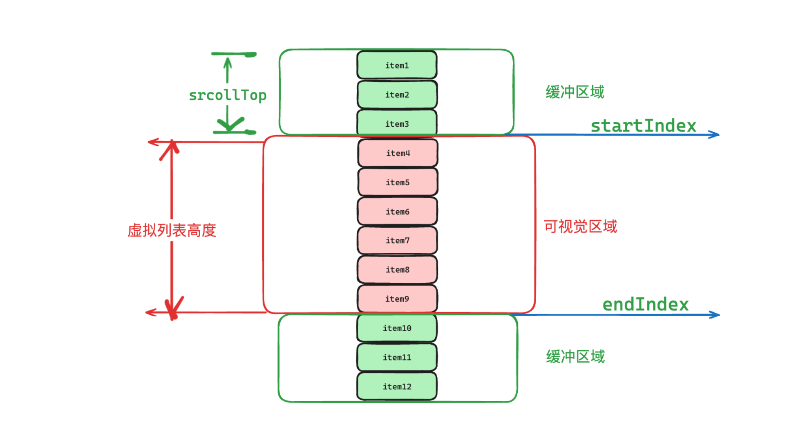
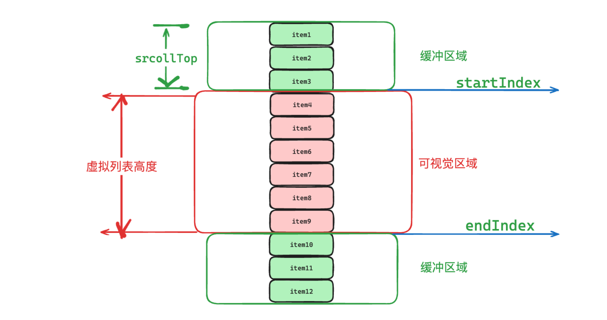
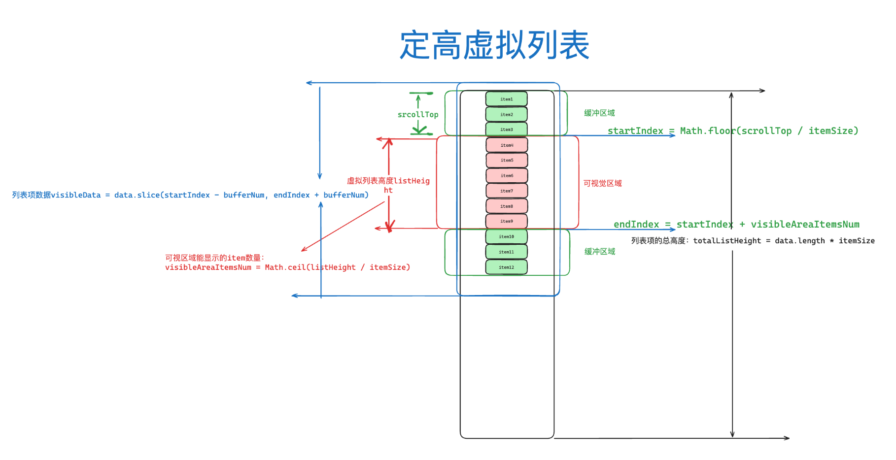
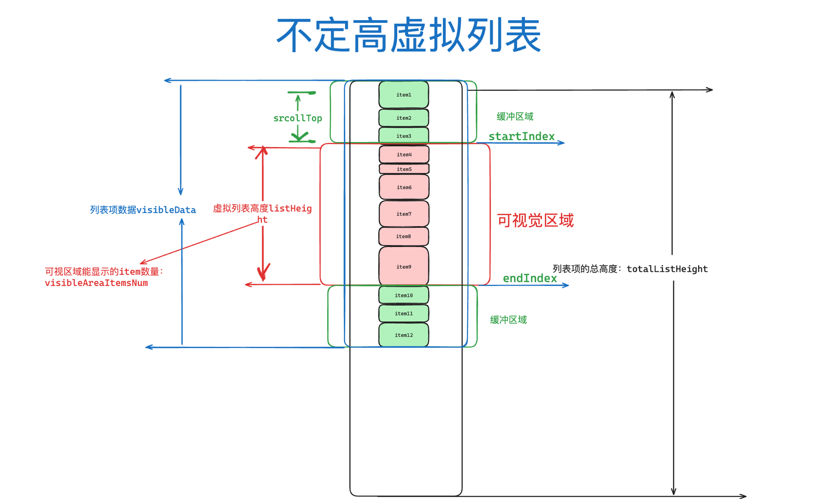
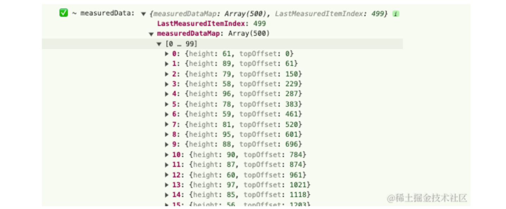
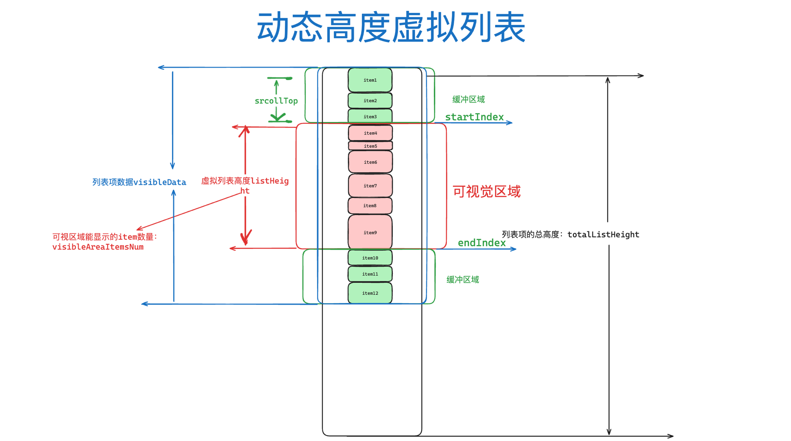

---
group:
  title: 2.虚拟列表
  order: 1
title: 虚拟列表的几种实现方式
order: 1
# 这个可以将写的组件设置为demo在右侧展示
# demo: /
---

# 虚拟列表的几种实现方式
## 🥑 实现效果&代码
[在线demo体验](https://github.com/ObjectX-9/react_demo)

## 定高


## 不定高


## 动态高度


# 工程化
本系列是一个从0到1的实现过程，如果您有耐心跟着实现，您可以实现一个完整的`react18 + ts5 + webpack5 + 代码质量&代码风格检测&自动修复 + storybook8 + rollup + git action`实现的一个完整的组件库模板项目。如果您不打算自己配置，也可以直接clone[组件库仓库](https://github.com/ObjectX-9/react_demo)切换到`rollup_comp`分支即是完整的项目，当前实现已经足够个人使用，后续我们会新增webpack5优化、按需加载组件、实现一些常见的组件封装：包括但不限于拖拽排序、瀑布流、穿梭框、弹窗等  
*   [【前端工程化】项目搭建篇-项目初始化&prettier、eslint、stylelint、lint-staged、husky](https://juejin.cn/post/7353504333999505408)
*   [【前端工程化】项目搭建篇-配置changelog、webpack5打包](https://juejin.cn/post/7353561676091097103)
*   [【前端工程化】项目搭建篇-引入react、ts、babel解析es6+、配置css module](https://juejin.cn/post/7353963878541246504)
*   [【前端工程化】组件库搭建篇-引入storybook、rollup打包组件、本地测试组件库](https://juejin.cn/post/7355026320088989733)
*   [【前端工程化】包管理器篇-三大包管理器、npm工程管理、npm发布流程](https://juejin.cn/post/7356175306937466916)
*   [【前端工程化】自动化篇-Github Action基本使用、自动部署组件库文档、github3D指标统计](https://juejin.cn/post/7356815857078157331)
*   [【前端工程化】自动化篇-手写脚本一键自动tag、发包、引导登录npm](https://juejin.cn/post/7366601730426159144)

**常见组件实现**
*   [【组件实现篇】"从零使用react打造瀑布流的四种方式：完美展示动态图片流"](https://juejin.cn/post/7370513151052021787)
*   [【组件实现篇】定高、不定高、动态高度虚拟列表实现](https://juejin.cn/post/7372488623944728585)

# 一、虚拟列表
## 什么是虚拟列表
`虚拟列表`其实是按需显示的一种实现，即只对`可见区域`进行渲染，对`非可见区域`中的数据不渲染或部分渲染，也就是设置缓冲区，从而达到极高的渲染性能。如下图所示，未滚动的时候上缓冲区是没有的，虚拟列表有三种情况
+ 定高虚拟列表，每一项的高度固定，可以很容易计算
+ 不定高虚拟列表，每一项的高度是不固定的，但是我们知道整个列表的高度数组
+ 动态高度虚拟列表，每一项的高度在渲染时确认

对于所有虚拟列表而言，我们的实现考虑的都是如何计算出可视区域的节点索引范围，即`[startIndex, endIndex]`，然后加上缓冲区的大小，将此范围内的节点渲染到容器中，我们最根本的目的是计算起始索引`startIndex`和终止索引`endIndex`。



## 1.定高虚拟列表
### 图示

### 原理



定高是最简单的，`itemSize`值是固定的我们可以直接求出我们需要的几个值，即如下几个值：
-   列表总高度: 列表总高度是用于显示滚动条的
```js
totalListHeight = data.length * itemSize
```
-   可视区域能显示的item数量: 主要是用于，在计算出`startIndex`后计算出`endIndex`
```js
visibleAreaItemsNum = Math.ceil(listHeight / itemSize)
```

-   数据的起始索引: 由于高度固定，起始索引可以根据滚动掉的高度`scrollTop`直接计算出
```js
startIndex = Math.floor(scrollTop / itemSize)
```

-   数据的结束索引: 根据起始索引和可视区域显示的item数，我们可以直接计算出结束索引
```js
endIndex = startIndex + visibleAreaItemsNum
```

-   列表显示数据为，加上了缓冲区域
```js
visibleData = data.slice(startIndex - bufferNum, endIndex + bufferNum)
```
### 实现
#### 虚拟列表的基本结构
`fixedHeightContainer`容器自定义宽高，`contentContainer`容器用于撑起滚动条
```tsx
// 定高
const fixedHeightRender = (options: VirtualListProps) => {
	const {itemHeight = 50, itemSumCount = 1000, listWidth, listHeight} = options;
	// 记录滚动掉的高度
	const [scrollTop, setScrollTop] = useState<number>(0);
	// 自定义的列表高度
	const customContainerStyle: CSSProperties = {
		position: 'relative',
		width: listWidth ?? 400,
		height: listHeight ?? 600,
	};
	// 1000个元素撑起盒子的实际高度
	const contentStyle: CSSProperties = {
		height: itemHeight * itemSumCount,
		width: '100%',
	};
	// 当触发滚动就重新计算
	const scrollHandle = (event: React.UIEvent<HTMLElement>) => {
		const {scrollTop} = event.currentTarget;
		setScrollTop(scrollTop);
	};

	return (
		<div
                className={style.fixedHeightContainer}
                style={customContainerStyle}
                onScroll={scrollHandle}>
                <div className={style.contentContainer} style={contentStyle}>
                        {getCurShowChild(options)}
                </div>
		</div>
	);
};
```
#### 样式
```less
.fixedHeightContainer {
	display: block;
	width: 400px;
	height: 600px;
	overflow: auto;
	border: 1px solid tan;

	.contentContainer {
		display: block;
	}
}
```
#### 实现核心方法
解释都在注释中，就是实现原理中的描述，纯计算
```js
const getCurShowChild = (options: VirtualListProps) => {
    const {itemHeight = 50, itemSumCount = 1000, listHeight = 600} = options;
    // 可视区起始索引
    const startIndex = Math.floor(scrollTop / itemHeight);
    // 上缓冲区起始索引
    const finialStartIndex = Math.max(0, startIndex - 2);
    // 可视区能展示的元素的最大个数
    const numVisible = Math.ceil(listHeight / itemHeight);
    // 下缓冲区结束索引
    const finialEndIndex = Math.min(itemSumCount, startIndex + numVisible + 2);
    const items = [];
    // 根据上面计算的索引值，不断添加元素给container
    for (let i = finialStartIndex; i < finialEndIndex; i++) {
            items.push(
                    ChildItem({
                            childHeight: itemHeight,
                            childIndex: i,
                    }),
            );
    }
    return items;
};
```

### 效果
[在线demo体验](https://zhuling904.github.io/react_demo/?path=/story/%E9%80%9A%E7%94%A8-virtuallist%E8%99%9A%E6%8B%9F%E5%88%97%E8%A1%A8--fixed-height)


## 2.不定高虚拟列表
### 图示
因为每一项的高度不固定，所以我们需要的`startIndex`和`visibleAreaItemsNum`无法直接根据项目高度直接计算出来，也就意味着`endIndex`我们也计算不出来



### 原理
**我们有什么？**
+ 一个包含所有容器高度的高度列表？


**知道这个能做什么？**
+ 可以知道总容器的高度


**我们需要什么？**
+ 第一：可视区域：我们的目标仍然是如何计算出可视区域的节点索引范围，即`[startIndex, endIndex]`，然后加上缓冲区的大小，将此范围内的节点渲染到容器中，我们最根本的目的是计算起始索引`startIndex`和终止索引`endIndex`。
+ 第二：容器的总高度：我们无需精确计算全部数据容器到底有多高，需要需要这个是、是因为需要滚动条，滚动区域。我们可以简单给出一个粗略的高度

**如何计算**
我们可以设计一个数据结构保存已经展示过的item的高度，偏移值信息如下，这样我们就可以计算出起始索引，终止索引了
```js
// 每一项的数据结构
interface MeasuredDataMap {
	height: number;
	topOffset: number;
}

// 缓存映射的数据结构
interface MeasuredDataList {
	measuredDataMap: MeasuredDataMap[];
        // 当前已经记录的最后一个index
	LastMeasuredItemIndex: number;
}

const measuredData: MeasuredDataList = {
        measuredDataMap: [],
        LastMeasuredItemIndex: -1,
};
```



-   预测列表总高度: 我们无需获取精确的全部数量的容器高度，仅需要通过当前已记录的总高度+当前未记录的总高度，预估列表总高度
```js
const totalEstimatedHeight =
			measuredHeight + unMeasuredItemsCount * defaultItemHeight;
```
-   最大索引偏移值: 现在我们无法通过列表项高度直接算出，但是我们可以通过起始项的偏移值加上列表的总高度，计算出最大偏移值，从而计算出结束索引。
```js
const maxOffset = startItem.topOffset + listHeight;
```

-   数据的起始索引: 我们可以通过二分法在已经记录的项中找到`topOffset >= srcollTop`的项就是第一项
```js
const getStartIndex = (options: VirtualListProps, scrollOffset: number) => {
    const {itemSumCount = 1000} = options;
    let low = 0;
    let high = itemSumCount - 1;

    while (low <= high) {
            const mid = Math.floor((low + high) / 2);
            const currentOffset = getItemMetaData(mid).topOffset;
            if (currentOffset === scrollOffset) {
                    return mid;
            } else if (currentOffset < scrollOffset) {
                    low = mid + 1;
            } else {
                    high = mid - 1;
            }
    }
    return low;
};
```

-   数据的结束索引: 从`startItem`一直遍历加上每一项的`height`，直到`topOffset >= maxOffset`，就是结束项的索引
```js
// 查找终止索引：通过起始item的topOffset+自定义的listHeight可以计算出当前能显示的最大偏移值maxOffset
// 从startItem一直遍历加上height，直到offset >= maxOffset
const getEndIndex = (options: VirtualListProps, startIndex: number) => {
    const {listHeight = 600, itemSumCount = 1000} = options;
    const startItem = getItemMetaData(startIndex);
    const maxOffset = startItem.topOffset + listHeight;
    let offset = startItem.topOffset + startItem.height;
    let endIndex = startIndex;

    while (offset <= maxOffset && endIndex < itemSumCount - 1) {
            endIndex++;
            const currentItem = getItemMetaData(endIndex);
            offset += currentItem.height;
    }
    return endIndex;
};

```
### 实现
#### 定义缓存数据结构
```js
// 使用useRef保存itemHeightList，确保在组件生命周期内不变
const itemHeightListRef = useRef<number[]>(
        new Array(itemSumCount).fill(0).map(() => {
                return itemHeight + Math.round(Math.random() * itemHeight);
        }),
);
const getItemHeightByIndex = (index: number) =>
        itemHeightListRef.current[index];

const measuredData: MeasuredDataList = {
        measuredDataMap: [],
        LastMeasuredItemIndex: -1,
};
```

#### 获取每一项的数据
根据`LastMeasuredItemIndex`
+ 如果小于`LastMeasuredItemIndex`的都是被缓存过的项，直接获取
+ 如果大于`LastMeasuredItemIndex`则是未被缓存过的项，从`LastMeasuredItemIndex`开始，遍历到`index`，将遍历的所有项的`height`相加，即为当前项的`index`
```js
// LastMeasuredItemIndex是已经被记录的滚动到的最大索引，如果是大于LastMeasuredItemIndex，
// 则可以通过一项一项的相加，加到index就是当前项的最大偏移值
const getItemMetaData = (index: number) => {
        const {measuredDataMap, LastMeasuredItemIndex} = measuredData;
        if (index > LastMeasuredItemIndex) {
                let topOffset = 0;
                // 先获取到最底部新增的一项的topOffset
                if (LastMeasuredItemIndex >= 0) {
                        const lastMeasuredItem = measuredDataMap[LastMeasuredItemIndex];
                        topOffset += lastMeasuredItem.topOffset + lastMeasuredItem.height;
                }
                // 遍历记录，直到index
                for (let i = LastMeasuredItemIndex + 1; i <= index; i++) {
                        const currentItemSize = getItemHeightByIndex(i);
                        measuredDataMap[i] = {height: currentItemSize, topOffset};
                        topOffset += currentItemSize;
                }
                measuredData.LastMeasuredItemIndex = index;
        }
        return measuredDataMap[index];
};

```

#### 获取开始索引
查找起始索引，从记录的数据结构中查找，第一项就是`topOffset >= srcollTop`
这里我们用二分法进行优化
```js
const getStartIndex = (options: VirtualListProps, scrollOffset: number) => {
    const {itemSumCount = 1000} = options;
    let low = 0;
    let high = itemSumCount - 1;

    while (low <= high) {
            const mid = Math.floor((low + high) / 2);
            const currentOffset = getItemMetaData(mid).topOffset;
            if (currentOffset === scrollOffset) {
                    return mid;
            } else if (currentOffset < scrollOffset) {
                    low = mid + 1;
            } else {
                    high = mid - 1;
            }
    }
    return low;
};
```

#### 获取结束索引
我们虽然不知道可视区能显示多少个列表项，但是我们可以根据第一个的偏移值加上虚拟列表的高度，计算出最大偏移值，这样我们就可以查找终止索引：通过起始item的`topOffset`+自定义的`listHeight`可以计算出当前能显示的最大偏移值`maxOffset`，从`startItem`一直遍历加上`height`，直到`offset >= maxOffset`就是结束索引的位置
```js
const getEndIndex = (options: VirtualListProps, startIndex: number) => {
    const {listHeight = 600, itemSumCount = 1000} = options;
    const startItem = getItemMetaData(startIndex);
    const maxOffset = startItem.topOffset + listHeight;
    let offset = startItem.topOffset + startItem.height;
    let endIndex = startIndex;

    while (offset <= maxOffset && endIndex < itemSumCount - 1) {
            endIndex++;
            const currentItem = getItemMetaData(endIndex);
            offset += currentItem.height;
    }
    return endIndex;
};

```
#### 可视区项目获取
```js
// 获取当前可现实的范围
const getChildShowRange = (
        options: VirtualListProps,
        scrollOffset: number,
) => {
        const {itemSumCount = 1000, bufferNum = 4} = options;
        const startIndex = getStartIndex(options, scrollOffset);
        const endIndex = getEndIndex(options, startIndex);
        return {
                bufferStartIndex: Math.max(0, startIndex - bufferNum),
                bufferEndIndex: Math.min(itemSumCount - 1, endIndex + bufferNum),
                startIndex,
                endIndex,
        };
};

const getCurShowChild = (options: VirtualListProps, scrollTop: number) => {
        const items = [];
        const {bufferStartIndex, bufferEndIndex} = getChildShowRange(
                options,
                scrollTop,
        );
        for (let i = bufferStartIndex; i <= bufferEndIndex; i++) {
                const item = getItemMetaData(i);
                const itemStyle: CSSProperties = {
                        position: 'absolute',
                        height: item.height,
                        width: '100%',
                        top: item.topOffset,
                };
                items.push(<ChildItem key={i} childIndex={i} itemStyle={itemStyle} />);
        }
        console.log('✅ ~ measuredData:', measuredData);

        return items;
};
```
### 效果
[在线demo体验](https://zhuling904.github.io/react_demo/?path=/story/%E9%80%9A%E7%94%A8-virtuallist%E8%99%9A%E6%8B%9F%E5%88%97%E8%A1%A8--uncertain-height)


## 3.动态高度虚拟列表
### 图示
大部分原理是跟不定高一致的，区别是我们连一个高度列表都没有，无法知道每一项的高度是多少，每一项的高度是在渲染时确定的，为了防止抖动，我们设置了一个默认高度。

### 原理
原理主要是设置先设置一个默认的高度，并记录到缓存数据结构中，我们去监听节点的高度变换，在发生变化后重新计算缓存数据，然后更新列表。
### 实现
#### 定义默认高度
在不定高的基础上我们更改代码如下
这里我们用的都是默认高度，因为后面渲染时监听节点变化会更新缓存数据
```js
// 获取每一项的元数据
const getItemMetaData = (index: number) => {
    const {measuredDataMap, LastMeasuredItemIndex} = measuredData;
    // 如果index大于当前记录的最大值，挨个计算到index去，用top+height一个一个计算
    if (index > LastMeasuredItemIndex) {
        let topOffset =
                LastMeasuredItemIndex >= 0
                        ? measuredDataMap[LastMeasuredItemIndex].topOffset +
                                measuredDataMap[LastMeasuredItemIndex].height : 0;
        for (let i = LastMeasuredItemIndex + 1; i <= index; i++) {
                // 这里用的都是默认高度，因为后面渲染时会更新缓存数据
                measuredDataMap[i] = {height: 50, topOffset};
                topOffset += 50;
        }
        measuredData.LastMeasuredItemIndex = index;
    }
    return measuredDataMap[index];
};
```
#### 动态获取任意高度的项目
这里所有项目的高度都是通过`getOneChildItem`在渲染的时候动态获取到的。
```js
// 获取任意高度的item
const getRandomHeightItem = (() => {
	let items: ReactNode[] | null = null;
	return () => {
		if (items) return items;
		items = [];
		const itemCount = 1000;
		for (let i = 0; i < itemCount; i++) {
			const height = 30 + Math.floor(Math.random() * 30);
			const style = {
				height,
				width: '100%',
			};
			items.push(<ChildItem key={i} childIndex={i} itemStyle={style} />);
		}
		return items;
	};
})();

// 动态获取子集
const DynamicChildItem = (options: DynamicChildItemProps) => {
	const {itemStyle, getChildItem, onSizeChange, childIndex} = options;
	const childRef = useRef(null);
	const resizeObserverRef = useRef<ResizeObserver | null>(null);

	useEffect(() => {
		const domNode = childRef.current;
		if (domNode) {
			if (!resizeObserverRef.current) {
				resizeObserverRef.current = new ResizeObserver(() => {
					onSizeChange(childIndex, domNode);
				});
			}
			resizeObserverRef.current.observe(domNode);
		}
		return () => {
			if (resizeObserverRef.current && domNode) {
				resizeObserverRef.current.unobserve(domNode);
			}
		};
	}, [childIndex, onSizeChange]);

	return (
		<div ref={childRef} style={itemStyle}>
			{getChildItem(childIndex)}
		</div>
	);
};

const getOneChildItem = (index: number) => getRandomHeightItem()[index];
```
调用
```js
// 根据当前显示范围，插入节点，节点通过getOneChildItem动态获取
const getCurShowChild = (scrollTop: number) => {
    const items = [];
    const {bufferStartIndex, bufferEndIndex} = getChildShowRange(scrollTop);
    for (let i = bufferStartIndex; i <= bufferEndIndex; i++) {
            const item = getItemMetaData(i);
            const itemStyle: CSSProperties = {
                    position: 'absolute',
                    height: item.height,
                    width: '100%',
                    top: item.topOffset,
            };
            items.push(
                    <DynamicChildItem
                            key={`${i}${item.topOffset}`}
                            childIndex={i}
                            getChildItem={getOneChildItem}
                            onSizeChange={sizeChangeHandle}
                            itemStyle={itemStyle}
                    />,
            );
    }
    return items;
};

```

#### 监听节点宽高变化
通过监听节点的尺寸变化去更新缓存数据，然后触发虚拟列表重新渲染，实现动态高度渲染
```js
useEffect(() => {
    const domNode = childRef.current;
    if (domNode) {
            if (!resizeObserverRef.current) {
                    resizeObserverRef.current = new ResizeObserver(() => {
                            onSizeChange(childIndex, domNode);
                    });
            }
            resizeObserverRef.current.observe(domNode);
    }
    return () => {
            if (resizeObserverRef.current && domNode) {
                    resizeObserverRef.current.unobserve(domNode);
            }
    };
}, [childIndex, onSizeChange]);


// 监听节点尺寸变化，更新measuredDataMap，触发重新渲染
const sizeChangeHandle = (index: number, domNode: HTMLDivElement) => {
    const height = (domNode.children[0] as HTMLDivElement).offsetHeight;
    const {measuredDataMap, LastMeasuredItemIndex} = measuredData;
    measuredDataMap[index].height = height;
    let offset = 0;
    // 重新计算偏移值
    for (let i = 0; i <= LastMeasuredItemIndex; i++) {
            measuredDataMap[i].topOffset = offset;
            offset += measuredDataMap[i].height;
    }
    domNode.style.height = height + 'px';
    // 触发列表的一次更新
    setNeedUpdate(true);
};
```
### 效果
[在线demo体验](https://zhuling904.github.io/react_demo/?path=/story/%E9%80%9A%E7%94%A8-virtuallist%E8%99%9A%E6%8B%9F%E5%88%97%E8%A1%A8--dynamic-height)


# 参考文章
+ [「前端进阶」高性能渲染十万条数据(虚拟列表)](https://juejin.cn/post/6844903982742110216?searchId=202405151054293D6A8B7D5246CA76F132)
+ [虚拟列表，我真的会了！！！](https://juejin.cn/post/7085941958228574215?searchId=202405151054293D6A8B7D5246CA76F132)
+ [三种虚拟列表原理与实现](https://juejin.cn/post/7232856799170805820?searchId=20240525194501C3EF4D0CAEAB585C40C9#heading-17)

# 🍎 推荐阅读
## 工程化
本系列是一个从0到1的实现过程，如果您有耐心跟着实现，您可以实现一个完整的`react18 + ts5 + webpack5 + 代码质量&代码风格检测&自动修复 + storybook8 + rollup + git action`实现的一个完整的组件库模板项目。如果您不打算自己配置，也可以直接clone[组件库仓库](https://github.com/zhuling904/react_demo/tree/rollup_comp)切换到`rollup_comp`分支即是完整的项目，当前实现已经足够个人使用，后续我们会新增webpack5优化、按需加载组件、实现一些常见的组件封装：包括但不限于拖拽排序、瀑布流、穿梭框、弹窗等  
*   [【前端工程化】项目搭建篇-项目初始化&prettier、eslint、stylelint、lint-staged、husky](https://juejin.cn/post/7353504333999505408)
*   [【前端工程化】项目搭建篇-配置changelog、webpack5打包](https://juejin.cn/post/7353561676091097103)
*   [【前端工程化】项目搭建篇-引入react、ts、babel解析es6+、配置css module](https://juejin.cn/post/7353963878541246504)
*   [【前端工程化】组件库搭建篇-引入storybook、rollup打包组件、本地测试组件库](https://juejin.cn/post/7355026320088989733)
*   [【前端工程化】包管理器篇-三大包管理器、npm工程管理、npm发布流程](https://juejin.cn/post/7356175306937466916)
*   [【前端工程化】自动化篇-Github Action基本使用、自动部署组件库文档、github3D指标统计](https://juejin.cn/post/7356815857078157331)
*   [【前端工程化】自动化篇-手写脚本一键自动tag、发包、引导登录npm](https://juejin.cn/post/7366601730426159144)
## 常见组件实现
*   [【组件实现篇】"从零使用react打造瀑布流的四种方式：完美展示动态图片流"](https://juejin.cn/post/7370513151052021787)
*   [【组件实现篇】定高、不定高、动态高度虚拟列表实现](https://juejin.cn/spost/7372488623944728585#heading-36)
## 面试手写系列
*   [前端面试手写必备【实现常见八大数据结构一】](https://juejin.cn/post/7353504333999505408)
*   [手写哈希表【银四末尾，你上岸了吗？】哈希表，快速计算、均匀分布、扩容实现](https://juejin.cn/post/7359877430340157503)
*   [【前端面试手写必备】树🌲&实现树结构](https://juejin.cn/post/7370513151052038171)
## react实现原理系列
*   [【react原理实践】使用babel手搓探索下jsx的原理](https://juejin.cn/spost/7360512664316117026)
*   [【喂饭式调试react源码】上手调试源码探究jsx原理](https://juejin.cn/spost/7361284455535345699)
*   [【上手调试源码系列】图解react几个核心包之间的关联](https://juejin.cn/spost/7363220284503097354#heading-0)
*   [【上手调试源码系列】react启动流程，其实就是创建三大全局对象](https://juejin.cn/post/7363193808521199655#heading-1)
## 其他
*   [工作流【效率小技巧】让alfred帮我启动所有项目，nice](https://juejin.cn/post/7358709354424860707)
*   [GPT4前端食用指南](https://juejin.cn/post/7352045198854406183)


# 🍋 写在最后

如果您看到这里了，并且觉得这篇文章对您有所帮助，希望您能够点赞👍和收藏⭐支持一下作者🙇🙇🙇，感谢🍺🍺！如果文中有任何不准确之处，也欢迎您指正，共同进步。感谢您的阅读，期待您的点赞👍和收藏⭐！

感兴趣的同学可以关注下我的公众号ObjectX前端实验室


🌟 少走弯路 | ObjectX前端实验室 🛠️「精选资源｜实战经验｜技术洞见」

