---
group:
  title: 00实战搭建&部署篇
  order: 0
title: 3.代码质量
order: 3
# 这个可以将写的组件设置为demo在右侧展示
# demo: /
---
## ESlint
ESLint 是一个用于 JavaScript 代码的静态代码分析工具，它可以帮助开发人员发现和修复代码中的问题，确保代码的质量和一致性。ESLint 可以检查代码中的语法错误、代码风格问题以及可能的逻辑错误。

ESLint 的工作原理是通过解析 JavaScript 代码并应用一系列的规则来检查代码。这些规则可以根据项目的需要进行配置，以满足不同团队或项目的编码标准。

ESLint 的特点包括：

*   可配置性：ESLint 的规则可以根据项目的需要进行配置，包括启用、禁用规则，以及设置规则的严格程度。
*   插件化：ESLint 支持通过插件扩展其功能，可以选择性地添加额外的规则或功能。
*   自动化：ESLint 可以集成到开发工具中，如编辑器或构建工具，以便在编写代码时自动进行检查。
*   错误报告：ESLint 可以生成详细的错误报告，包括错误的位置、规则名称和修复建议，以帮助开发人员快速定位和解决问题。

在上面我们配置了 EditorConfig 和 Prettier 都是为了解决代码风格问题，而 ESLint 是主要为了解决代码质量问题，它能在我们编写代码时就检测出程序可能出现的隐性BUG，通过 eslint --fix 还能自动修复一些代码写法问题，比如你定义了 var a = 3 ，自动修复后为 const a = 3 。还有许多类似的强制扭转代码最佳写法的规则，在无法自动修复时，会给出红线提示，强迫开发人员为其寻求更好的解决方案。

### 安装

    yarn add eslint@8.0.1 -D

初始化配置文件

    npx eslint --init

会问这几个问题
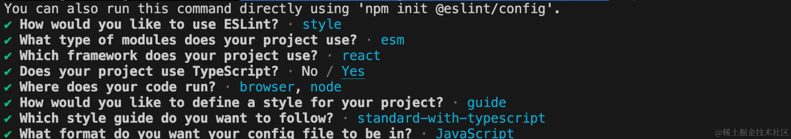

配置完成之后之前的js文件会报一个这样的错，这是因为我们创建的时候选择了使用`typescript`,接下来我们先配置下ts
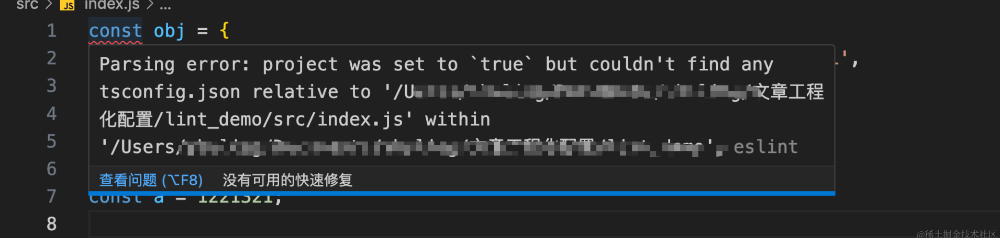

### 提前安装ts并配置文件

转到ts目录去看

### 生成的配置.eslintrc.js文件，配置如下

```js
module.exports = {
    "env": {
        "browser": true,
        "es2021": true,
        "node": true
    },
    "extends": [
        "standard-with-typescript",
        "plugin:react/recommended"
    ],
    "overrides": [
        {
            "env": {
                "node": true
            },
            "files": [
                ".eslintrc.{js,cjs}"
            ],
            "parserOptions": {
                "sourceType": "script"
            }
        }
    ],
    "parserOptions": {
        "ecmaVersion": "latest",
        "sourceType": "module"
    },
    "plugins": [
        "react"
    ],
    "rules": {
    }
}
```

ESLint 8 中一些常用的配置选项包括：

*   extends：用于扩展已有的配置，可以继承一些已经存在的配置文件，如"eslint:recommended"、"airbnb"等。
*   parser：指定要使用的解析器，如Babel、Typescript等。
*   parserOptions：用于配置解析器的选项，例如ecmaVersion、sourceType等。
*   env：定义代码执行的环境，比如browser、node等。
*   plugins：插件列表，可以加入一些自定义规则。
*   rules：规则配置，用于设定规则的严格程度，如"error"、"warn"、"off"。
*   globals：定义全局变量。
*   ignorePatterns：指定要忽略的文件路径模式。
*   reportUnusedDisableDirectives：指定是否要报告未使用的 ESLint 禁用规则注释。
*   fixTypes：配置用于执行自动修复的文件类型。
*   supersededConfigs：用于指示配置文件是否被后续配置所取代。
*   noInlineConfig：指示是否允许内联配置。
*   allowInlineConfig：控制是否允许在注释内配置规则。
    但是我们发现这个配置文件有一个报错，是因为eslint检测了js文件


安装一下

    yarn add @typescript-eslint/parser@7.2.0 -D
    yarn add @typescript-eslint/eslint-plugin@6.4.0 -D

我们来更改一下eslint的配置，更改后的配置如下

```js
const OFF = 0;
const WARN = 1;
const ERROR = 2;

module.exports = {
	env: {
		browser: true,
		es2021: true,
		node: true,
	},
	extends: ['standard-with-typescript', 'plugin:react/recommended'],
	settings: {
		'react': {
			'version': 'detect', // 自动检测 React 版本
		},
		// 这个配置是用于指定模块导入解析器的配置，主要用于告诉 ESLint 如何解析模块导入语句
		'import/resolver': {
			// node：指定了使用 Node.js 解析模块导入语句的配置。在这里，配置了支持的文件扩展名，包括 .tsx、.ts、.js 和 .json。
			node: {
				extensions: ['.tsx', '.ts', '.js', '.json'],
			},
			// typescript：指定了使用 TypeScript 解析模块导入语句的配置。这个配置为空对象，表示使用默认配置。
			typescript: {},
		},
	},
	overrides: [
		// 检测ts和tsx，注意files要包括文件，否则会报错
		{
			files: ['./src/**/*.ts', './src/**/*.tsx'],
			parser: '@typescript-eslint/parser',
			parserOptions: {
				sourceType: 'module',
				project: './tsconfig.json', // 指定 TypeScript 配置文件
			},
		},
		// 不检测js文件的类型, 有ignorePatterns就不需要了
		{
			extends: ['plugin:@typescript-eslint/disable-type-checked'],
			files: ['./**/*.js'],
		},
	],
	plugins: ['react'],
	rules: {
		// 对象的最后一个可以增加【,】
		'@typescript-eslint/comma-dangle': OFF,
		// 单引号关闭
		'@typescript-eslint/quotes': OFF,
		// 需要分号
		'@typescript-eslint/semi': OFF,
		// 不允许使用var
		'no-var': ERROR,
		// 函数不需要ts标注返回类型
		'@typescript-eslint/explicit-function-return-type': OFF,
		'no-tabs': OFF,
		'@typescript-eslint/indent': OFF,
	},
	// 忽略文件
	ignorePatterns: [
		'/lib/**/*', // Ignore built files.
		'**/*.js',
	],
};

```

这样配置完成之后就不会检测js文件了，但是这时候我们发现我们配置了不适用var，但是ts文件中竟然没有报错

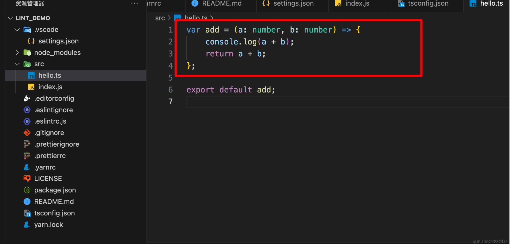

这时候可以看一下eslint插件的输出，看看插件是否报错，对于其他的插件的配置也可以使用一样的方法去检测配置是否正确

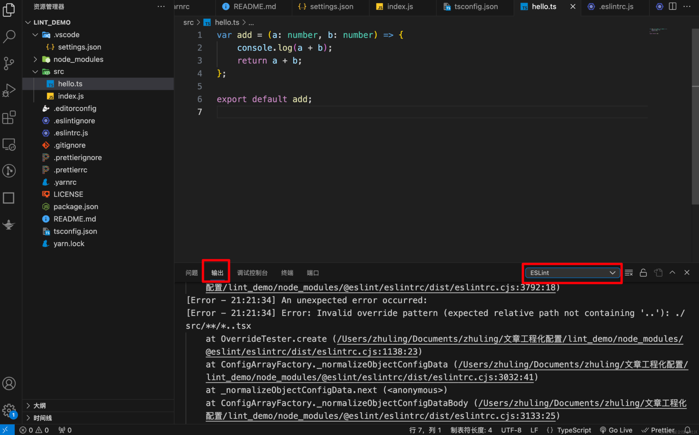

我们看到一个报错，说的是，这里../错了，我们多输入了一个.,导致路劲不对，删除即可

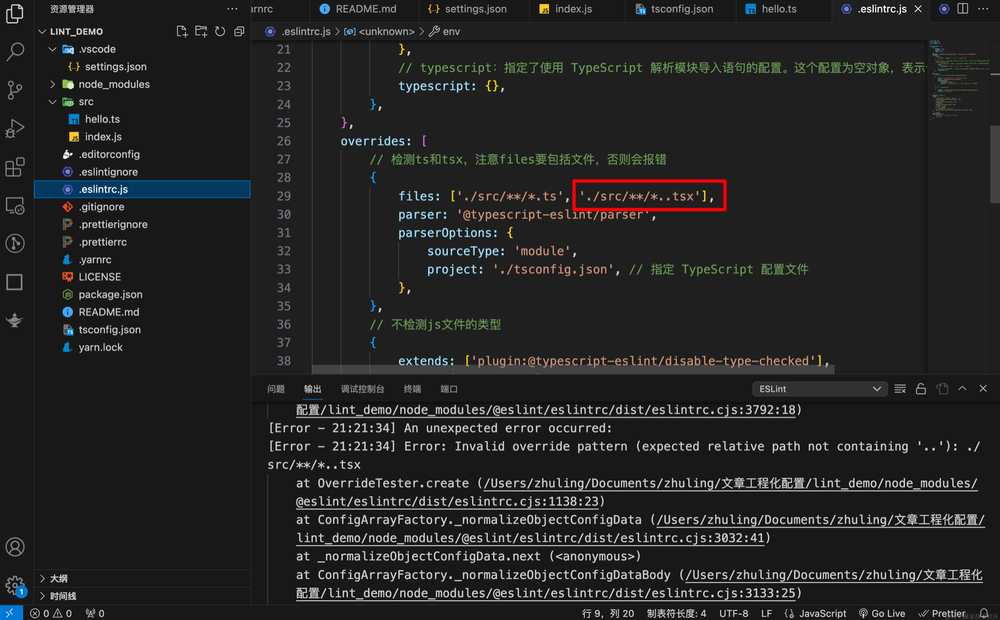

更改后的配置

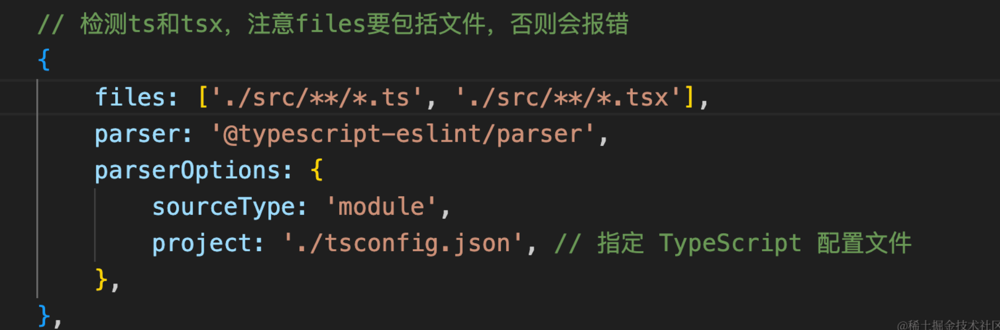

这样更改完成之后，ts文件的报错就恢复了

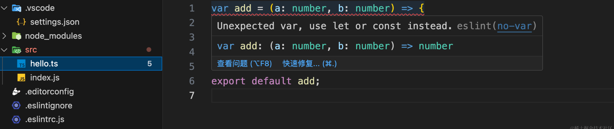

### 配置保存自动修复

安装eslint插件
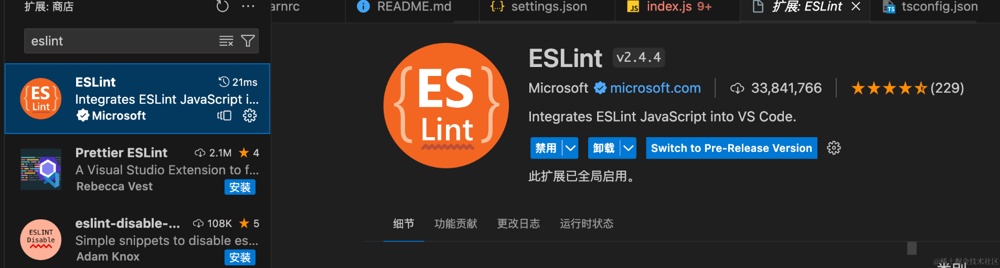

再到之前创建的 .vscode/settings.json 中添加以下代码：

```
// ========================eslint===================================
  "eslint.validate": ["javascript", "javascriptreact", "typescript", "typescriptreact"],
  "typescript.tsdk": "./node_modules/typescript/lib", // 代替 vscode 的 ts 语法智能提示
  // 保存自动修复
  "editor.codeActionsOnSave": {
    "source.fixAll.eslint": "explicit",
  },
  // =================================================================

```

配置完整之后最好重启一下vscode，否自动修复不一定生效，如下是实现效果
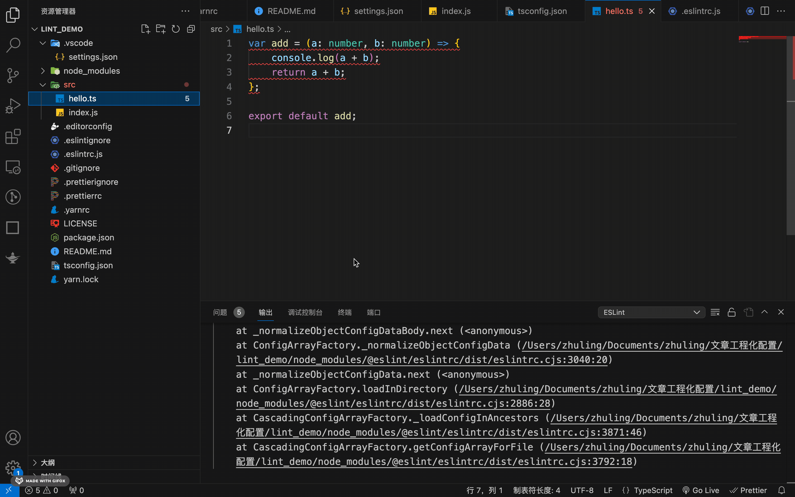

这里还有一个报错是因为我们配置的prettier和eslint冲突了，我们使用tabs作为缩进风格，但是eslint中的导入配置中有no-tabs，我们去配置一下，这样就OK了

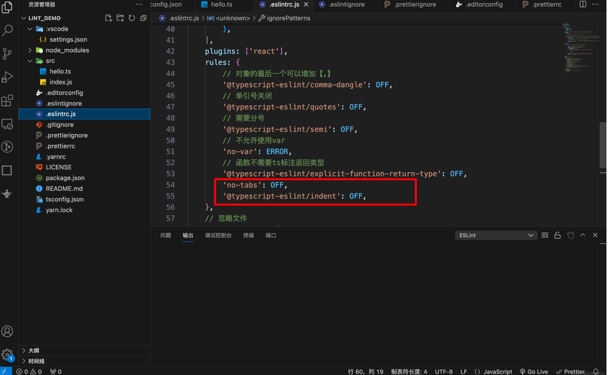

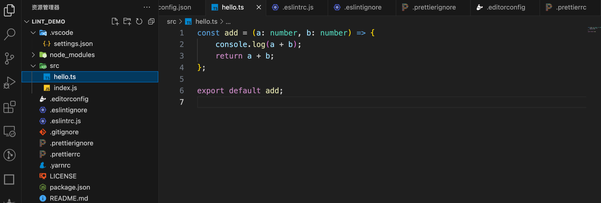

### 配置忽略文件.eslintignore 和 .prettierignore

一般保持一致就行了

    /node_modules
    /build
    /dist

## StyleLint

StyleLint 是一个强大的工具，用于在代码中发现并报告样式代码中的问题。它可以帮助团队保持一致的代码风格，并避免常见的错误。StyleLint 支持多种样式语言，包括 CSS、SCSS、Less 等，可以检查各种规则，如缩进、空格、命名约定等。它还支持自定义规则，以便根据团队的具体需求进行配置。

要开始使用 StyleLint，首先需要安装 StyleLint 包，然后在项目中配置一个 .stylelintrc 文件来指定检查规则。可以通过命令行工具或与构建过程集成来运行 StyleLint。当 StyleLint 检测到问题时，它会生成报告，其中包含有关问题的详细信息和建议的修复方法。

### 安装

    yarn add stylelint@16.2.1 stylelint-config-standard@36.0.0 -D

### 增加.stylelintrc.js配置文件

```js
module.exports = {
	// 从标准配置中继承规则
	extends: ['stylelint-config-standard'],
  
	// 规则配置
	rules: {
	  // 禁用注释前的空行规则
	  'comment-empty-line-before': null,
	  // 禁用声明前的空行规则
	  'declaration-empty-line-before': null,
	  // 指定函数名的大小写为小写
	  'function-name-case': 'lower',
	  // 禁用选择器特异性递减规则
	  'no-descending-specificity': null,
	  // 禁用无效的双斜杠注释规则
	  'no-invalid-double-slash-comments': null,
	  // 指定规则前需要空行
	  'rule-empty-line-before': 'always',
	},
  
	// 忽略检查的文件或文件夹
	ignoreFiles: ['node_modules/**/*', 'build/**/*'],
  };
  
```

*   extends：可以从已有的 StyleLint 配置中继承规则。这样可以避免重复定义相同的规则集。例如，"extends": "stylelint-config-standard" 将从标准配置中继承规则。
*   plugins：用于指定要使用的 StyleLint 插件。插件可以添加额外的规则或功能。例如，"plugins": \["stylelint-scss"] 将启用 SCSS 相关的规则和功能。
*   rules：指定项目中的规则配置。可以根据项目需求启用、禁用或修改规则。例如，"rules": { "indentation": "tab", "selector-pseudo-class-no-unknown": \[true, { "ignorePseudoClasses": \["global"] }] } 将规定使用制表符缩进，并忽略全局伪类的未知类规则。
*   ignoreFiles：指定 StyleLint 忽略检查的文件或文件夹。可以使用 glob 模式匹配多个文件或文件夹。例如，"ignoreFiles": \["node\_modules/", "\*\*/\*.min.css"] 将忽略 node\_modules 文件夹和所有.min.css 文件。

### 配置保存自动修复

安装stylelint插件

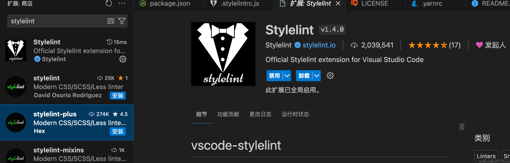

并且在 .vscode/settings.json 中增加以下代码：

    // ========================stylelint==============================
      // 使用 stylelint 自身的校验即可, 关闭vscode验证
      "css.validate": false,
      "less.validate": false,
      "scss.validate": false,
      "stylelint.validate": ["css", "less", "sass", "scss"]
      // 在editor.codeActionsOnSave中增加styleLint修复
      
      // 保存自动修复
      "editor.codeActionsOnSave": {
        "source.fixAll.stylelint": "explicit"
      },
    // ===============================================================

这时候新建一个less文件，就已经显示报错提示了

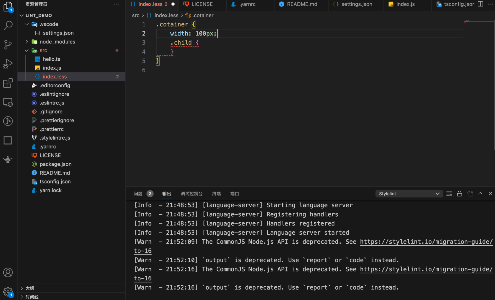

保存也可以自动修复了


### 配置根据分组排序

就是配置这个总是不生效，我还以为配置出错了，重启vscode！！！，重启vscode！！！重启vscode！！！，

    yarn add stylelint-config-rational-order@0.1.2 -D

会按照如下属性进行分组排序

    1.Positioning   2.Box Model    3.Typography    4.Visual    5.Animation    6.Misc

效果如下：


### 提示我们写的矛盾样式

stylelint-declaration-block-no-ignored-properties 用于提示我们写的矛盾样式，比如下面的代码中 width 是会被浏览器忽略的，这可以避免我们犯一些低级错误～

    yarn add stylelint-declaration-block-no-ignored-properties@2.8.0 -D

lint文件中配置

```js
// .stylelintrc
{
  "plugins": ["stylelint-declaration-block-no-ignored-properties"],
  "rules": {
    "plugin/declaration-block-no-ignored-properties": true
  }
}
```

重启、重启、重启！！！！

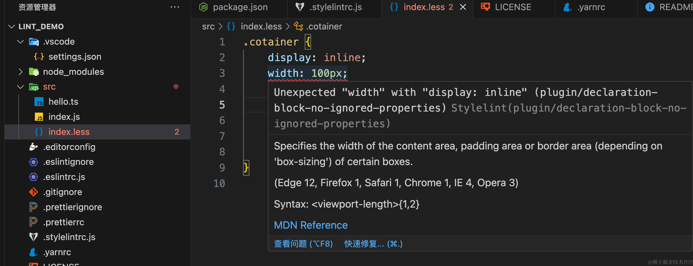

## ESLint、Stylelint 和 Prettier 的冲突

有时候 eslint 和 stylelint 的自定义规则和 prettier 定义的规则冲突了，比如在 .eslintrc.js 中某个 extends 的配置设置了缩进大小为 4 ，但是我 .prettierrc 中我设置的缩进为 2 ，那就会出现我们保存时，先是 eslint 的自动修复缩进大小为 4 ，但是保存的时候 prettier 又给他格式化回去了，eslint就直接报错。在上面的时候我们遇到过一个使用tab的报错，但是我们是手动的去禁用掉这个规则，现在我们可以通过配置插件解决这个问题。

### eslint冲突

安装插件 eslint-config-prettier ，这个插件会禁用所有和 prettier 起冲突的规则：

    yarn add eslint-config-prettier@9.1.0 -D

添加以下配置到 .eslintrc.js 的 extends 中：

    extends: ['standard-with-typescript', 'plugin:react/recommended', 'prettier'],

这里需要注意， 'prettier' 及之后的配置要放到原来添加的配置的后面，这样才能让 prettier 禁用之后与其冲突的规则。

### stylelint冲突

stylelint 的冲突解决也是一样的，先安装插件 stylelint-config-prettier ：

    yarn add stylelint-config-prettier@9.0.5 -D
    yarn add stylelint-prettier@5.0.0 -D

添加配置

    // 从标准配置中继承规则
    	extends: [
    		'stylelint-config-standard',
    		'stylelint-config-rational-order',
    		'prettier',
    	],
        
      plugins: [
        'stylelint-declaration-block-no-ignored-properties',
        'stylelint-prettier'
      ],

### 增加lint命令

    "lint": "npm run lint-eslint && npm run lint-stylelint",
    		"lint-eslint": "eslint -c .eslintrc.js --ext .ts,.tsx,.js src",
    		"lint-stylelint": "stylelint --config .stylelintrc.js src/**/*.{less,css,scss}"

## lint-staged\&husky

**lint-staged**

lint-staged 是一个在提交代码之前运行linter或其他工具的工具。这意味着当开发人员尝试提交代码到版本控制系统（如git）时，lint-staged 会只对暂存区（staged files）的文件运行配置的命令，这通常是代码风格检查器（如ESLint、Prettier）、代码格式化工具或测试套件。

使用lint-staged可以确保只有符合项目规定代码质量标准的代码被提交，减少了不必要的错误和风格问题被引入代码库的可能性。

在一个项目中使用lint-staged通常包括以下步骤：

添加lint-staged到项目的依赖中。
在package.json中配置lint-staged，指定哪些文件与相对应的校验命令。
提交代码时，lint-staged会自动运行只对staged文件的检查。

**husky**

husky 是一个用于简化Git钩子（hooks）的设置的工具，允许开发者轻松地在各种Git事件触发时运行脚本。例如，在提交之前（pre-commit）、推送之前（pre-push）、或者在提交信息被写入后（commit-msg）等。

husky的使用可以提高项目团队的工作效率，确保代码库中的代码符合特定的质量标准。它通常与lint-staged一起使用，以在提交前自动执行代码的静态检查。

使用husky包括以下简单步骤：

添加husky到项目依赖。
配置Git钩子，使用husky的配置。
当相应的Git事件被触发时，定义的脚本就会自动执行。

### 安装

    yarn add husky@9.0.11 lint-staged@15.2.2 -D

启用husky，执行如下命令会自动在package中增加命令

    npx husky install

husky prepare 命令，自动加入，有时候也没法自动加入，手动写也是可以的

    {
      "scripts": {
        "prepare": "husky install"
      }
    }

在 package.json 中添加以下代码

    {
    	"husky": {
        "hooks": {
          "pre-commit": "lint-staged",
        }
      },
      "lint-staged": {
        "*.{ts,tsx,js}": [
          "eslint --config .eslintrc.js"
        ],
        "*.{css,less,scss}": [
          "stylelint --config .stylelintrc.js"
        ],
        "*.{ts,tsx,js,json,html,yml,css,less,scss,md}": [
          "prettier --write"
        ]
      },
    }

修改.husky/pre-commit脚本的内容，将.husky/pre-commit脚本的内容改为npm run lint-staged

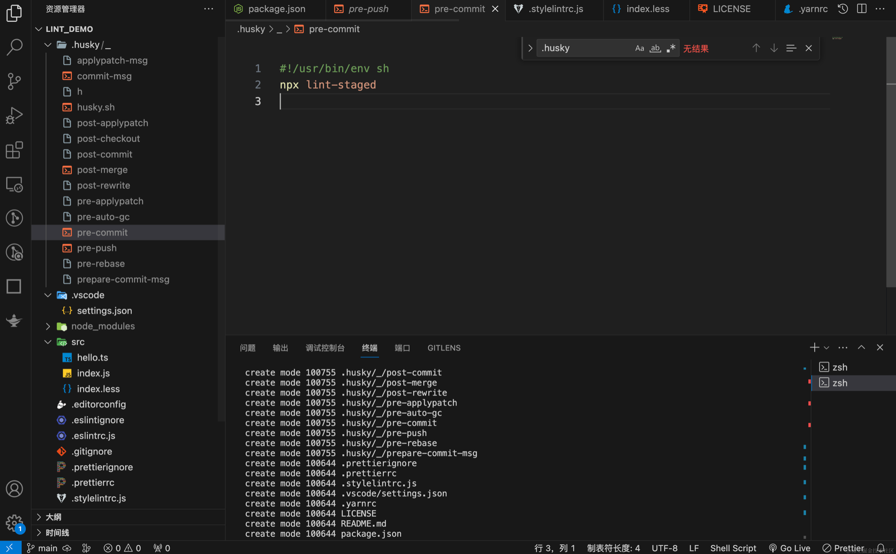

通过上面的步骤，就完成了lint-staged的配置，这个时候再进行 git 提交时，将只检查暂存区（staged）的文件，不会检查项目所有文件，加快了每次提交 lint 检查的速度，同时也不会被历史遗留问题影响。通过这样的约束让我们定义的规则规范大家都能去遵守，共同维护代码的质量。

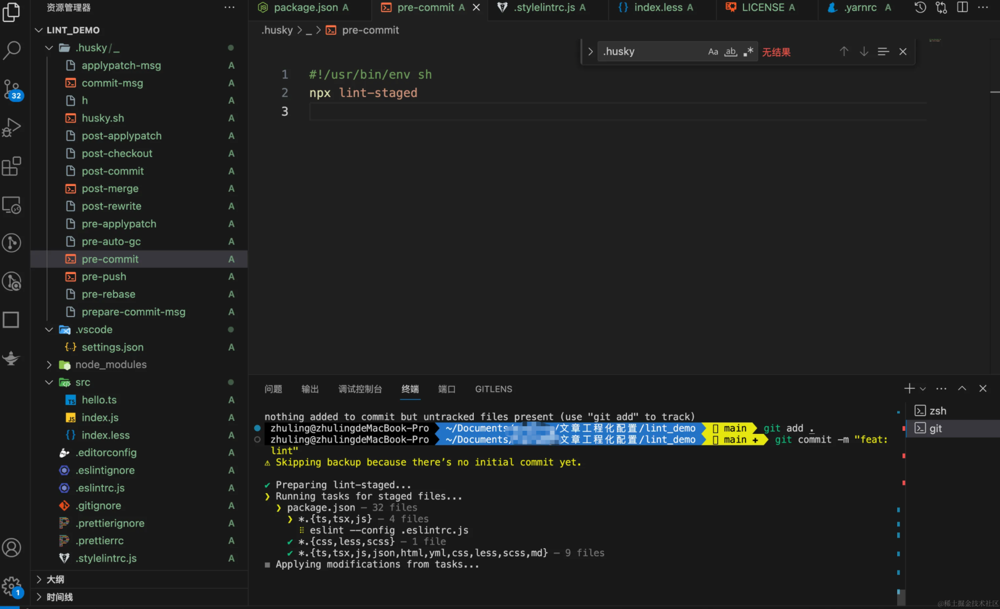

## commitlint

配置提交校验，commitlint 可以帮助我们进行 git commit 时的 message 格式是否符合规范

    yarn add @commitlint/cli@19.2.0 @commitlint/config-conventional@19.1.0 -D

@commitlint/config-conventional 这是一个规范配置,标识采用什么规范来执行消息校验, 这个默认是Angular的提交规范

新增配置文件.commitlintrc.js

```
module.exports = {
	extends: ['@commitlint/config-conventional'],
	rules: {
		'type-enum': [
			2,
			'always',
			[
				'build',
				'ci',
				'chore',
				'docs',
				'feat',
				'fix',
				'perf',
				'refactor',
				'revert',
				'style',
				'test',
				'addLog',
			],
		],
	},
};

```

随后回到 package.json 的 husky 配置，增加一个钩子，并且改写husky的commit-msg钩子
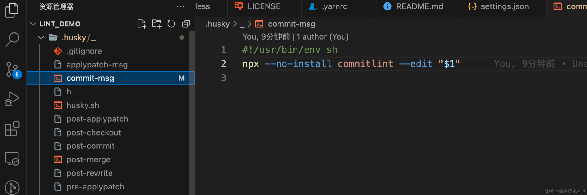

    "husky": {
    		"hooks": {
    			"pre-commit": "lint-staged",
    			"commit-msg": "commitlint --config .commitlintrc.js -E HUSKY_GIT_PARAMS"
    		}
    	},

效果如下

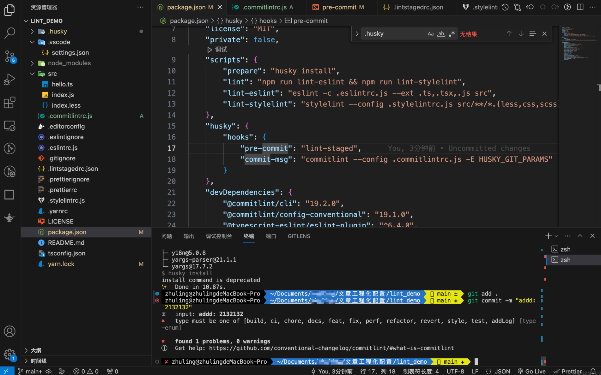

## 配置可视化的提交提示

    yarn add commitizen@4.3.0 cz-conventional-changelog@3.3.0 -D

在pageage.json中增加更改commitizen的配置，并增加脚本

    "config":{
        "commitizen":{
            "path":"node_modules/cz-conventional-changelog"
        }
    }
    
    "scripts":{
        commit:"git-cz"
    }

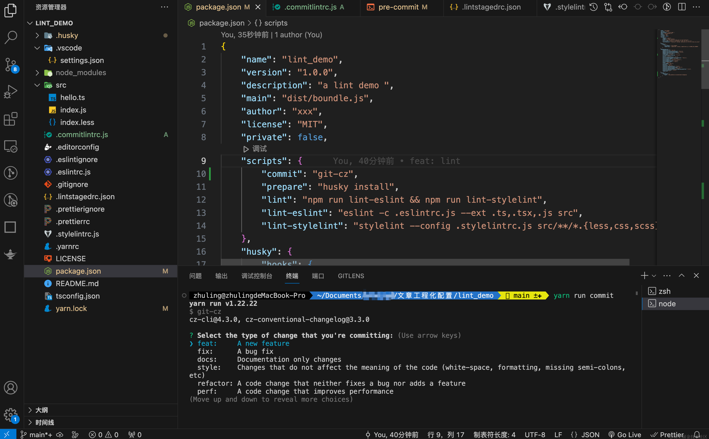

## 配置自定义提交规范

    yarn add cz-customizable@7.0.0 commitlint-config-cz@0.13.3 -D

变更 commitlint.config.js 这里采用自己定义的规范,将会覆盖上面那个,所以上面那个可以不用安装

```
module.exports = {
	extends: ['cz'],
	rules: {},
};

```

增加 .cz-config.js

    'use strict';
    module.exports = {
    	types: [
    		{value: 'feat', name: '✨新增:    新的内容'},
    		{value: 'fix', name: '🐛修复:    修复一个Bug'},
    		{value: 'docs', name: '📝文档:    变更的只有文档'},
    		{value: 'style', name: '💄格式:    空格, 分号等格式修复'},
    		{value: 'refactor', name: '️♻️重构:    代码重构，注意和特性、修复区分开'},
    		{value: 'perf', name: '️️⚡️性能:    提升性能'},
    		{value: 'test', name: '✅测试:    添加一个测试'},
    		{value: 'build', name: '🔧工具:    开发工具变动(构建、脚手架工具等)'},
    		{value: 'rollback', name: '⏪回滚:    代码回退'},
    		{value: 'addLog', name: '👨🏻‍💻添加log:    代码回退'},
    	],
    	scopes: [
    		{name: 'leetcode'},
    		{name: 'javascript'},
    		{name: 'typescript'},
    		{name: 'Vue'},
    		{name: 'node'},
    	],
    	// it needs to match the value for field type. Eg.: 'fix'
    	/*  scopeOverrides: {
    	fix: [
    	  {name: 'merge'},
    	  {name: 'style'},
    	  {name: 'e2eTest'},
    	  {name: 'unitTest'}
    	]
      },  */
    	// override the messages, defaults are as follows
    	messages: {
    		type: '选择一种你的提交类型:',
    		scope: '选择一个scope (可选):',
    		// used if allowCustomScopes is true
    		customScope: 'Denote the SCOPE of this change:',
    		subject: '短说明:\n',
    		body: '长说明，使用"|"换行(可选)：\n',
    		breaking: '非兼容性说明 (可选):\n',
    		footer: '关联关闭的issue，例如：#31, #34(可选):\n',
    		confirmCommit: '确定提交说明?(yes/no)',
    	},
    	allowCustomScopes: true,
    	allowBreakingChanges: ['特性', '修复'],
    	// limit subject length
    	subjectLimit: 100,
    };

package.json 中,将原来commit配置,变更为自定义配置

    "config": {
    		"commitizen": {
    			"path": "node_modules/cz-customizable"
    		}
    	}

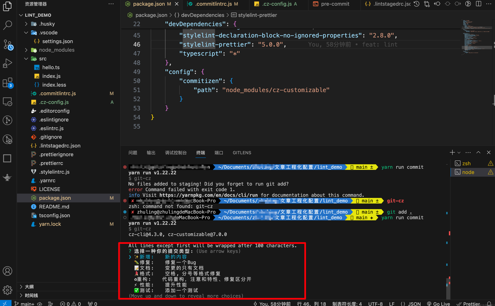

### 配置使用git commit走自定义配置

更改husky的prepare-commit-msg钩子，如下

```
#!/bin/bash
exec < /dev/tty && node_modules/.bin/cz --hook || true

```

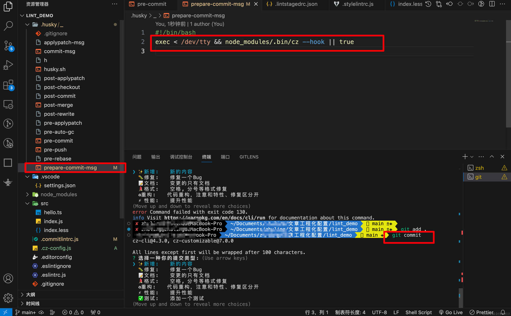
## typescript

安装

    yarn add typescript@5.4.2 -D

初始化配置文件

    npx tsc --init


更改配置文件的内容如下，然后重启vscode，因为有时候抽风，vscode需要重新构建依赖树和缓存，所以重启之后这个报错就消失了

    {
      "compilerOptions": {
        // 基本配置
        "target": "ES5", // 编译成哪个版本的 es
        "module": "ESNext", // 指定生成哪个模块系统代码
        "lib": ["dom", "dom.iterable", "esnext"], // 编译过程中需要引入的库文件的列表
        "allowJs": true, // 允许编译 js 文件
        "jsx": "react", // 在 .tsx 文件里支持 JSX
        "isolatedModules": true,
        "strict": true, // 启用所有严格类型检查选项

        // 模块解析选项
        "moduleResolution": "node", // 指定模块解析策略
        "esModuleInterop": true, // 支持 CommonJS 和 ES 模块之间的互操作性
        "resolveJsonModule": true, // 支持导入 json 模块
        "baseUrl": "./", // 根路径
        "paths": {
          // 路径映射，与 baseUrl 关联，这个需要跟webpack一一对应，我们后面会讲解如何配置&使用
          "@src/*": ["src/*"],
          "@components/*": ["src/components/*"],
          "@utils/*": ["src/utils/*"]
        },

        // 实验性选项
        "experimentalDecorators": true, // 启用实验性的ES装饰器
        "emitDecoratorMetadata": true, // 给源码里的装饰器声明加上设计类型元数据

        // 其他选项
        "forceConsistentCasingInFileNames": true, // 禁止对同一个文件的不一致的引用
        "skipLibCheck": true, // 忽略所有的声明文件（ *.d.ts）的类型检查
        "allowSyntheticDefaultImports": true, // 允许从没有设置默认导出的模块中默认导入
        "noEmit": true // 只想使用tsc的类型检查作为函数时（当其他工具（例如Babel实际编译）时）使用它
      },
      "include": [
        "src/**/*" // 这将包括 src 目录下的所有文件
      ]
    }

### 介绍下tsconfig常见的配置

以下是 TypeScript 中常见的一些配置选项：

在TypeScript 5中，tsconfig.json 文件仍然是用来配置TypeScript项目编译选项的主要方式。这个文件指定了编译器应遵守的规则和项目的编译上下文。以下是一些常见的配置选项和简短的描述：

compilerOptions: 该对象包含可以用来配置编译器行为的各种选项。

*   target: 设置目标JavaScript语言版本。例如，"ES5", "ES6", "ES2015", "ES2020"等。
*   module: 指定生成的代码模块化的方式，如 "CommonJS", "AMD", "System", "UMD", "ES6", "ES2015", "ES2020"等。
*   lib: 指定编译过程中需要包含的库文件的列表，如 \["DOM", "ES5", "ScriptHost", "WebWorker"]。
*   allowJs: 允许编译器编译 JavaScript 文件。
*   checkJs: 允许在 .js 文件中报告错误。
*   jsx: 在.tsx文件中指定JSX代码的生成，常用值有 "React", "Preserve"。
*   declaration: 生成相应的.d.ts声明文件。
*   sourceMap: 生成相应的.map文件，用于调试。
*   outFile: 将所有全局作用域的文件合并到一个输出文件中。
*   outDir: 指定输出文件夹。
*   strict: 启用所有严格类型检查选项。
*   noImplicitAny: 禁止隐含的any类型。
*   moduleResolution: 模块解析策略，"Node" 或 "Classic"。
*   baseUrl: 用于解析非相对模块名称的基目录。
*   paths: 一个映射列表，与 baseUrl 一起工作以进行模块重定向。
*   esModuleInterop: 改善了对非ES模块的默认导出的兼容。
*   resolveJsonModule: 允许导入.json文件。
*   noEmit: 不生成输出文件。
*   noEmitOnError: 发生错误时不生成输出文件。
*   skipLibCheck: 跳过对.d.ts文件的类型检查；对于包含大量声明文件的大型项目，这可以减少编译时间。
*   forceConsistentCasingInFileNames: 确保文件名的大小写一致，以避免在大小写不敏感的文件系统中产生问题。
*   strictNullChecks: 当设置为true时，在所有可能为null或undefined的地方显式检查。
*   strictFunctionTypes: 更严格地检查函数类型的赋值。
*   strictBindCallApply: 对bind，call和apply方法使用更严格的类型。
*   strictPropertyInitialization: 确保类的每个实例属性都显式初始化。
*   noImplicitThis: 当this表达式的值为any类型的时候，生成一个错误。
*   alwaysStrict: 在代码中每个文件都应用JavaScript的严格模式。
*   noUnusedLocals: 报告未使用的局部变量。
*   noUnusedParameters: 报告未使用的函数参数。
*   noImplicitReturns: 在函数中，如果不是所有路径都有返回值，将报告错误。
*   noFallthroughCasesInSwitch: 防止switch语句贯穿（未通过break中断）。
*   inlineSourceMap: 生成内联的.map源映射文件，而不是单独的文件。
*   inlineSources: 将代码与sourcemap生成在同一文件中，仅当你设置了inlineSourceMap或sourceMap选项时才有效。
*   emitDecoratorMetadata: 当使用装饰器时，会为相关的设计类型添加元数据信息。
*   experimentalDecorators: 启用实验性的装饰器支持。
*   removeComments: 从输出文件中移除注释。
*   isolatedModules: 确保每个文件可以安全地独立编译。
*   downlevelIteration: 当目标为低于ES6环境时，提供对迭代器的全面支持。
*   preserveConstEnums: 即使使用了const enum， 枚举也会被保留在生成的代码中。
*   suppressImplicitAnyIndexErrors: 当索引对象时忽略noImplicitAny的错误。
    include: 这个属性定义了编译器应该包含在编译过程中的文件或文件夹。
    exclude: 这个属性定义了编译器应该排除在编译过程之外的文件或文件夹。
    extends: 允许配置继承自另一个配置文件。
    files: 如果你想显式设置一组文件（而不是整个目录），可以使用此属性。
    references: 用于配置项目间的依赖。

## 🍋 写在最后

如果您看到这里了，并且觉得这篇文章对您有所帮助，希望您能够点赞👍和收藏⭐支持一下作者🙇🙇🙇，感谢🍺🍺！如果文中有任何不准确之处，也欢迎您指正，共同进步。感谢您的阅读，期待您的点赞👍和收藏⭐！

## 参考文章

*   [commitizen + husky 规范git提交信息](https://juejin.cn/post/6844904025868271629?searchId=20240404230547BCC4A2A240F03741F8E6#heading-1)
*   [我是这样搭建Typescript+React项目环境的！](https://github.com/vortesnail/blog/issues/14) 本文主要流程参考这篇文章，将文章中的包换成了相对较新的，解决了配置过程中存在的问题，增加了一些没有的配置
*   [Eslint + Prettier + Husky + Commitlint+ Lint-staged 规范前端工程代码规范](https://juejin.cn/post/7038143752036155428?searchId=20240404224332BDEE7231DFF8823CE5F7#heading-5)

