---
group:
  title: 00实战搭建&部署篇
  order: 0
title: 4.react+ts环境搭建
order: 4
# 这个可以将写的组件设置为demo在右侧展示
# demo: /
---
# 支持react

安装 react 和 react-dom ：

    yarn add react@18.2.0 react-dom@18.2.0 -S

\-S 相当于 --save ， -D 相当于 --save-dev 。

其实安装了这两个包就已经能使用 jsx 语法了，我们在 src/index.js 中输入以下代码：

```js
import React from 'react';
import ReactDOM from 'react-dom';
import App from './app';

ReactDOM.render(<App />, document.querySelector('#root'));
```

在src/app.js中输入

    import React from 'react';
    
    function App() {
    	return <div className='App'>React18 + Ts5 + webpack5 开发模板搭建</div>;
    }
    
    export default App;

修改入口文件

    entry: {
    		app: resolve(PROJECT_PATH, './src/index.js'),
    	},

这时候运行`yarn run start`会发生报错，这是因为react不能识别jsx语法，这个时候我们就需要babel了，我们后面会有一篇文章专门介绍babel，这里知道如何配置即可

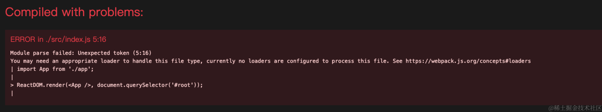

# 安装babel支持tsx

## 支持js文件中使用jsx语法

    yarn add babel-loader@9.1.3 @babel/core@7.24.0 @babel/preset-react@7.23.3 -D

babel-loader 使用 babel 解析文件；@babel/core 是 babel 的核心模块；@babel/preset-react 转译 jsx 语法。

在根目录下新建 .babelrc 文件，输入以下代码：

    {
      "presets": ["@babel/preset-react"]
    }

presets 是一些列插件集合。比如 @babel/preset-react 一般情况下会包含 @babel/plugin-syntax-jsx 、 @babel/plugin-transform-react-jsx 、 @babel/plugin-transform-react-display-name 这几个 babel 插件。

接下来打开我们的 webpack.common.js 文件，增加以下代码：

```js
module: {
		rules: [
			{
				test: /\.(tsx?|js)$/,
				loader: 'babel-loader',
				options: {cacheDirectory: true},
				exclude: /node_modules/,
			},
		],
	},
```

这里因为我们在配置eslint的时候就已经配置过ts了，所以直接就检测tsx就行了，不用jsx了。

现在直接`yarn run start`看效果，跟之前是一样的

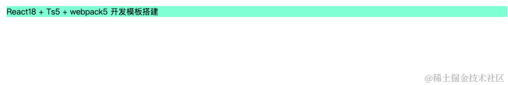
现在我们把`src/index.js`改为`index.tsx`, `src/app.js`改为`app.tsx`，然后更改webpack打包入口为`index.tsx`，这时候vscode会报错，因为之前我们只是支持了react，但是并没有配置ts识别react等

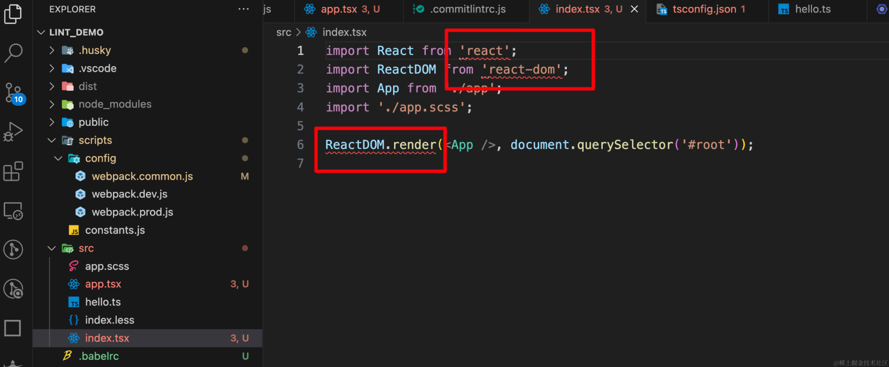

## 支持tsx文件的解析

[@babel/preset-typescript](https://babeljs.io/docs/babel-preset-typescript) 是 babel 的一个 preset，它编译 ts 的过程很粗暴，它直接去掉 ts 的类型声明，然后再用其他 babel 插件进行编译，所以它很快。

    yarn add @babel/preset-typescript@7.23.3 -D

然后修改 .babelrc ：

```json
{
  "presets": ["@babel/preset-react", "@babel/preset-typescript"]
}
```

presets 的执行顺序是从后到前的。根据以上代码的 babel 配置，会先执行 @babel/preset-typescript ，然后再执行 @babel/preset-react 。

## tsx 语法测试

这时候我们运行`yarn run start`编译代码是会报错的，因为我们只改了入口为tsx，但是引入app.tsx的时候我们省略了.tsx的后缀。这里如果你把后缀加上，它也能正常运行，但是我们不这么做，我们更改一下webpack的配置，增加

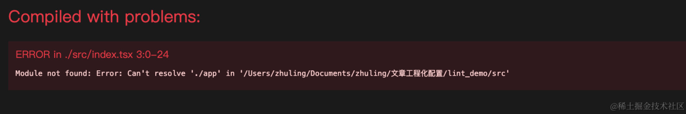

    module.exports = {
      entry: {
        app: resolve(PROJECT_PATH, './src/index.tsx'),
      },
      resolve: {
        extensions: ['.tsx', '.ts', '.js', '.json'],
      },
    }

就可以不加文件后缀名了。webpack 会按照定义的后缀名的顺序依次处理文件，比如上文配置 \['.tsx', '.ts', '.js', '.json'] ，webpack 会先尝试加上 .tsx 后缀，看找得到文件不，如果找不到就依次尝试进行查找，所以我们在配置时尽量把最常用到的后缀放到最前面，可以缩短查找时间。

这个时候再进行 `yarn run start` ，页面就能正确输出了。

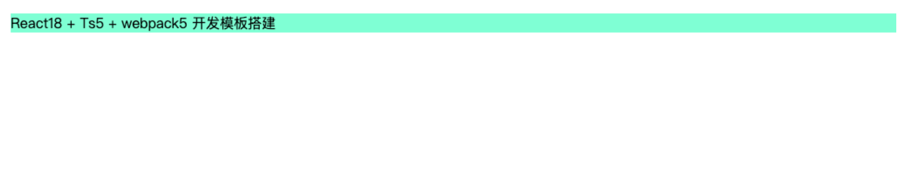

# 增加类型声明

虽然现在已经可以正常输出了，但是vscode还是给我们报了几个错，无法找到类型声明文件

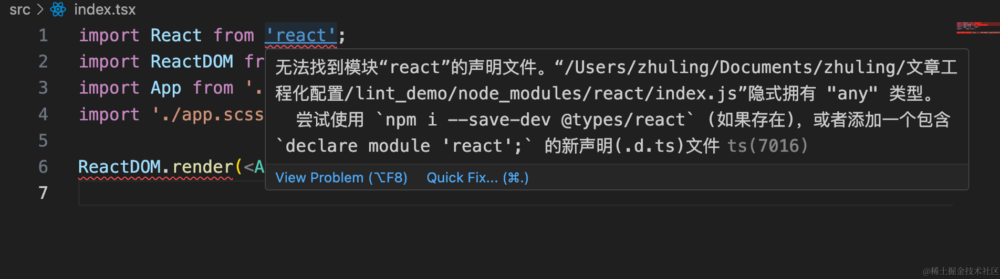

我们安装

    yarn add @types/react@18.2.66 @types/react-dom@18.2.22 -D

安装完成之后react就不再报错了

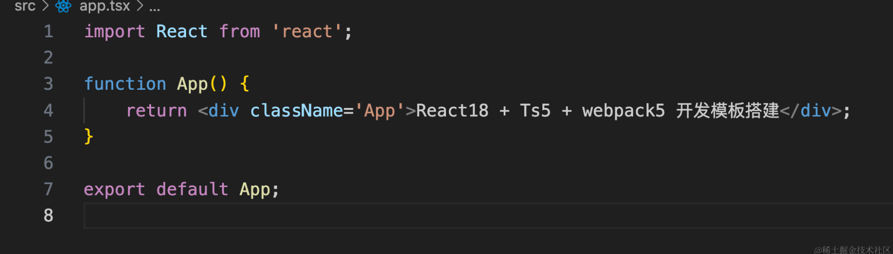

这时候index.tsx中仍然有一个报错，原因是react18之后，`ReactDom.render`已经被弃用了需要用createRoot来替代。

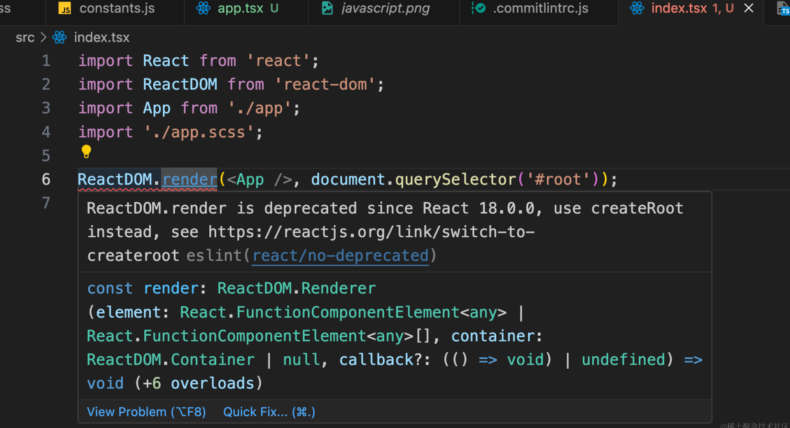

我们更改`index.tsx`的代码

```js
import React from 'react';
import ReactDOM from 'react-dom/client';
import App from './app';

// 获取你的 HTML 文件中的根 DOM 元素
const container = document.getElementById('root');

// 非空断言，确保 container 不是 null
if (container !== null) {
	const root = ReactDOM.createRoot(container);
	root.render(<App />);
} else {
	console.error('Failed to find the root element');
}

```

这里解释下为什么react18要使用createRoot替换ReactDOM.render，

createRoot 是 React 18 引入的一个 API，它是 Concurrent Mode 的入口点之一。Concurrent Mode 是一组新的功能，使 React 能够同时处理多个优先级的工作，从而优化渲染性能和用户体验。以下是 createRoot 的一些特点：

*   启用并发特性：createRoot 允许你启用 React 的并发渲染能力。在并发模式下，React 可以打断和恢复渲染工作，这允许高优先级的更新（如用户输入）能够打断低优先级的渲染（如数据的预加载）。因此，对于用户互动和应用的响应性来说，这是一个显著的提升。

*   更好的错误和中断处理：Concurrent Mode 还改进了错误处理机制，使得 React 在面临错误时更为稳健。此外，由于 React 能够分块处理更新，当执行长时间的更新时，应用不会冻结，而是能够保持交互性。

*   自动批处理：在并发模式下，React 会更智能地批处理更新，从而减少渲染次数，以及与渲染相关的浏览器工作量，这可以显著提高性能。

*   Transition 提升体验：React 18 引入的新特性中，包括了 startTransition API，这是 Concurrent Mode 的一个重要部分。startTransition 允许你标记某些更新为“过渡”，与立即重要的更新分开，这样即使这些更新可能导致较长的加载时间，用户也不会感觉到应用变得卡顿不响应，因为主要的界面操作（例如输入、点击等）仍然能够快速响应。

*   更一致的状态更新：在之前的 React 版本（无并发模式）中，状态更新可以是同步的，也可以是异步的，这取决于事件处理器（例如点击事件）执行时的上下文。现在，通过 createRoot 与并发模式，React 统一了更新的行为，让状态更新预测变得更容易。

而ReactDOM.render 方法是 React 老版本中用来将 React 组件挂载到 DOM 节点的传统方法。该方法在 React 18 之前一直是挂载 React 应用的标准方式。然而，随着 React 18 的发布和新的并发功能的引入，ReactDOM.render 方法在某些方面显得不够用，并且具有些许局限性。以下是 ReactDOM.render 的一些缺点：

*   不支持并发特性：ReactDOM.render 方法不支持 React 18 引入的并发特性。它无法利用并发模式（Concurrent Mode）提供的新特性，如并发渲染、任务的中断和恢复、自动批处理、优先级管理等。

*   同步更新：ReactDOM.render 方法会导致组件状态的更新和 DOM 的更新以同步的方式发生。这在某些情况下会影响性能，尤其是在执行大量计算或处理复杂更新的时候，可能会导致用户界面变得卡顿。

*   批处理局限性虽然 React 在某些情况下会尝试自动批处理状态更新，但在 ReactDOM.render 使用的传统模式下，React 的自动批处理能力受限于事件处理函数的上下文。这使得在非事件处理代码中执行的更新不一定会自动批处理，从而可能导致额外的渲染和性能不足。

*   状态更新不一致：在传统渲染模式下，根据更新发生的上下文，React 状态更新可能是同步的，也可能是异步的。这造成了一定的预测困难，使得开发者可能需要进行额外的工作来确保组件的行为如期望的那样。

*   渲染优化受限：传统的 ReactDOM.render 方法在处理更新和优化渲染性能方面的能力有限。在一些复杂的更新场景中，开发者可能需要手动进行优化，比如防止不必要的渲染，这要求更多的编码和性能调优工作。

*   过渡API不可用：使用 ReactDOM.render 的代码不能利用 startTransition 这样的过渡 API 来区分不紧急的更新，从而改善用户在加载新内容或执行计算密集型任务时的体验。

*   错误和中断处理较弱：在并发模式之外，React 组件的错误边界和中断处理能力较弱，这可能使得应用对错误条件和长时间执行任务的响应不够鲁棒。

# 增加图片、文件等模块的类型声明

现在大部分的环境搭建我们已经搞定了，但是如果你在
app.tsx中引入一个图片，你会发现它有报错，没有类型声明，这里我们还需要配置一下文件的类型声明。以后如果你安装的第三方模块没有@type/xxx的包，也可以使用同样的方式解决

```js
import React from 'react';
import img from '../javascript.png';
function App() {
	return (
		<>
			<div className='App'>React18 + Ts5 + webpack5 开发模板搭建</div>;
			</img>
		</>
	);
}

export default App;

```

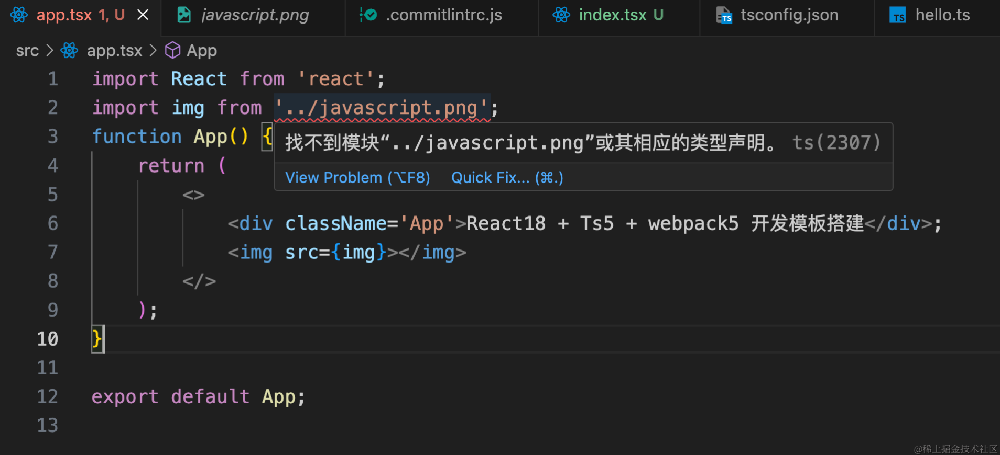

只是会有ts报错但是不影响打包，我们配置下文件的类型声明，在根目录下创建typings/file.d.ts文件输入

    declare module '*.svg' {
    	const path: string;
    	export default path;
    }
    
    declare module '*.bmp' {
    	const path: string;
    	export default path;
    }
    
    declare module '*.gif' {
    	const path: string;
    	export default path;
    }
    
    declare module '*.jpg' {
    	const path: string;
    	export default path;
    }
    
    declare module '*.jpeg' {
    	const path: string;
    	export default path;
    }
    
    declare module '*.png' {
    	const path: string;
    	export default path;
    }
    
    declare module '*.css' {
    	const classes: Record<string, string>;
    	export default classes;
    }
    
    declare module '*.scss' {
    	const classes: Record<string, string>;
    	export default classes;
    }
    
    declare module '*.sass' {
    	const classes: Record<string, string>;
    	export default classes;
    }
    
    declare module '*.styl' {
    	const classes: Record<string, string>;
    	export default classes;
    }
    
    // 继续保持你已有的 .less 声明
    declare module '*.less' {
    	const content: Record<string, string>;
    	export default content;
    }

修改tsconfig.json文件增加如下，可以看到报错就消失了。

    "include": [
    		"src/**/*", // 这将包括 src 目录下的所有文件
    		"typings/**/*"
    	]

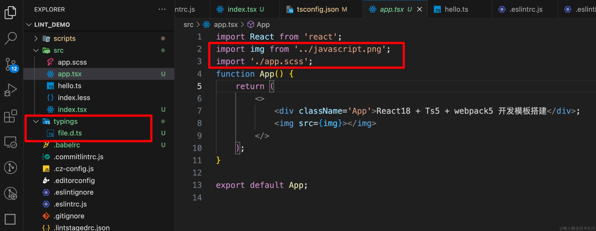

# baseUrl\&paths&配置别名

目的是不使用`../../../`去导入组件，配置完成之后，我们可以使用如下方式导入组件，这样就方便多了

    import Header from '@components/Header'

首先需要防止eslint报错，


这个时候需要改 .eslintrc.js 文件的配置了，首先得安装 eslint-import-resolver-typescript ：

    yarn add eslint-import-resolver-typescript@3.6.1 -D

然后在 .eslintrc.js 文件的 setting 字段修改为以下代码：

    settings: {
      'import/resolver': {
        node: {
          extensions: ['.tsx', '.ts', '.js', '.json'],
        },
        typescript: {},
      },
    },

是的，只需要添加 typescript: {} 即可，这时候再去看已经没有报错了。并且是index的文件可以直接不用写，只需要到header层就行了。 但是上面我们完成的工作仅仅是对于编辑器来说可识别这个路径映射，我们需要在 webpack.common.js 中的 resolve.alias 添加相同的映射规则配置：

webpack.common.js，配置webpack可以让我们正确打包

    resolve: {
        extensions: [".tsx", ".ts", ".js", ".json"],
        alias: {
          "@src": resolve(PROJECT_PATH, "./src"),
          "@components": resolve(PROJECT_PATH, "./src/components"),
          "@utils": resolve(PROJECT_PATH, "./src/utils"),
        },
      },

tsconfig.json，配置ts可以给我们开发提示。

    "paths": {
    			// 路径映射，与 baseUrl 关联
    			"@src/*": ["src/*"],
    			"@components/*": ["src/components/*"],
    			"@utils/*": ["src/utils/*"]
    		},

# 配置css module

我想要使用如下的方式导入less文件并使用

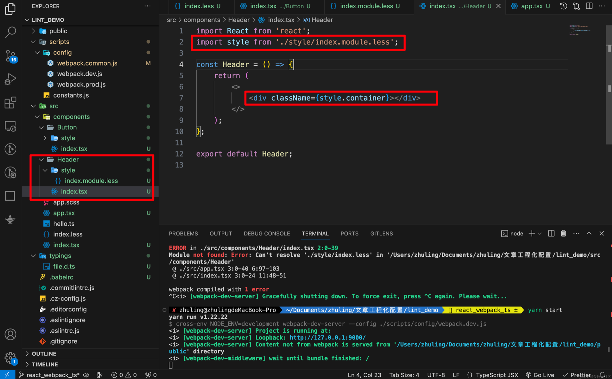

我们需要开启css模块化，请注意，对于模块化的方式，通常会使用 .module.less 作为文件后缀，以区分模块化的样式文件和全局的样式文件。所以less文件名需要改为`xxxx.module.less`

更改webpack配置，之前设置的是false

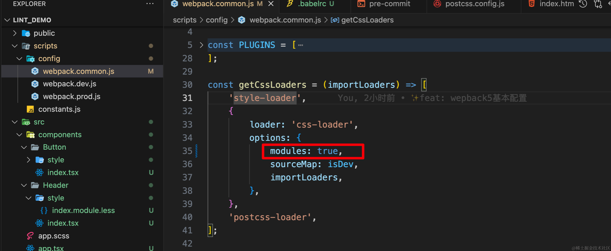

这样配置就OK了，模块化也生效了。

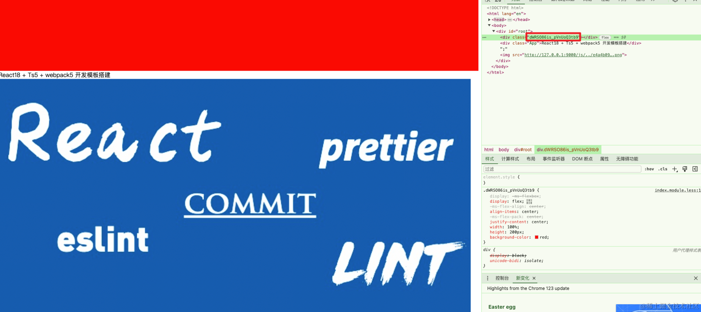

但是这个名字让我们看不出有任何规律，这里是可以更改配置的，配置规则如下
在 modules 对象中，localIdentName 是生成类名的模板字符串，它可以包含以下占位符：

*   \[local]：原始的类名。
*   \[path]：文件的相对路径。
*   \[name]：文件名。
*   \[hash:base64]：内容的 base64 哈希。
*   \[hash:base64:length]：长度限制的内容哈希。
*   \[folder]：文件所在的文件夹名。
    例如，localIdentName: '\[path]\[name]\_\_\[local]--\[hash:base64:5]' 可能产生下面这样的类名：src-components-MyComponent\_\_header--1a2b3c.

我们的配置如下：

    const getCssLoaders = (importLoaders) => [
    	'style-loader',
    	{
    		loader: 'css-loader',
    		options: {
    			modules: {
    				localIdentName: '[local]__[hash:base64:5]',
    			},
    			sourceMap: isDev,
    			importLoaders,
    		},
    	},
    	'postcss-loader',
    ];

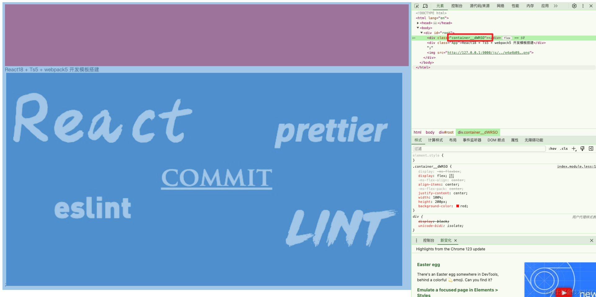

# 配置es6+转es5

之前我们已经使用 babel 去解析 react 语法和 typescript 语法了，但是目前我们所做的也仅仅如此，你在代码中用到的 ES6+ 语法编译之后依然全部保留，然而不是所有浏览器都能支持 ES6+ 语法的，这时候就需要`@babel/preset-env`，它会根据设置的目标浏览器环境（browserslist）找出所需的插件去转译 ES6+ 语法。比如 const 或 let 转译为 var 。

但是遇到 Promise 或 .includes 这种新的 es 特性，是没办法转译到 es5 的，除非我们把这中新的语言特性的实现注入到打包后的文件中，不就行了吗？我们借助 `@babel/plugin-transform-runtime` 这个插件，它和 @babel/preset-env 一样都能提供 ES 新API 的垫片，都可实现按需加载，但前者不会污染原型链。

比如我们先将webpack的模式更改为`development`，在Header组件中增加一点es6的逻辑，比如箭头函数

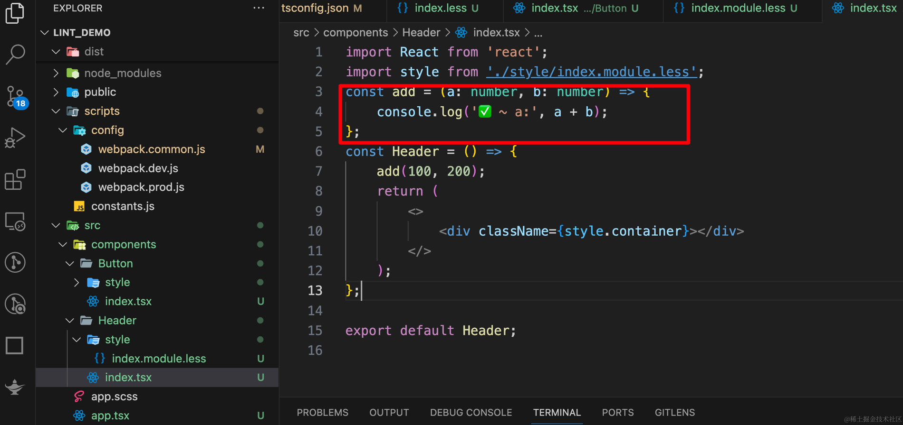

这时候我们打包看看，打包结果中，箭头函数并没有转换

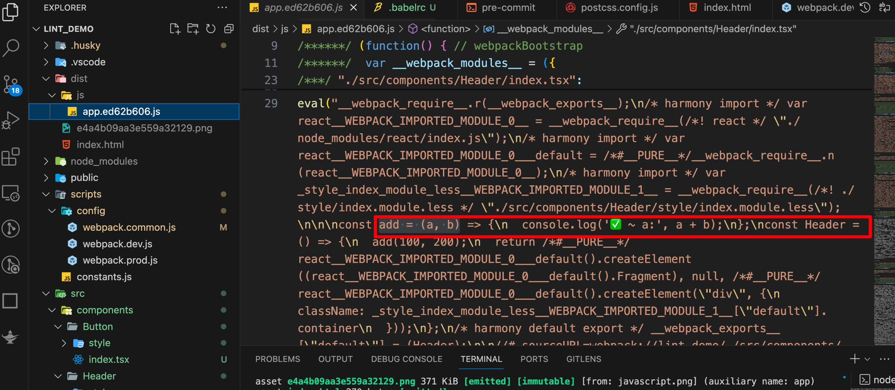

现在我们配置下es6+转换成es5

另外，babel 在编译每一个模块的时候在需要的时候会插入一些辅助函数例如 \_extend ，每一个需要的模块都会生成这个辅助函数，显而易见这会增加代码的冗余，`@babel/plugin-transform-runtime` 这个插件会将所有的辅助函数都从 `@babel/runtime-corejs3` 导入（我们下面使用 corejs3），从而减少冗余性。

    yarn add  @babel/preset-env@7.24.0 @babel/plugin-transform-runtime@7.24.0 -D
    
    yarn add @babel/runtime-corejs3@7.24.0 -S

> 注意： @babel/runtime-corejs3 的安装为生产依赖。
> 修改 .babelre 如下：

    {
      "presets": [
        [
          "@babel/preset-env",
          {
            // 防止babel将任何模块类型都转译成CommonJS类型，导致tree-shaking失效问题
            "modules": false
          }
        ],
        "@babel/preset-react",
        "@babel/preset-typescript"
      ],
      "plugins": [
        [
          "@babel/plugin-transform-runtime",
          {
            "corejs": {
              "version": 3,
              "proposals": true
            },
            "useESModules": true
          }
        ]
      ]
    }

可以看到，箭头函数已经被转换了，这里我们只需要知道如何配置即可，后序我们会专门对babel写一篇文章来介绍一下使用、原理等

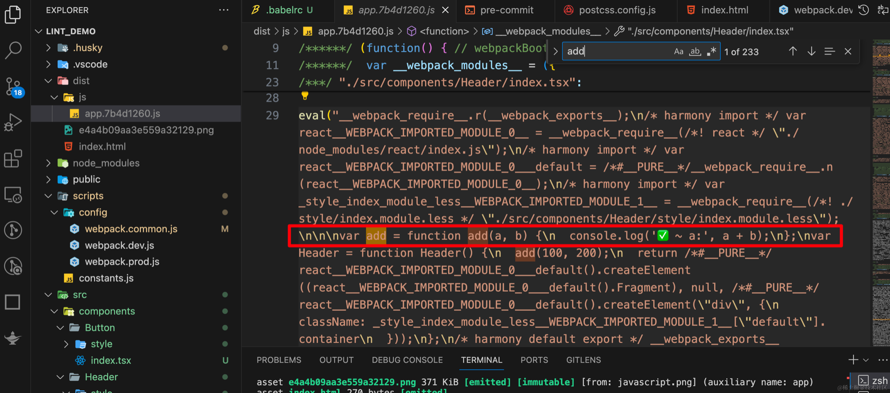

# 🍋 写在最后

如果你看到这里了，并且觉得这篇文章对您有所帮助，希望你能够点赞👍和收藏⭐支持一下作者🙇🙇🙇，感谢🍺🍺！如果文中有任何不准确之处，也欢迎您指正，共同进步。感谢您的阅读，期待您的点赞👍和收藏⭐！

感兴趣的同学可以关注下我的公众号ObjectX前端实验室

🌟 少走弯路 | ObjectX前端实验室 🛠️「精选资源｜实战经验｜技术洞见」
