---
group:
  title: 00实战搭建&部署篇
  order: 0
title: 9.Github Action、部署组件库文档
order: 9
# 这个可以将写的组件设置为demo在右侧展示
# demo: /
---
# 一、CI&CD
## CI：持续集成（Continuous Integration）
**持续集成（CI）** ：开发人员将代码频繁合并到共享存储库中，并通过自动化构建和测试流程快速验证代码的可用性。这有助于发现和解决集成问题，并促进团队更频繁地发布软件。

从日常开发的角度来说就是，我们平时开发的时候会从master切出一个feat分支，开发完成后又需要将feat合并到master的这个过程，在这个过程中进行代码测试，如果失败就不能集成，可以保证产品快速迭代的过程中还有较高的质量。

## CD: 持续交付
**持续交付（Continuous delivery）** 或者 **持续部署（continuous deployment）**  或者是两者的并集
**持续交付（CD）** 

CD：是一种自动化流程，可确保软件的每个更改都是可部署的。通过持续交付，团队可以随时准备将新功能、修复程序或改进部署到生产环境中。

**持续交付与持续部署之间的区别在于，需要手动批准才能更新到生产环境。对于持续部署，生产会在没有明确批准的情况下自动发生。**

说白了就是，
+ 持续交付就是平时我们搞定了一个大版本，但是有一个上线时间，一般不需要我们管，有专门的上线人员，我们只需要保证需求已经提交并且可部署就行了。
+ 持续部署就是平时开发的时候，我们需要部署测试环境，这个是我们自己把控的，一般合并mr就会自动部署到测试环境。

# 二、`GitHub Action`
## 1.简介
[官方文档](https://docs.github.com/en/actions/learn-github-actions/understanding-github-actions)

Git Action 是 GitHub 提供的一项功能，用于实现自动化工作流程。它基于事件驱动，当特定事件发生时（如代码推送、拉取请求等），Git Action 可以触发预定义的动作，比如运行测试、构建应用程序、部署到服务器等。

Git Action 的主要组成部分包括：

+ **工作流程（Workflow）** ：定义了一系列任务（即作业），以及它们执行的条件和顺序。工作流程使用 YAML 格式进行描述，并存储在代码仓库中的 `.github/workflows` 目录下。
+ **触发器（Trigger）** ：指定了触发工作流程的事件，如 push、pull_request、schedule 等。
+ **作业（Job）** ：工作流程中的一个步骤，可以包含一个或多个任务。
+ **任务（Step）** ：作业中的一个单元，表示执行一个命令或调用一个动作。任务可以是构建、测试、部署等操作。
+ **动作（Action）** ：预先构建好的可重用的任务，可以在工作流程中使用。GitHub 提供了许多官方的动作，也可以通过自定义动作来扩展功能。

官网图片示例：

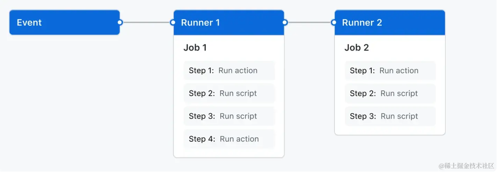

## 2.官方例子解析
```yaml
name: learn-github-actions
# 定义了工作流程的名称

run-name: ${{ github.actor }} is learning GitHub Actions
# 定义了作业的名称，使用了 GitHub 提供的内置变量 github.actor

on: [push]
# 指定了触发工作流程的事件，这里是当代码推送时触发

jobs:
  check-bats-version:
    runs-on: ubuntu-latest
    # 指定了作业运行的操作系统环境为最新的 Ubuntu

    steps:
      - uses: actions/checkout@v4
      # 使用了一个名为 checkout 的官方动作，用于拉取代码库

      - uses: actions/setup-node@v4
        with:
          node-version: '20'
        # 使用了一个名为 setup-node 的官方动作，设置 Node.js 环境，并指定了要安装的 Node.js 版本为 20

      - run: npm install -g bats
        # 运行了一个命令，使用 npm 全局安装 bats

      - run: bats -v
        # 运行了一个命令，检查 bats 的版本
```

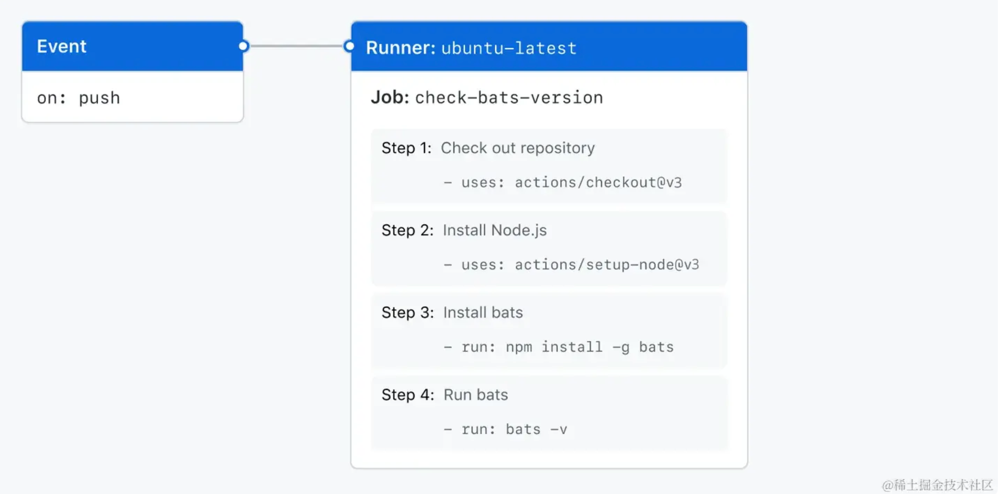

## 3.详解Workflow
一个工作流程是一个自动化的流程，可以由一系列的事件触发。工作流程定义在项目仓库中的一个 YAML 文件里，通常放置于 `.github/workflows/` 目录下。每个文件代表一个工作流程，你可以有多个工作流

### 工作流程文件的基本构成

```
name: Example Workflow # 工作流程的名称

on: [push]  # 触发工作流程的事件列表

jobs:  # 工作流程包含的工作列表
  build:
    runs-on: ubuntu-latest  # 工作运行的环境
    steps:  # 工作需要执行的步骤列表
      - uses: actions/checkout@v2  # 使用的 Action，这里是签出代码
      - name: Run a one-line script
        run: echo "Hello, world!" # 运行脚本命令
      - name: Run a multi-line script
        run: |
          echo "Add other commands"
          echo "Run multiple lines of scripts"
```

### 工作流程的关键元素

1.  `name`: 工作流程的名称，它会显示在 GitHub 仓库的 Actions 选项卡中。
1.  `on`: 这个语句定义了一组触发工作流程执行的事件。常见触发器包括像 `push`、`pull_request` 或者是定时事件 `schedule`。
1.  `jobs`: 工作流程包含的任务，它们可以并行运行或根据需要进行顺序运行。每个 job 都会在一个新的虚拟环境中运行。
1.  `runs-on`: 指定 job 运行在哪类运行环境上。可以是Ubuntu、Windows、macOS等。
1.  `steps`: steps 是 job 中的执行单元，它可以是运行脚本或者是一个已经打包的 Action。

### Actions

-   `actions/checkout`: 这是一个预构建的 action，用于签出你的仓库到运行工作流程的虚拟环境中，这样你才可以执行诸如构建、测试等任务。
-   自定义 Actions: 除了预构建的 Actions，你也可以编写自己的或者使用社区共享的 Actions。

### 事件触发机制

你可以设定以下事件之一或多个事件触发工作流程：

-   `push`: 当有提交被推送到仓库时。
-   `pull_request`: 当有 Pull Request 被创建或更新时。
-   `schedule`: 根据定时计划执行。
-   `release`: 当创建了一个新的 Release 时。
-   `workflow_dispatch`: 允许手动触发工作流程。

### 示例: 触发工作流程的事件

```
on:
  push:
    branches: [ master ]
  pull_request:
    branches: [ master ]
  schedule:
    - cron: '0 0 * * *'
```
### 解释下定时机制
`schedule` 在 GitHub Actions 工作流程（Workflow）中使用 cron 语法来定义定时任务。Cron 语法允许你精确地指定何时运行工作流程。

在 `schedule` 下的 `- cron` 字段中，你需要指定一个 cron 表达式。Cron 表达式由 5 或 6 个由空格分隔的字段组成，每个字段代表一个时间单位：

```
- cron: '分 时 日 月 星期几'
```

每个字段的可能取值如下：

-   分：`0` 到 `59` 或 `*`
-   时：`0` 到 `23` 或 `*`
-   日：`1` 到 `31` 或 `*`
-   月：`1` 到 `12` 或 `*`
-   星期几：`0` 到 `7`（其中 `0` 和 `7` 都代表星期日）或 `*`

单个星号 `*` 表示该字段的每个可能的值。

此外，还可以使用以下特殊字符来提供更多选项：

-   `*`：匹配字段的任意值
-   `,`：分隔一个字段中的多个值，表示或的关系（例如 `0,15,30,45`）
-   `-`：定义一个范围（例如 `1-5`）
-   `/`：指定间隔频率（例如 `*/15` 在分钟字段上表示每 15 分钟）

例如，如果你想要每天 UTC 时间在午夜（00:00）运行你的工作流程，你的 schedule 会像这样：

```
on:
  schedule:
    - cron: '0 0 * * *'
```

又或者，如果你想在每个工作日（星期一至星期五）的午夜以及下午 12 点运行你的工作流程，你的 schedule 会这样写：

```
on:
  schedule:
    - cron: '0 0 * * 1-5'
    - cron: '0 12 * * 1-5'
```

重要的是要注意，GitHub Actions 中的计划时间是以 UTC 为准的，并且最小的调度间隔为 5 分钟。如果你需要根据其他时区来计划任务，你需要在 cron 表达式中考虑时区转换。

在这个例子中，工作流程会在以下情况触发：

-   任何推送到 `master` 分支的提交。
-   提到 `master` 分支的任何 Pull Request 更新。
-   一个定时任务，它会在 UTC 时间每天 0 点执行。

GitHub Workflows 提供了强大的自动化能力，通过编写适当的 YAML 文件，开发团队可以显著提升他们的开发效率，实现自动化构建、测试、部署等一系列流程。

### 如何进行时区转换
用这个网站就可以[https://dateful.com/](https://dateful.com/time-zone-converter)

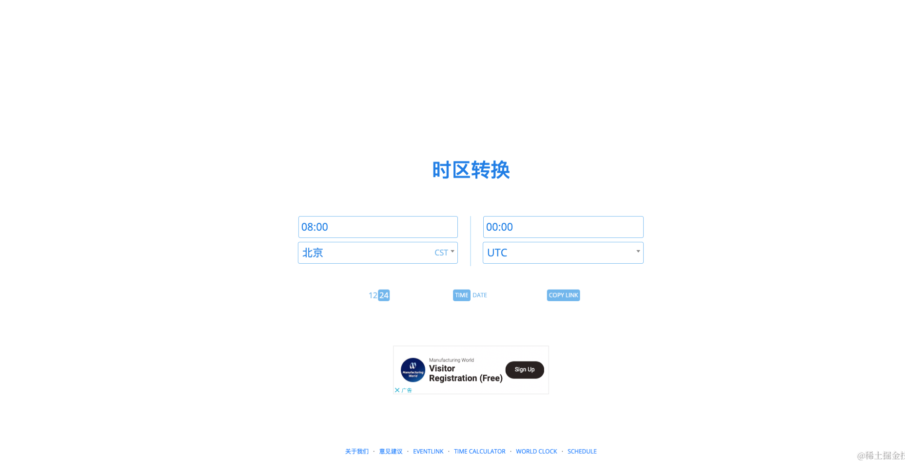

## 4.详解Events
GitHub Actions 的 `events` 是指触发工作流（workflow）执行的特定活动或条件。当这些事件发生在 GitHub 仓库中时，它们可以自动触发定义好的流程。GitHub 支持多种事件，每种事件可以单独或组合使用来触发工作流。这里简单介绍一些常见的，没必要记，用的时候官网查一查就可以了[Events that trigger workflows](https://docs.github.com/en/actions/using-workflows/events-that-trigger-workflows)

事件                    | 描述                                              |
| --------------------- | ----------------------------------------------- |
| `push`                | 当有提交被推送到仓库时触发，可以指定分支和标签。                        |
| `pull_request`        | 对PR不同操作触发，例如 `opened`, `synchronize`, `closed`。 |
| `schedule`            | 根据设定的计划时间触发，使用cron语法。                           |
| `workflow_dispatch`   | 允许手动触发工作流，可以在GitHub UI中或使用GitHub API。           |
| `repository_dispatch` | 当触发自定义的repository_dispatch事件时触发工作流。             |
| `release`             | 当发生发布操作时触发，如发布新版本、编辑或删除版本。                      |
| `issues`              | 当Issue发生变动时触发，例如被创建、编辑、开启或关闭。                   |
| `issue_comment`       | 当在Issue或PR下的评论被创建、编辑或删除时触发。                     |
| `create`              | 当新建标签或分支时触发。                                    |
| `delete`              | 当删除标签或分支时触发。                                    |
| `fork`                | 当仓库被fork时触发。                                    |
| `gollum`              | 当Wiki页面被创建或编辑时触发。


除了上述事件外，还有许多其他事件，例如 `watch`、`star`、`workflow_run`、`project_card` 等，可以在 GitHub Actions 的文档中找到完整的事件列表和它们的详细描述。

工作流事件可以非常灵活地配置，可以指定多个事件来触发同一个工作流，也可以根据事件的具体类型或某些分支或路径的改变来进一步细化触发条件。这使得 GitHub Actions 可以在众多场景下自动执行 CI/CD（持续集成/持续部署）和其他自动化任务。

务必注意，为了保护您的仓库不受滥用，并确保 GitHub Actions 的资源公平使用，GitHub 对工作流执行次数和方式有一些限制。例如，`schedule` 事件不能进行的频率太高，GitHub 规定最短的重复间隔是 5 分钟。

## 5.详解jobs
### 关键元素
-   **并行与依赖性**:

    -   默认情况下，作业是并行运行的，除非指定了依赖关系。
    -   可以通过 `jobs.<job_id>.needs` 属性来指定作业之间的依赖关系。只有当依赖的作业成功完成后，依赖于它的作业才会开始。

-   **运行环境（运行器）** :

    -   GitHub 提供了 Linux、Windows 和 macOS 等多种运行器，可以在这些操作系统上执行作业。
    -   可以使用 `jobs.<job_id>.runs-on` 属性指定作业的运行环境。
    -   如果需要，也可以使用自己的服务器作为自托管运行器。

-   **步骤（Steps）** :

    -   作业由顺序执行的一系列步骤组成，每个步骤可以是一个执行命令或者是使用一个动作（action）。
    -   步骤可以运行脚本、安装软件、部署代码、运行测试等操作。
    -   可以使用 `jobs.<job_id>.steps` 属性定义作业中的步骤。

-   **作业状态**:

    -   作业的运行状态可以是成功、失败或者取消。
    -   可以使用 `jobs.<job_id>.if` 条件来决定是否执行特定的作业，这取决于前一个作业的状态或工作流中的其他条件。

-   **环境变量的使用和共享**:

    -   作业中可以设置环境变量，这些变量在作业的所有步骤中都是可用的。
    -   环境变量可以在 `jobs.<job_id>.env` 下定义，或者在具体步骤中使用。
    -   输出可以从一个步骤传递到下一个步骤，甚至可以在作业之间传递，如果定义了输出并在作业级别声明了需要。

-   **工作矩阵（Matrix）** :

    -   使用矩阵策略（matrix strategy），可以让一个作业在不同版本的语言、不同的操作系统或不同的环境变量设置下运行，而不需要编写多个作业配置。
    -   使用 `jobs.<job_id>.strategy.matrix` 属性来定义矩阵。


### 举例
```yaml
name: Parallel Jobs with Conditions and Env Variables

on: push

jobs:
  setup:
    runs-on: ubuntu-latest
    outputs:
      matrix: ${{ steps.set-matrix.outputs.matrix }}
    steps:
      - id: set-matrix
        run: echo "::set-output name=matrix::{"include":[{"config":"prod"},{"config":"dev"}]}"

  build:
    needs: setup
    runs-on: ubuntu-latest
    strategy:
      matrix: ${{fromJson(needs.setup.outputs.matrix)}}
    steps:
      - name: Check out repository code
        uses: actions/checkout@v2

      - name: Build
        run: echo "Building for ${{ matrix.config }}"
        env:
          BUILD_ENV: ${{ matrix.config }}

  deploy:
    needs: build
    if: ${{ github.ref == 'refs/heads/main' && matrix.config == 'prod' }}
    runs-on: ubuntu-latest
    strategy:
      matrix: ${{fromJson(needs.setup.outputs.matrix)}}
    steps:
      - name: Deploy
        run: echo "Deploying to ${{ matrix.config }} environment."
        env:
          DEPLOY_ENV: ${{ matrix.config }}
```

该工作流定义了以下作业且假定存在 `prod` 和 `dev` 配置：

-   `setup`：初始化操作的作业，它设置了一个输出变量 `matrix`，这里是一个 JSON 对象，包含了两种环境 `prod` 和 `dev`。这个作业会在后续作业的矩阵策略中使用。
-   `build`：一个依赖于 `setup` 作业的构建作业，它利用从 `setup` 作业传递过来的矩阵（通过 `needs.setup.outputs.matrix` 获取），并行地为 `prod` 和 `dev` 环境构建。它包括检出代码的步骤以及一个命令行构建步骤，这个步骤使用环境变量 `BUILD_ENV` 显示构建环境信息。
-   `deploy`：一个依赖于 `build` 作业的部署作业，它也使用矩阵策略，并且只有当分支是 `main` 且矩阵配置是 `prod` 时才执行。这个作业包含了一个部署的步骤，它同样使用环境变量 `DEPLOY_ENV` 显示部署环境信息。

重要的概念点：

-   **`needs` 属性**：指定了作业之间的依赖关系。`build` 和 `deploy` 作业都需要在 `setup` 完成后才会开始，并且 `deploy` 需要在 `build` 完成后才会开始。
-   **`if` 条件**：在 `deploy` 作业中使用，确保只有在满足一定条件（在 `main` 分支且配置为 `prod`）时才执行部署。
-   **环境变量**：在 `build` 和 `deploy` 作业的步骤中通过 `env` 定义，并在运行命令中引用。
-   **工作矩阵**：在 `build` 和 `deploy` 作业中使用了矩阵，它由 `setup` 作业定义并传递给后续作业。
-   **作业输出**：`setup` 作业设置了一个输出值 `matrix`，它在 `build` 和 `deploy` 作业的矩阵策略中被引用。

## 6.详解actions

在 GitHub Actions 中，“动作”（Actions）是一种封装了复杂任务的独立组件，你可以在工作流中的任何步骤中使用这些动作。动作可以是写好的单一命令，也可以是复杂的工作流程，包含多个步骤。动作分为两类：GitHub官方提供的动作和[社区](https://github.com/marketplace?utf8=%E2%9C%93&type=actions&query=deploy)贡献的动作。

### GitHub Actions 动作的特点

-   **复用性**：动作可以在多个工作流中复用。
-   **封装性**：动作可以封装复杂逻辑，从而简化工作流的配置。
-   **社区驱动**：GitHub 市场上有成千上万的动作可供使用，不断有新的动作被开发和分享。
-   **自定义**：如果市场上没有你所需要的动作，你可以自己编写一个动作。

### 使用动作

在工作流定义文件中，一个步骤可以引用一个动作。你可以通过 `uses` 关键字  根据，作者的用户名、仓库名和标签、分支或提交SHA来引用一个动作。

例如以下YAML配置中，`checkout` 和 `setup-node` 是两个不同的动作：

```
steps:
- name: Check out repository code
  uses: actions/checkout@v2
  
- name: Use Node.js ${{ matrix.node-version }}
  uses: actions/setup-node@v2
  with:
    node-version: ${{ matrix.node-version }}
```

在这个例子中：

-   `actions/checkout@v2` 是一个动作，用于检出你的代码库到 GitHub Actions 运行器上，`v2` 是这个动作的版本标签。
-   `actions/setup-node@v2` 是另一个动作，用于在运行器上安装 Node.js，并且可以指定版本号。这个动作也采用了版本标签 `v2`。

### 动作输入

像 `setup-node` 这样的动作允许你传入输入参数，这些参数在动作内部用来配置其行为。你可以使用 `with` 关键字来设置这些输入：

```
- name: Use Node.js ${{ matrix.node-version }}
  uses: actions/setup-node@v2
  with:
    node-version: '12.x'
```

在这个例子中 `node-version: '12.x'` 指定了 Node.js 的版本。

### 动作输出

动作还可以生成输出，这些输出可以在工作流中后续步骤中使用。动作的开发者需要在动作中明确声明输出的参数。

### 自定义动作

GitHub Actions 允许你创建自定义动作。每个动作都是一个小的独立代码仓库，它可能包含：

-   一个 `Dockerfile`（用于创建Docker容器动作）
-   一个 `action.yml` 文件（定义动作的接口）
-   实现逻辑的代码文件（比如JavaScript或Shell脚本）

创建动作后，你或其他人都可以通过 GitHub 仓库来使用它。

## 7.runners运行器
GitHub Actions 的运行器（Runners）是负责执行工作流的服务器。当在仓库中设置 GitHub Actions 工作流并触发了一个事件（如一个 push 操作）时，运行器就会根据工作流定义执行相关的作业（Jobs）。每个作业都是在运行器上执行的。运行器可以是由 GitHub 托管的也可以是自托管的，[配置教程](https://docs.github.com/en/actions/hosting-your-own-runners)

### GitHub 托管的运行器

GitHub 提供了托管的运行器，支持多个操作系统和平台：

-   Ubuntu Linux
-   Windows
-   macOS

这些托管的运行器由 GitHub 自动管理和更新，可以让用户不必担心维护和升级。使用托管的运行器非常方便，因为你可以快速启动 CI/CD 流水线而不必关心基础设施的问题。不过，每个仓库有使用这些托管运行器的限额和时间限制，需要注意。

### 自托管的运行器

如果你需要更多的控制，或者因为安全、政策或许可证要求，可以使用自托管运行器。自托管的运行器是你设置和管理的服务器或虚拟机，它可以在你自己的数据中心、云环境或者任何其他网络环境中运行。

自托管运行器有如下优势：

-   **定制环境**：可以安装必要的依赖、工具、脚本等。
-   **更大的控制权**：对运行器的操作系统、硬件和网络设置有完全的控制。
-   **节省成本**：如果有大量的自动化工作量，使用自己的硬件可以更经济。
-   **无限制**：没有使用时间的限制，可以一直运行。

但是自托管的运行器也需要一些额外的管理工作，比如监控、更新和安全性保障。

### 运行器的工作原理

当你的 GitHub Actions 工作流触发时，GitHub 会在可用的运行器上分配并开始执行作业。如果是在托管的运行器上运行，GitHub 会为每个作业创建一个全新的虚拟环境。如果是在自托管的运行器上，作业会在你提供的机器上运行。

工作流中的每个作业由一系列步骤（steps）组成。这些步骤可以是运行脚本的命令，也可以是引用的动作。无论在哪种类型的运行器上，步骤的执行都是按定义的顺序依次进行。

在一个自托管运行器实例被启动和注册到你的 GitHub 仓库或整个 GitHub 组织后，它就可以被用于运行作业。你可以有多个自托管运行器以便同时处理多个作业。

### 维护运行器

无论是使用 GitHub 托管的运行器还是自托管的运行器，保持运行器安全和最新都非常重要。对于 GitHub 托管的运行器，这些都由 GitHub 自动处理。对于自托管的运行器，你需要定期：

-   更新操作系统和安装的包。
-   确保运行器的硬件和软件安全性。
-   更新 GitHub Actions 运行器应用。

# 三、实操
## 1.自动部署组件库文档
### 增加yml文件
在我们之前搭建好的组件库模板下增加`.github/workflows/storybook.yml`，这里我给出两个脚本内容，因为其中脚本2可能出现`storybook`打包出现动态引入报错问题，但是隔天之后我无法复现。脚本1需要配置`secret`，后面会解释这个`secret`是做什么的。脚本2则不需要，如果不报错的话，直接用脚本2就好了。

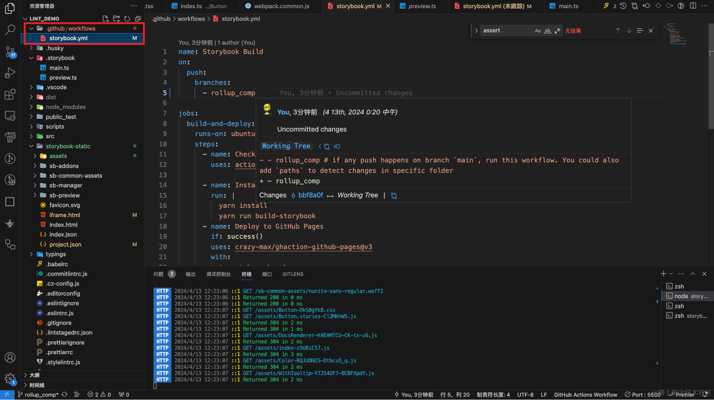

#### 脚本1
```yaml
# GitHub Actions工作流：Storybook构建与部署
# 当代码推送到'rollup_comp'分支时触发
on:
  push:
    branches:
      - rollup_comp

jobs:
  # 构建并部署作业
  build-and-deploy:
    # 运行环境为最新版的Ubuntu
    runs-on: ubuntu-latest
    steps:
      # 检出代码到工作目录
      - name: Checkout
        uses: actions/checkout@v2.3.1

      # 安装依赖并构建Storybook文档
      - name: Install and Build
        run: |
          yarn install
          yarn run build-storybook

      # 部署到GitHub Pages
      # 仅当前面的步骤成功时执行
      - name: Deploy to GitHub Pages
        if: success()
        uses: crazy-max/ghaction-github-pages@v3
        with:
          # 目标分支为'gh-pages'
          target_branch: gh-pages
          # 构建目录为'storybook-static'
          build_dir: storybook-static
          # 提交信息为'chore(deploy): Storybook'
          commit_message: 'chore(deploy): Storybook'
          # 不保留历史记录
          keep_history: false
          # 禁用Jekyll
          jekyll: false
        env:
          # 设置GitHub Token
          GITHUB_TOKEN: ${{ secrets.DELOY_STORYBOOK }}
```
#### 脚本2
```yaml
name: Storybook Build
on:
  push:
    branches:
      - rollup_comp

jobs:
  build-and-deploy:
    runs-on: ubuntu-latest
    steps:
      - name: Checkout
        uses: actions/checkout@v2.3.1

      - name: Install and Build # 安装并且构建组件库文档
        run: |
          yarn install
          yarn run build-storybook
      - name: Deploy
        uses: JamesIves/github-pages-deploy-action@3.6.2
        with:
          branch: gh-pages
          folder: storybook-static # npm run build-storybook输出的文件夹
```
### 记录一个动态导入问题【我还复现了不了这个问题了😠】

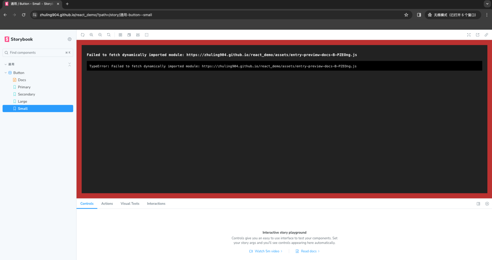
其他没什么好解释的，解释下为什么使用`crazy-max/ghaction-github-pages@v3`，我原本计算是使用`JamesIves/github-pages-deploy-action@3.6.2`，但是对于storybook打包后的代码部署完成后，会有一个动态引入的问题，我在storybook的[issue](https://github.com/storybookjs/storybook/issues/20564)里面看到了解决办法，挨个尝试之后，只有换`crazy-max/ghaction-github-pages@v3`这个脚本，关闭Jekyll默认部署才解决

在 `GitHub Pages` 上托管静态网站时，默认情况下会使用 Jekyll 来处理静态网站的构建和展示。但是，如果您的网站不需要 Jekyll 的功能，可以禁用它以加快构建速度并避免潜在的问题。

在这个工作流中，禁用 Jekyll 的原因可能是 Storybook 构建的静态网站不需要 Jekyll 的功能，所以可以安全地禁用它。这样可以确保部署流程更加简单和高效。

### 使用脚本2需要配置权限
否则脚本会报403无权限的错，无法写入仓库。

如果使用脚本2没报错，那就直接改分支名推上去就行了，推送之前需要在仓库给action赋予权限

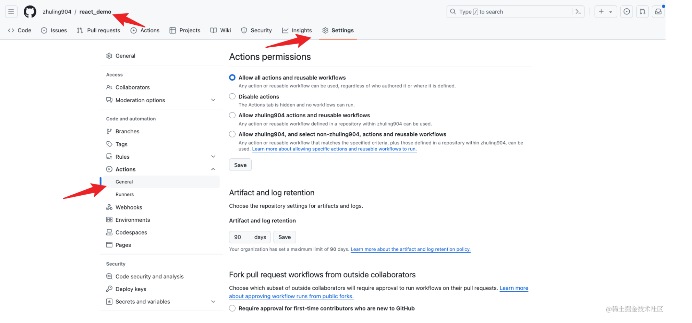


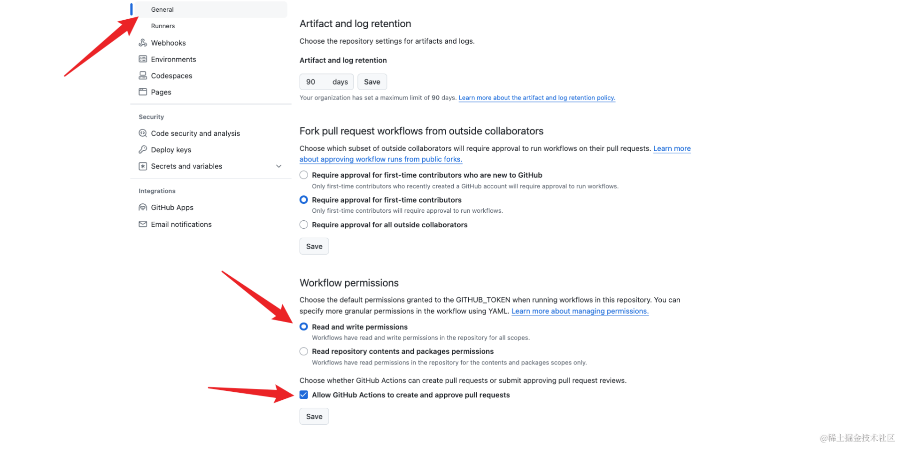

### 使用脚本1需要配置Action Secret
在一些情况下，你需要给你自己的 action 或者是官方提供的 action 进行传参，但是又不想暴露自己的这部分私密数据，那么你就需要新建一个自己的 Secret ，并把传参方式改成从运行环境中读取

**新建一个自己的 Secret**

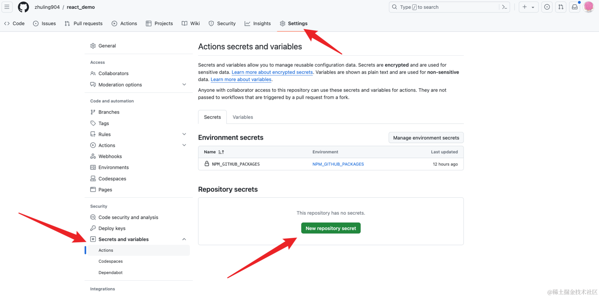


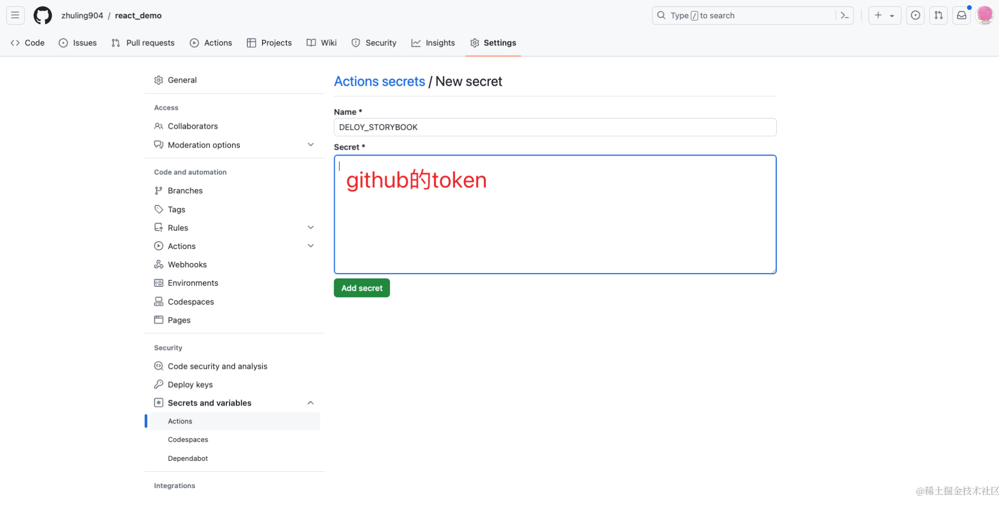

**获取token**

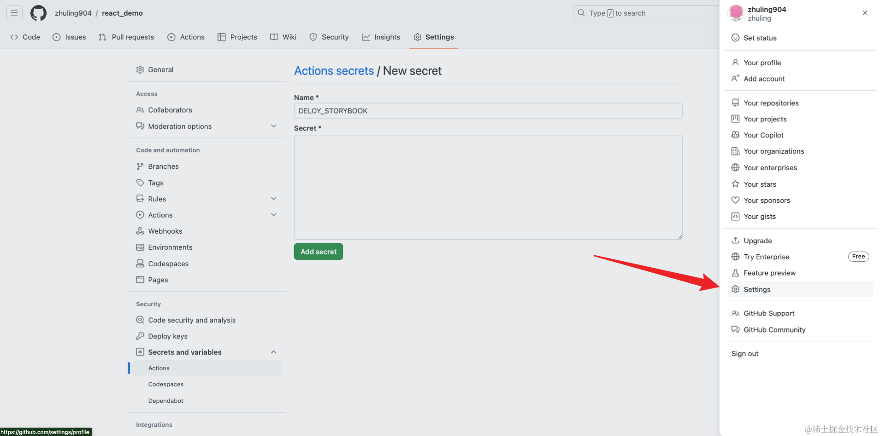


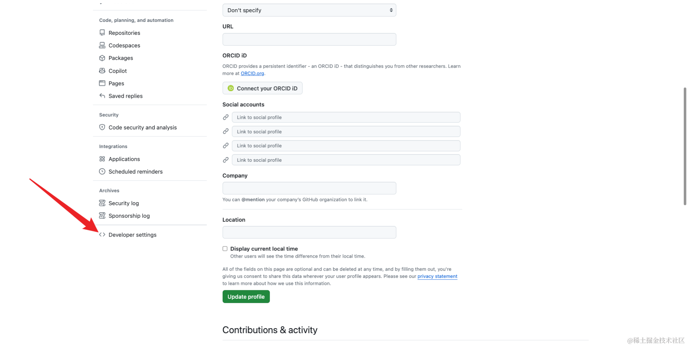


然后推送，就OK了。

### 第一次部署
第一次部署后可能需要去设置下pages的分支和目录

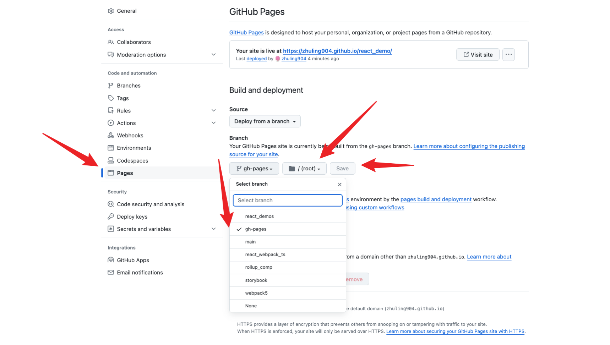

### 效果
[在线demo](https://zhuling904.github.io/react_demo/?path=/docs/%E9%80%9A%E7%94%A8-button--docs)

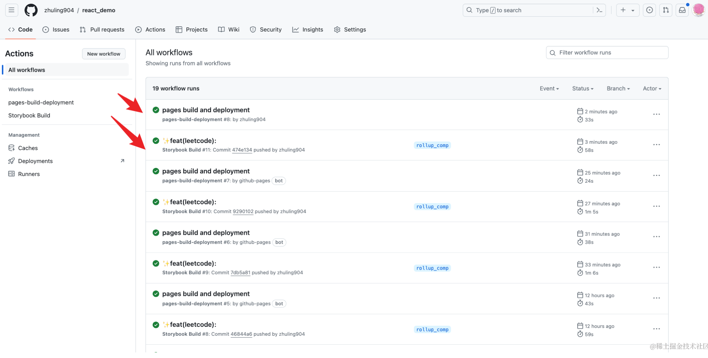

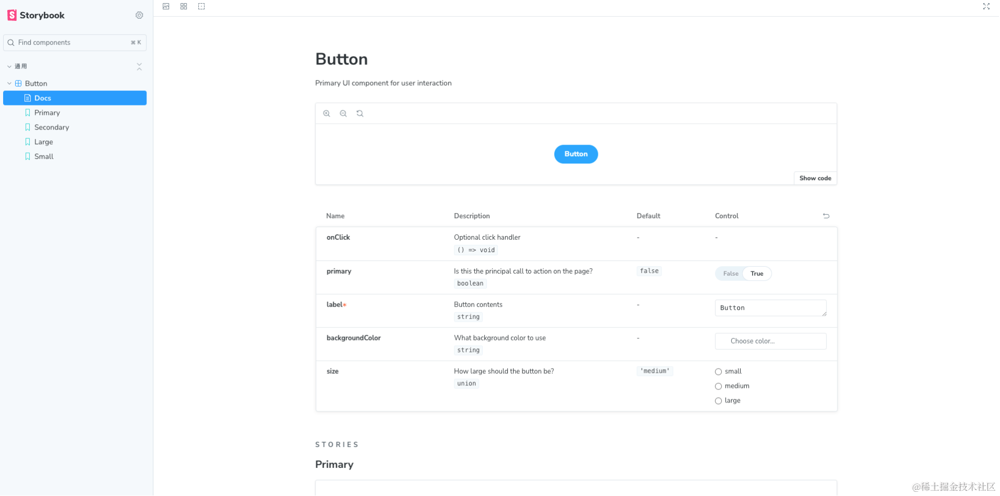


## 2.增加`github3D`指标统计
### 创建一个跟github用户名一样的仓库
这是一个特殊的仓库

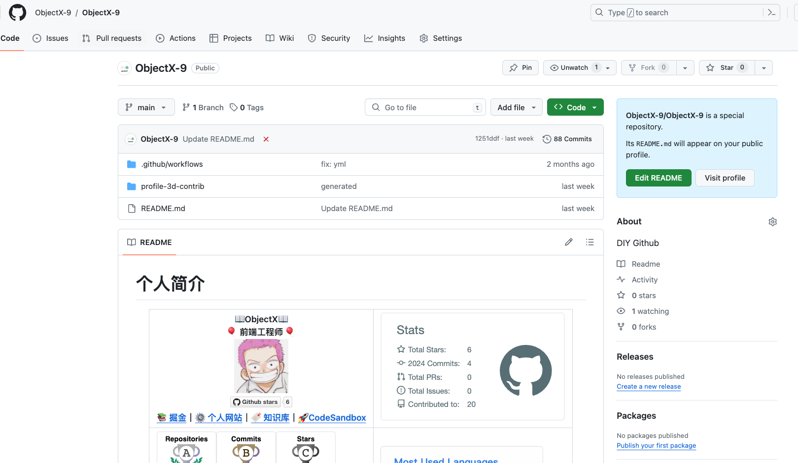
### 增加脚本
将名字改成你得github用户名
```yaml
name: GitHub-Profile-3D-Contrib

on:
  push:
    branches:
      - main
  schedule: # 03:00 JST == 18:00 UTC
    - cron: "0 18 * * *"
  workflow_dispatch:

jobs:
  build:
    runs-on: ubuntu-latest
    name: generate-github-profile-3d-contrib
    steps:
      - uses: actions/checkout@v3
      - uses: yoshi389111/github-profile-3d-contrib@0.7.1
        env:
          GITHUB_TOKEN: ${{ secrets.GITHUB_TOKEN }}
          USERNAME: !!!《你的Github用户名》
      - name: Commit & Push
        run: |
          git config user.name github-actions
          git config user.email github-actions@github.com
          git add -A .
          git diff --staged --exit-code || (git commit -m "generated" && git push)
```
推送上去，然后在readme中加入如下内容，这个是带动画的指标统计，还有其他的主题，你可以在[这里](https://github.com/marketplace/actions/github-profile-3d-contrib)预览选择 
```
  # 指标

```

大功告成

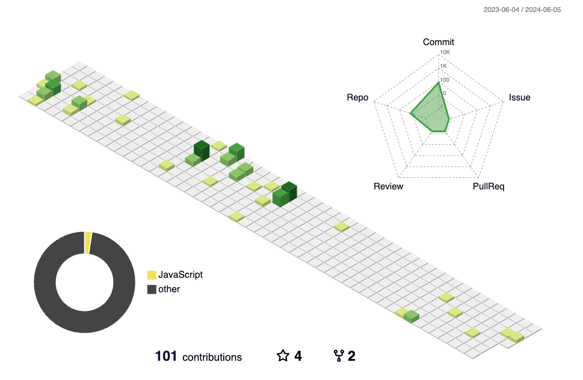


# 🍋 写在最后

如果您看到这里了，并且觉得这篇文章对您有所帮助，希望您能够点赞👍和收藏⭐支持一下作者🙇🙇🙇，感谢🍺🍺！如果文中有任何不准确之处，也欢迎您指正，共同进步。感谢您的阅读，期待您的点赞👍和收藏⭐！

感兴趣的同学可以关注下我的公众号ObjectX前端实验室


🌟 少走弯路 | ObjectX前端实验室 🛠️「精选资源｜实战经验｜技术洞见」
