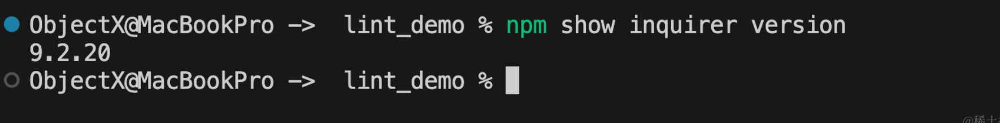
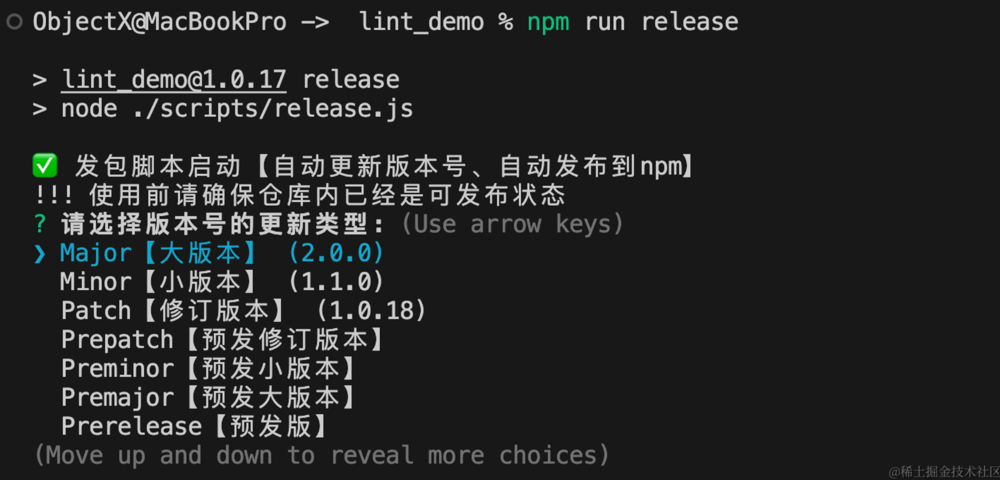

---
group:
  title: 00实战搭建&部署篇
  order: 0
title: 10.自动化篇-手写脚本一键自动tag、发包、引导登录npm
order: 10
# 这个可以将写的组件设置为demo在右侧展示
# demo: /
---
# 🍑 一、新增脚本文件&命令&核心流程
在项目的`src/scripts`目录下新增文件，增加`release.js`文件，文件内容如下
```js
/**
 * 主函数入口
 */
async function main() {
	try {
		
	} catch (error) {
		console.error('❌ 发生错误:', error);
	}
}

main();
```
在项目的`package.json`中增加如下命令，后续我们使用`npm run release`一键更新npm版本、Git缓存更改、自动标记tag、自动发布到npm。

```js
"release": "node ./scripts/release.js"
```


核心流程伪代码如下：
```js
let newVersion = getNewVersion();
// 更新版本号
updateVersion(newVersion);
// git增加tag并提交
gitOperations(newVersion);
// 设置npm源
const oldRegistryUrl = await setNpmRegistry();
// 检测是否已经登录npm
await ensureNpmLoggedIn();
// 发布到npm
await publishToNpm();
// 恢复npm源
await restoreNpmRegistry(oldRegistryUrl);
```

# 🥑 二、获取当前已经发布的最新的的版本号
`npm show ${packageName} version` 是一个用于检索指定 npm 包的最新版本信息的命令。通过运行这个命令，可以查看指定包的最新版本号。

-   `${packageName}`：这里是指要查找的 npm 包的名称。

举个例子，如果要查看包名为`inquirer`的最新版本号

```
npm show inquirer version
```

运行以上命令后，npm 将返回`inquirer`包的最新版本号



实现函数如下
```js
const exec = util.promisify(require('child_process').exec);
/**
 * 获取最新版本号
 * @returns Promise
 */
async function getLatestVersion() {
	try {
		const {stdout} = await exec(`npm show ${packageName} version`);
		const latestVersion = stdout.trim().replace(/^v/, ''); // 删除可能存在的前导 v
		return latestVersion;
	} catch (error) {
		console.error(`❌ 获取最新版本失败: ${error.message}`);
		throw error; // 抛出错误，以便可以在调用此函数的地方捕获并处理
	}
}
```

解释下
```js
const exec = util.promisify(require('child_process').exec);
```
这行代码的作用是将 `Node.js` 中的回调风格的函数转换为 `Promise` 风格的函数，使得可以更方便地处理异步操作。

具体解释如下：

1.  `require('child_process').exec`：这里是通过 `require` 函数引入 `node` 核心模块 `child_process` 中的 `exec` 方法，`exec` 方法用于在子进程中执行 `shell` 命令。
1.  `util.promisify`：这是 `node` 中的 `util` 模块提供的方法，用于将一个遵循回调函数规则的方法转换成返回 Promise 的函数。这里将 `child_process.exec` 方法转换为 `Promise` 风格的方法。
1.  `const exec = util.promisify(require('child_process').exec);`：将经过 `util.promisify` 处理后的 `child_process.exec` 方法赋值给一个新的常量 `exec`，从而创建了一个返回 `Promise` 的新函数 `exec`。

我们更改主函数如下:
```js
/**
 * 主函数入口
 */
async function main() {
	try {
		const latestVersion = await getLatestVersion();
	} catch (error) {
		console.error('❌ 发生错误:', error);
	}
}

main();
```

# 🍒 三、实现显示选择界面
## 1.`inquirer`的基本使用
这里使用的是`inquirer`库，
**`Inquirer`** 用于创建交互式命令行界面。它提供了丰富的方式来与用户进行交互，例如提问问题、接收用户输入并根据用户的响应执行相应的操作。

以下是使用 **Inquirer** 的基本步骤：

1.  **安装 Inquirer**：首先需要在项目中安装 `Inquirer` 模块。可以使用以下命令通过 npm 进行安装：

    ```
    npm install inquirer
    ```

1.  **引入 Inquirer 模块**：在项目中引入 Inquirer 模块，以便在代码中使用它：

    ```
    const inquirer = require('inquirer');
    ```

1.  **创建问题数组**：通过创建一系列问题的数组来定义需要向用户提出的问题。每个问题可以包括类型、消息、选择项等属性。

    ```js
    const questions = [
      {
        type: 'input',
        name: 'username',
        message: '请输入您的用户名：'
      },
      {
        type: 'list',
        name: 'color',
        message: '请选择您喜欢的颜色：',
        choices: ['红色', '蓝色', '绿色']
      }
    ];
    ```

1.  **使用 Inquirer 提出问题**：调用 `inquirer.prompt()` 方法并传入问题数组来开始与用户交互。用户将依次回答每个问题。

    ```js
    inquirer.prompt(questions)
      .then(answers => {
        console.log('您输入的用户名是：', answers.username);
        console.log('您选择的颜色是：', answers.color);
      })
      .catch(error => {
        console.error('交互过程中出错：', error);
      });
    ```
## 2.实现我们需要的界面
之前我们已经介绍过了[npm的工程管理命令](https://juejin.cn/post/7356175306937466916)，这里函数的逻辑就根据选择的版本类型，根据上面获取到的当前最新版包计算出新发布的版本信息。



代码如下：
```js
/**
 * 命令行显示逻辑
 * @param {*} latestVersion
 */
async function displayOptions(latestVersion) {
	console.log('✅ 发包脚本启动【自动更新版本号、自动发布到npm】');
	console.log('!!! 使用前请确保仓库内已经是可发布状态');
	const currentVersion = parseVersion(latestVersion);
	const choices = [
		{
			name: `Major【大版本】 (${parseInt(currentVersion.major) + 1}.0.0)`,
			value: 'major',
		},
		{
			name: `Minor【小版本】 (${currentVersion.major}.${parseInt(currentVersion.minor) + 1}.0)`,
			value: 'minor',
		},
		{
			name: `Patch【修订版本】 (${currentVersion.major}.${currentVersion.minor}.${parseInt(currentVersion.patch) + 1})`,
			value: 'patch',
		},
		{name: `Prepatch【预发修订版本】`, value: 'prepatch'},
		{name: `Preminor【预发小版本】`, value: 'preminor'},
		{name: `Premajor【预发大版本】`, value: 'premajor'},
		{name: `Prerelease【预发版】`, value: 'prerelease'},
		{name: `Specific version【指定版本】`, value: 'specific'},
	];

	inquirer
		.prompt([
			{
				type: 'list',
				name: 'releaseType',
				message: '请选择版本号的更新类型:',
				choices: choices,
			},
			{
				type: 'input',
				name: 'specificVersion',
				message: '输入具体的版本号:',
				when: (answers) => answers.releaseType === 'specific',
				validate: (input) =>
					/\d+\.\d+\.\d+(-\w+\.\d+)?/.test(input) ||
					'版本号必须符合语义化版本控制规范。',
			},
		])
		.then(async (answers) => {
                    // TODO：选择后的处理逻辑
		});
}
```

# 🥝 四、实现将新版本号写入`package.json`
这里我们区分正常版本发布和预发布两种
```js
let newVersion = '';
// 指定版本号，自己指定的版本号
if (answers.releaseType === 'specific') {
        newVersion = answers.specificVersion;
} else if (['major', 'minor', 'patch'].includes(answers.releaseType)) {
        // 非预发版本，上面计算出来的值
        currentVersion[answers.releaseType]++;
        newVersion = `${currentVersion.major}.${currentVersion.minor}.${currentVersion.patch}`;
} else {
        // 预发布版本，也是上面的计算逻辑，这里我们提出来了
        newVersion = getPreReleaseVersion(currentVersion, answers.releaseType);
}
// 更新版本号，写入到`package.json`中
updateVersion(newVersion);
```
预发布版本计算，个人开发一般也不用这种，但是我们还是实现一下
```js
/**
 * 检测是否是预发布版本
 * @param {*} version
 */
function isPreRelease(version) {
	return /-/.test(version);
}

/**
 * 获取预发布版本号
 * @param {*} currentVersion
 * @param {*} type
 */
function getPreReleaseVersion(currentVersion, type) {
    let {major, minor, patch, preReleaseLabel, preReleaseVersion} =
            currentVersion;
    switch (type) {
        case 'prepatch':
                patch += 1;
                return `${major}.${minor}.${patch}-0`;
        case 'preminor':
                minor += 1;
                return `${major}.${minor}.0-0`;
        case 'premajor':
                major += 1;
                return `${major}.0.0-0`;
        case 'prerelease':
                if (isPreRelease(`${major}.${minor}.${patch}`)) {
                        preReleaseVersion = preReleaseVersion || 0;
                        return `${major}.${minor}.${patch}-${preReleaseLabel || 'beta'}.${preReleaseVersion + 1}`;
                } else {
                        return `${major}.${minor}.${patch}-beta.0`;
                }
        default:
                throw new Error(`❌ 不支持的预发布版本类型: ${type}`);
    }
}
```

写入到`package.json`中
```js
/**
 * 更新版本号
 * @param {*} newVersion
 */
function updateVersion(newVersion) {
	packageJson.version = newVersion;
	fs.writeFileSync(packageJsonPath, JSON.stringify(packageJson, null, 2));
	console.log(`✅ 版本号已更新为 ${newVersion}`);
}
```
# 🍐 五、实现Git标记tag并推送远端
这里使用的是当前分支，需要当前分支是否关联了远端分支，如果未关联，我们给他关联上，关联完成后我们给他标记tag并推送到远端。
```js
/**
 * 标记tag
 * @param {*} newVersion
 */
function gitOperations(newVersion) {
	try {
		process.chdir(projectRootPath); // Change the current working directory to project root

		// 获取当前分支名称
		const branchName = execSync('git rev-parse --abbrev-ref HEAD')
			.toString()
			.trim();

		// 检查是否有设置 upstream（远程跟踪分支）
		let setUpstream = false;
		try {
			execSync(`git rev-parse --abbrev-ref --symbolic-full-name @{u}`);
		} catch (error) {
			// 如果没有设置 upstream，为远程的同名分支设置 upstream
			const remoteBranchExists = execSync(
				`git ls-remote --heads origin ${branchName}`,
			)
				.toString()
				.trim();
			if (remoteBranchExists) {
				execSync(`git branch --set-upstream-to=origin/${branchName}`);
			} else {
				console.error(
					`❌ 远程分支 'origin/${branchName}' 不存在，无法设置 upstream。`,
				);
				return;
			}
			setUpstream = true;
		}

		execSync(`git add .`, {stdio: 'inherit'});
		execSync(`git commit -m "chore(release): ${newVersion}"`, {
			stdio: 'inherit',
		});
		execSync(`git tag v${newVersion}`, {stdio: 'inherit'});

		// 推送改动到远程分支
		execSync(`git push`, {stdio: 'inherit'});
		if (setUpstream) {
			// 如果之前没有 upstream，并且我们为其设置了 upstream，现在也推送它
			execSync(`git push --set-upstream origin ${branchName}`, {
				stdio: 'inherit',
			});
		}
		// 推送tag到远程
		execSync(`git push origin v${newVersion}`, {stdio: 'inherit'});

		console.log(`✅ Git tag v${newVersion} 已标记`);
	} catch (error) {
		console.error(`❌ Git 操作失败: ${error.message}`);
	}
}
```
# 🍉 六、实现设置`npm`源
处理这个是因为我们可能使用`nrm`更改过`npm`的源，或者使用`.npmrc`，时候如果不更换会无法登录或者脚本执行流程正确，比如改成淘宝的之类，源不对没法发布，我们先记录当前`npm`源，检测是否已经登录`npm`、未登录提示登录、发布包、然后恢复`npm`源
```js
// 设置npm源
const oldRegistryUrl = await setNpmRegistry();
// 检测是否已经登录npm
await ensureNpmLoggedIn();
// 发布到npm
await publishToNpm();
// 恢复npm源
await restoreNpmRegistry(oldRegistryUrl);
```

## 1.保存旧的`npm`源并更新
主要就是先`npm config get registry`，然后在`npm config set registry`，如果是私域的`npm`，你可以更改这里的`url`，或者直接扩展这个脚本，改成询问的方式，使用`nrm`切换
```js
/**
 * 设置npm的registry到指定的URL，并返回旧的registry
 * @returns {Promise<string>} 当成功时返回旧的registry URL
 */
async function setNpmRegistry() {
    try {
            const {stdout: getRegistryStdout} = await exec(`npm config get registry`);
            const oldNpmRegistry = getRegistryStdout.trim();

            const NPM_REGISTRY_URL = 'https://registry.npmjs.org/';
            await exec(`npm config set registry ${NPM_REGISTRY_URL}`);

            console.log(`✅ npm registry已设置为: ${NPM_REGISTRY_URL}`);
            return oldNpmRegistry; // 返回旧的registry，以便后续可以恢复
    } catch (error) {
            if (error.stdout) {
                    console.error(`❌ 设置npm registry stdout输出流: ${error.stdout}`);
            }
            if (error.stderr) {
                    console.error(`❌ 设置npm registry stderr出错: ${error.stderr}`);
            }
            console.error(`❌ 设置npm registry中发生错误: ${error.message}`);
            throw error; // 抛出错误以供调用者处理
    }
}
```
## 2.检测是否已经登录`npm`
之前的文章中我们已经介绍过，未登录`npm`是无法发包的，但是自动化的脚本对于这种敏感信息引导用户手动登录比较安全，这里我们通过`npm whoami`命令判断用户是否登录，如果未登录，引导用户登录
```js
/**
 * 确保用户已登录npm
 * @returns {Promise<string>} 返回已登录用户的名称或抛出错误
 */
async function ensureNpmLoggedIn() {
        try {
                const {stdout} = await exec('npm whoami');
                console.log(`✅ 检测到您已作为${stdout.trim()}登录到npm`);
                return stdout.trim();
        } catch (error) {
                console.error('❌ 您似乎还没有登录到npm。请登录后继续。');
                const answers = await inquirer.prompt([
                        {
                                type: 'input',
                                name: 'username',
                                message: '请输入您的npm用户名:',
                        },
                        {
                                type: 'password',
                                name: 'password',
                                message: '请输入您的npm密码:',
                        },
                        {
                                type: 'input',
                                name: 'email',
                                message: '请输入您的npm邮箱地址:',
                        },
                ]);

                // 以下操作依赖于能够自动化的输入命令到npm login（在这个假设下编写）
                // 实际操作中这可能需要特殊处理，例如通过node-pty实现自动输入
                const {stdout: loginStdout} = await exec(
                        `echo "${answers.username}\n${answers.password}\n${answers.email}\n" | npm login`,
                );
                console.log('✅ 登录输出流loginStdout', loginStdout);
                return answers.username;
        }
}
```
## 3.发布到`npm`
使用`npm publish`命令发布。
```js
/**
 * 异步地发布到npm
 * @returns {Promise<void>}
 */
async function publishToNpm() {
	console.log('🚀🚀🚀 正在发布到 npm...');

	try {
		// 这里可以添加对newVersion的使用，例如修改package.json中的版本号
		// 如果newVersion参数确实需要被用于发布特定版本，这里应该加入对版本号处理的逻辑
		// 例如使用 npm version 命令来更新项目的版本号

		const {stdout, stderr} = await exec('npm publish');

		if (stderr) {
			console.log(`✅ 发布输出流stderr: ${stderr}`);
		}

		console.log(`🎉🎉🎉 npm包发布成功: ${stdout}`);
	} catch (error) {
		console.error(`❌ 发布失败: ${error.message}`);
		throw error; // 抛出错误以供调用方处理
	}
}
```

## 4.恢复`npm`源
根据之前保存的旧的`npm`源，还原
```js
/**
 * 恢复npm的registry为旧的URL
 * @returns {Promise<void>}
 */
async function restoreNpmRegistry(oldNpmRegistry) {
    if (oldNpmRegistry) {
        try {
                await exec(`npm config set registry ${oldNpmRegistry}`);
                console.log(`✅ npm registry已恢复为: ${oldNpmRegistry}`);
        } catch (error) {
                if (error.stdout) {
                        console.error(`✅ 恢复npm registry输出流: ${error.stdout}`);
                }
                if (error.stderr) {
                        console.error(`❌ 恢复npm registry出错: ${error.stderr}`);
                }
                console.error(`❌ 恢复npm registry中发生错误: ${error.message}`);
                throw error; // 抛出错误以供调用方处理
        }
    } else {
        console.error(`❌ 未找到旧的npm registry，无法恢复。`);
        throw new Error(`❌ 未找到旧的npm registry，无法恢复。`);
    }
}
```

# 完整代码&代码仓库
[组件库仓库](https://github.com/zhuling904/react_demo/tree/rollup_comp)切换到`rollup_comp`分支即是完整的项目，脚本已上传
```js
const {execSync} = require('child_process');
const util = require('util');
// 改为异步：包裹返回promise

const fs = require('fs');
const path = require('path');
const inquirer = require('inquirer');
const exec = util.promisify(require('child_process').exec);

const projectRootPath = path.join(__dirname, '..');
const packageJsonPath = path.join(projectRootPath, 'package.json');
const packageJson = JSON.parse(fs.readFileSync(packageJsonPath, 'utf8'));
const packageName = packageJson.name;

/**
 * 解析版本号
 * @param {*} version
 * @returns
 */
function parseVersion(version) {
	const [semver, preReleaseTag = ''] = version.split('-');
	const [major, minor, patch] = semver.split('.').map(Number);
	const [preReleaseLabel, preReleaseVersion] = preReleaseTag.split('.');
	return {
		major,
		minor,
		patch,
		preReleaseLabel,
		preReleaseVersion: preReleaseVersion ? parseInt(preReleaseVersion, 10) : 0,
	};
}

/**
 * 检测是否是预发布版本
 * @param {*} version
 */
function isPreRelease(version) {
	return /-/.test(version);
}

/**
 * 获取预发布版本号
 * @param {*} currentVersion
 * @param {*} type
 */
function getPreReleaseVersion(currentVersion, type) {
	let {major, minor, patch, preReleaseLabel, preReleaseVersion} =
		currentVersion;
	switch (type) {
		case 'prepatch':
			patch += 1;
			return `${major}.${minor}.${patch}-0`;
		case 'preminor':
			minor += 1;
			return `${major}.${minor}.0-0`;
		case 'premajor':
			major += 1;
			return `${major}.0.0-0`;
		case 'prerelease':
			if (isPreRelease(`${major}.${minor}.${patch}`)) {
				preReleaseVersion = preReleaseVersion || 0;
				return `${major}.${minor}.${patch}-${preReleaseLabel || 'beta'}.${preReleaseVersion + 1}`;
			} else {
				return `${major}.${minor}.${patch}-beta.0`;
			}
		default:
			throw new Error(`❌ 不支持的预发布版本类型: ${type}`);
	}
}

/**
 * 获取最新版本号
 * @returns Promise
 */
async function getLatestVersion() {
	try {
		const {stdout} = await exec(`npm show ${packageName} version`);
		const latestVersion = stdout.trim().replace(/^v/, ''); // 删除可能存在的前导 v
		return latestVersion;
	} catch (error) {
		console.error(`❌ 获取最新版本失败: ${error.message}`);
		throw error; // 抛出错误，以便可以在调用此函数的地方捕获并处理
	}
}

/**
 * 更新版本号
 * @param {*} newVersion
 */
function updateVersion(newVersion) {
	packageJson.version = newVersion;
	fs.writeFileSync(packageJsonPath, JSON.stringify(packageJson, null, 2));
	console.log(`✅ 版本号已更新为 ${newVersion}`);
}

/**
 * 确保用户已登录npm
 * @returns {Promise<string>} 返回已登录用户的名称或抛出错误
 */
async function ensureNpmLoggedIn() {
	try {
		const {stdout} = await exec('npm whoami');
		console.log(`✅ 检测到您已作为${stdout.trim()}登录到npm`);
		return stdout.trim();
	} catch (error) {
		console.error('❌ 您似乎还没有登录到npm。请登录后继续。');
		const answers = await inquirer.prompt([
			{
				type: 'input',
				name: 'username',
				message: '请输入您的npm用户名:',
			},
			{
				type: 'password',
				name: 'password',
				message: '请输入您的npm密码:',
			},
			{
				type: 'input',
				name: 'email',
				message: '请输入您的npm邮箱地址:',
			},
		]);

		// 以下操作依赖于能够自动化的输入命令到npm login（在这个假设下编写）
		// 实际操作中这可能需要特殊处理，例如通过node-pty实现自动输入
		const {stdout: loginStdout} = await exec(
			`echo "${answers.username}\n${answers.password}\n${answers.email}\n" | npm login`,
		);
		console.log('✅ 登录输出流loginStdout', loginStdout);
		return answers.username;
	}
}

/**
 * 异步地发布到npm
 * @returns {Promise<void>}
 */
async function publishToNpm() {
	console.log('🚀🚀🚀 正在发布到 npm...');

	try {
		// 这里可以添加对newVersion的使用，例如修改package.json中的版本号
		// 如果newVersion参数确实需要被用于发布特定版本，这里应该加入对版本号处理的逻辑
		// 例如使用 npm version 命令来更新项目的版本号

		const {stdout, stderr} = await exec('npm publish');

		if (stderr) {
			console.log(`✅ 发布输出流stderr: ${stderr}`);
		}

		console.log(`🎉🎉🎉 npm包发布成功: ${stdout}`);
	} catch (error) {
		console.error(`❌ 发布失败: ${error.message}`);
		throw error; // 抛出错误以供调用方处理
	}
}

/**
 * 标记tag
 * @param {*} newVersion
 */
function gitOperations(newVersion) {
	try {
		process.chdir(projectRootPath); // Change the current working directory to project root

		// 获取当前分支名称
		const branchName = execSync('git rev-parse --abbrev-ref HEAD')
			.toString()
			.trim();

		// 检查是否有设置 upstream（远程跟踪分支）
		let setUpstream = false;
		try {
			execSync(`git rev-parse --abbrev-ref --symbolic-full-name @{u}`);
		} catch (error) {
			// 如果没有设置 upstream，为远程的同名分支设置 upstream
			const remoteBranchExists = execSync(
				`git ls-remote --heads origin ${branchName}`,
			)
				.toString()
				.trim();
			if (remoteBranchExists) {
				execSync(`git branch --set-upstream-to=origin/${branchName}`);
			} else {
				console.error(
					`❌ 远程分支 'origin/${branchName}' 不存在，无法设置 upstream。`,
				);
				return;
			}
			setUpstream = true;
		}

		execSync(`git add .`, {stdio: 'inherit'});
		execSync(`git commit -m "chore(release): ${newVersion}"`, {
			stdio: 'inherit',
		});
		execSync(`git tag v${newVersion}`, {stdio: 'inherit'});

		// 推送改动到远程分支
		execSync(`git push`, {stdio: 'inherit'});
		if (setUpstream) {
			// 如果之前没有 upstream，并且我们为其设置了 upstream，现在也推送它
			execSync(`git push --set-upstream origin ${branchName}`, {
				stdio: 'inherit',
			});
		}
		// 推送tag到远程
		execSync(`git push origin v${newVersion}`, {stdio: 'inherit'});

		console.log(`✅ Git tag v${newVersion} 已标记`);
	} catch (error) {
		console.error(`❌ Git 操作失败: ${error.message}`);
	}
}

/**
 * 设置npm的registry到指定的URL，并返回旧的registry
 * @returns {Promise<string>} 当成功时返回旧的registry URL
 */
async function setNpmRegistry() {
	try {
		const {stdout: getRegistryStdout} = await exec(`npm config get registry`);
		const oldNpmRegistry = getRegistryStdout.trim();

		const NPM_REGISTRY_URL = 'https://registry.npmjs.org/';
		await exec(`npm config set registry ${NPM_REGISTRY_URL}`);

		console.log(`✅ npm registry已设置为: ${NPM_REGISTRY_URL}`);
		return oldNpmRegistry; // 返回旧的registry，以便后续可以恢复
	} catch (error) {
		if (error.stdout) {
			console.error(`❌ 设置npm registry stdout输出流: ${error.stdout}`);
		}
		if (error.stderr) {
			console.error(`❌ 设置npm registry stderr出错: ${error.stderr}`);
		}
		console.error(`❌ 设置npm registry中发生错误: ${error.message}`);
		throw error; // 抛出错误以供调用者处理
	}
}

/**
 * 恢复npm的registry为旧的URL
 * @returns {Promise<void>}
 */
async function restoreNpmRegistry(oldNpmRegistry) {
	if (oldNpmRegistry) {
		try {
			await exec(`npm config set registry ${oldNpmRegistry}`);
			console.log(`✅ npm registry已恢复为: ${oldNpmRegistry}`);
		} catch (error) {
			if (error.stdout) {
				console.error(`✅ 恢复npm registry输出流: ${error.stdout}`);
			}
			if (error.stderr) {
				console.error(`❌ 恢复npm registry出错: ${error.stderr}`);
			}
			console.error(`❌ 恢复npm registry中发生错误: ${error.message}`);
			throw error; // 抛出错误以供调用方处理
		}
	} else {
		console.error(`❌ 未找到旧的npm registry，无法恢复。`);
		throw new Error(`❌ 未找到旧的npm registry，无法恢复。`);
	}
}

/**
 * 命令行显示逻辑
 * @param {*} latestVersion
 */
async function displayOptions(latestVersion) {
	console.log('✅ 发包脚本启动【自动更新版本号、自动发布到npm】');
	console.log('!!! 使用前请确保仓库内已经是可发布状态');
	const currentVersion = parseVersion(latestVersion);
	const choices = [
		{
			name: `Major【大版本】 (${parseInt(currentVersion.major) + 1}.0.0)`,
			value: 'major',
		},
		{
			name: `Minor【小版本】 (${currentVersion.major}.${parseInt(currentVersion.minor) + 1}.0)`,
			value: 'minor',
		},
		{
			name: `Patch【修订版本】 (${currentVersion.major}.${currentVersion.minor}.${parseInt(currentVersion.patch) + 1})`,
			value: 'patch',
		},
		{name: `Prepatch【预发修订版本】`, value: 'prepatch'},
		{name: `Preminor【预发小版本】`, value: 'preminor'},
		{name: `Premajor【预发大版本】`, value: 'premajor'},
		{name: `Prerelease【预发版】`, value: 'prerelease'},
		{name: `Specific version【指定版本】`, value: 'specific'},
	];

	inquirer
		.prompt([
			{
				type: 'list',
				name: 'releaseType',
				message: '请选择版本号的更新类型:',
				choices: choices,
			},
			{
				type: 'input',
				name: 'specificVersion',
				message: '输入具体的版本号:',
				when: (answers) => answers.releaseType === 'specific',
				validate: (input) =>
					/\d+\.\d+\.\d+(-\w+\.\d+)?/.test(input) ||
					'版本号必须符合语义化版本控制规范。',
			},
		])
		.then(async (answers) => {
			let newVersion = '';
			// 指定版本号
			if (answers.releaseType === 'specific') {
				newVersion = answers.specificVersion;
			} else if (['major', 'minor', 'patch'].includes(answers.releaseType)) {
				// 非预发版本
				currentVersion[answers.releaseType]++;
				newVersion = `${currentVersion.major}.${currentVersion.minor}.${currentVersion.patch}`;
			} else {
				// 预发布版本
				newVersion = getPreReleaseVersion(currentVersion, answers.releaseType);
			}
			// 更新版本号
			updateVersion(newVersion);
			// git增加tag并提交
			gitOperations(newVersion);
			// 设置npm源
			const oldRegistryUrl = await setNpmRegistry();
			// 检测是否已经登录npm
			await ensureNpmLoggedIn();
			// 发布到npm
			await publishToNpm();
			// 恢复npm源
			await restoreNpmRegistry(oldRegistryUrl);
		});
}

/**
 * 主函数入口
 */
async function main() {
	try {
		const latestVersion = await getLatestVersion();
		await displayOptions(latestVersion);
	} catch (error) {
		console.error('❌ 发生错误:', error);
	}
}

main();

```
# 🍎 推荐阅读
## 面试手写系列
*   [前端面试手写必备【实现常见八大数据结构一】](https://juejin.cn/post/7353504333999505408)
*   [手写哈希表【银四末尾，你上岸了吗？】哈希表，快速计算、均匀分布、扩容实现](https://juejin.cn/post/7359877430340157503)

## react实现原理系列
*   [【react原理实践】使用babel手搓探索下jsx的原理](https://juejin.cn/spost/7360512664316117026)
*   [【喂饭式调试react源码】上手调试源码探究jsx原理](https://juejin.cn/spost/7361284455535345699)
*   [【上手调试源码系列】图解react几个核心包之间的关联](https://juejin.cn/spost/7363220284503097354#heading-0)
*   [【上手调试源码系列】react启动流程，其实就是创建三大全局对象](https://juejin.cn/post/7363193808521199655#heading-1)

## 其他
*   [工作流【效率小技巧】让alfred帮我启动所有项目，nice](https://juejin.cn/post/7358709354424860707)
*   [GPT4前端食用指南](https://juejin.cn/post/7352045198854406183)


# 🍋 写在最后

如果您看到这里了，并且觉得这篇文章对您有所帮助，希望您能够点赞👍和收藏⭐支持一下作者🙇🙇🙇，感谢🍺🍺！如果文中有任何不准确之处，也欢迎您指正，共同进步。感谢您的阅读，期待您的点赞👍和收藏⭐！

感兴趣的同学可以关注下我的公众号ObjectX前端实验室


🌟 少走弯路 | ObjectX前端实验室 🛠️「精选资源｜实战经验｜技术洞见」
